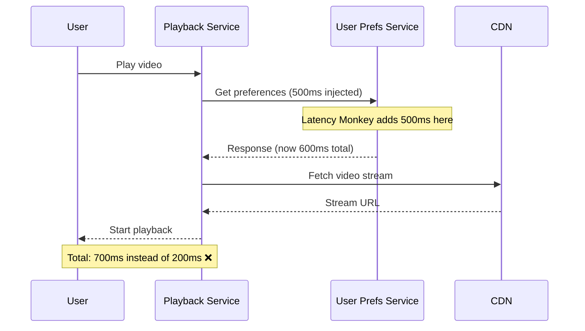
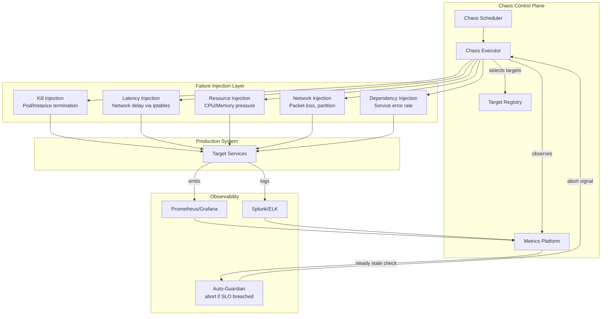

# Day 51/50+ — The Day Netflix Deliberately Broke Production
## Chaos Engineering: How the World's Best Systems Are Stress-Tested on Purpose

> **Series:** How to Think Like an Architect  
> **Difficulty:** Senior / Staff  
> **Core Concept:** Chaos Engineering, Resilience Testing, Failure Injection

---

## 🎬 The Story: Netflix Breaks Its Own Production — On Purpose

It's 2010. Netflix has just moved its entire infrastructure to AWS. The engineering team is celebrating a major milestone. Then a senior engineer, Yury Izrailevsky, raises an uncomfortable question in a meeting:

**"We say we're resilient. But how do we actually know?"**

The room goes quiet.

The team had circuit breakers, retries, fallbacks. They had tested everything in staging. But staging is a lie. Staging doesn't have the traffic patterns, the DNS cache states, the subtle connection pool exhaustion, the memory fragmentation that builds up over six weeks of production load.

The only way to know if a system is resilient under chaos is to **introduce chaos — in production.**

So they built **Chaos Monkey**.

A service that randomly terminates EC2 instances during business hours. Not at 3 AM when no one is watching. During business hours, when engineers are at their desks and can see what breaks.

The results were revelatory. Systems they thought were fault-tolerant weren't. Dependencies they assumed were stateless held hidden state. Fallbacks that looked correct in code never actually triggered because the conditions in production were subtly different from what they'd tested.

Chaos Monkey became the foundation of a discipline Netflix called **Chaos Engineering** — and it changed how the industry thinks about resilience.

---

## 🧠 What Is Chaos Engineering?

> **Chaos Engineering is not random destruction. It is a disciplined, hypothesis-driven experiment to discover system weaknesses before they manifest as incidents.**

The process has four steps:

```
1. Define steady state  →  "The system is healthy when checkout success rate > 99.9%"
2. Form a hypothesis    →  "If we kill one payment service pod, checkout rate stays above 99.9%"
3. Inject the failure   →  Kill the pod
4. Observe and learn    →  Did the hypothesis hold? If not — you just found a real bug
```

This is fundamentally different from stress testing or load testing. Those ask:
- *"Can the system handle 10× traffic?"*

Chaos Engineering asks:
- *"When something breaks — and it will — does the system degrade gracefully, or does it fall over completely?"*

---

## 🐒 Netflix's Simian Army: A Family of Chaos Tools

Netflix didn't stop at Chaos Monkey. They built an entire family of chaos tools they called the **Simian Army**:

```
┌─────────────────────────────────────────────────────────────────────┐
│                        The Simian Army                              │
├─────────────────────┬───────────────────────────────────────────────┤
│ Chaos Monkey        │ Randomly terminates EC2 instances in prod     │
│ Chaos Gorilla       │ Simulates an entire AWS Availability Zone      │
│                     │ going down                                    │
│ Chaos Kong          │ Simulates an entire AWS Region going down     │
│ Latency Monkey      │ Injects artificial network delays between     │
│                     │ services                                      │
│ Conformity Monkey   │ Finds instances not following best practices  │
│                     │ and shuts them down                          │
│ Doctor Monkey       │ Finds unhealthy instances via health checks   │
│                     │ and removes them from rotation               │
│ Janitor Monkey      │ Searches for unused resources and cleans them │
│ Security Monkey     │ Detects security policy violations            │
└─────────────────────┴───────────────────────────────────────────────┘
```

Each monkey tests a different failure dimension. Together they give a comprehensive picture of how the system behaves under real-world failure conditions.

---

## 💥 Anatomy of a Chaos Experiment at Netflix

### Experiment 1: Chaos Monkey — Single Instance Kill

**Steady state:** API success rate > 99.5%, P95 latency < 200ms

**Hypothesis:** Killing one instance of the Recommendation Service will not affect the user-facing API success rate because other instances will absorb the traffic.

**Injection:** Terminate one Recommendation Service pod at random.

```
Before:
  [User] → [API Gateway] → [Recommendation Service: 3 instances]
                                     │
                              [Database Cluster]

After injection:
  [User] → [API Gateway] → [Recommendation Service: 2 instances]  ← one killed
                                     │
                              [Database Cluster]
```

**What they found:**
- The load balancer took 30 seconds to detect the dead instance and stop routing to it.
- During those 30 seconds, 12% of requests to that instance returned errors.
- API success rate dropped to 98.2% — below the 99.5% SLA.

**The fix:**
- Implement health check endpoints that respond within 1 second.
- Configure the load balancer to use active health checks every 5 seconds, not passive failure detection.
- Add a fallback in the API Gateway: if Recommendation Service is slow, return cached recommendations rather than failing.

**Result after fix:** Instance kill → API success rate stays at 99.8%. Hypothesis confirmed.

---

### Experiment 2: Latency Monkey — Dependency Timeout

**Hypothesis:** If the User Preferences Service has 500ms added latency, the video playback start time will not be affected because it's not in the critical path.

**Injection:** Add 500ms artificial delay to all responses from User Preferences Service.



**What they found:**
- User Preferences Service *was* in the critical path. The Playback Service called it synchronously before starting video stream resolution.
- Every video play took 700ms instead of 200ms.
- A dependency everyone assumed was "not important" was blocking the most critical user action.

**The fix:**
- Move the User Preferences call to be asynchronous — start video with defaults, apply preferences once they arrive.
- Add a 100ms timeout with a cached fallback.

---

### Experiment 3: Chaos Gorilla — Full AZ Failure

**Hypothesis:** If AWS `us-east-1a` goes down entirely, Netflix continues to serve traffic from `us-east-1b` and `us-east-1c` with no customer impact.

```
Before:
  us-east-1a: [50 services × 10 pods each]
  us-east-1b: [50 services × 10 pods each]
  us-east-1c: [50 services × 10 pods each]

Chaos Gorilla injection:
  us-east-1a: ████ OFFLINE ████
  us-east-1b: [50 services × 15 pods each]  ← absorbing traffic
  us-east-1c: [50 services × 15 pods each]  ← absorbing traffic
```

**What they found:**
- 3 services had sticky sessions tied to AZ-specific state stored in-process memory.
- When `us-east-1a` went offline, 8% of users mid-session were dropped.
- One service's database connection pool wasn't configured for cross-AZ failover — it only knew the `us-east-1a` read replica address.

**The fixes:**
- Move all session state to Redis (cross-AZ).
- Configure database clients with multi-AZ connection strings.
- Implement cross-AZ load balancing from day one, not as an afterthought.

---

## 🔧 How to Run Chaos Engineering: The Architecture

### The Chaos Platform Architecture



### The Safety Mechanism: Auto-Abort

The most important part of chaos engineering in production is the **kill switch**:

```java
public class ChaosExperiment {

    private final MetricsClient metrics;
    private final SteadyStateChecker steadyState;
    private final ChaosExecutor executor;

    public ExperimentResult run(ChaosExperiment experiment) {
        // 1. Verify system is healthy before starting
        SteadyStateResult baseline = steadyState.check(experiment.getSteadyStateHypothesis());
        if (!baseline.isHealthy()) {
            return ExperimentResult.SKIPPED("System not in steady state before experiment");
        }

        // 2. Register auto-abort listener
        steadyState.watchAsync(experiment.getSteadyStateHypothesis(), violation -> {
            log.error("SLO violated during experiment: {}. Aborting.", violation);
            executor.rollback();  // immediately stop the injection
            alertOncall("Chaos experiment auto-aborted: " + violation.getDescription());
        });

        // 3. Run the experiment
        try {
            executor.inject(experiment.getFailureMode());
            Thread.sleep(experiment.getDurationMs());
            return steadyState.evaluate(experiment.getSteadyStateHypothesis());
        } finally {
            executor.rollback();  // always clean up
            steadyState.stopWatching();
        }
    }
}
```

```java
public class SteadyStateChecker {

    // Define what "healthy" means for your system
    public SteadyStateResult check(SteadyStateHypothesis hypothesis) {
        double successRate = metrics.getSuccessRate("checkout_api", Duration.ofMinutes(5));
        double p95Latency  = metrics.getP95Latency("checkout_api", Duration.ofMinutes(5));

        if (successRate < hypothesis.getMinSuccessRate()) {
            return SteadyStateResult.unhealthy(
                "Success rate " + successRate + " < threshold " + hypothesis.getMinSuccessRate()
            );
        }
        if (p95Latency > hypothesis.getMaxP95LatencyMs()) {
            return SteadyStateResult.unhealthy(
                "P95 latency " + p95Latency + "ms > threshold " + hypothesis.getMaxP95LatencyMs()
            );
        }
        return SteadyStateResult.healthy();
    }
}
```

---

## 🏢 How Other Companies Do It

### Amazon — GameDays
Amazon runs **GameDays** — structured events where an entire team spends a day injecting failures into their system and practicing the incident response. The goal isn't just to find bugs — it's to build the muscle memory for responding to incidents.

> "The worst time to learn how your system fails is when it's failing for real customers at 2 AM."

### Google — DiRT (Disaster Recovery Testing)
Google runs **DiRT** annually — a company-wide event where teams deliberately take down services, simulate data center fires, and test whether the disaster recovery runbooks actually work. They discovered that many runbooks had steps that referenced services that had been renamed or decommissioned.

### Meta (Facebook) — Storm
Meta runs **Storm**, a chaos platform that specifically tests the behavior of the social graph under partial failures. One key experiment: "What happens when 30% of TAO (their social graph cache) nodes go offline simultaneously?" Answer the first time: cascading database overload. The fix involved adding shedding and load-shedding logic into TAO.

### LinkedIn — Waterbear
LinkedIn's **Waterbear** focuses on Kafka-based infrastructure. Experiments include: killing brokers mid-replication, injecting consumer lag, triggering leader elections. Their key discovery: consumer groups were more fragile during rebalancing than expected — the fix led to improvements in Kafka's cooperative rebalancing protocol.

---

## 📊 Types of Failure Injections and What They Test

```
┌──────────────────────┬────────────────────────────────┬─────────────────────────────────────────┐
│ Injection Type       │ What It Simulates              │ What Weakness It Exposes                │
├──────────────────────┼────────────────────────────────┼─────────────────────────────────────────┤
│ Process kill         │ Pod crash, OOM kill            │ Missing health checks, no replica       │
│                      │                                │ redundancy, sticky sessions             │
├──────────────────────┼────────────────────────────────┼─────────────────────────────────────────┤
│ Latency injection    │ Slow dependency, network       │ Missing timeouts, synchronous calls     │
│                      │ congestion                     │ on critical path, no fallbacks          │
├──────────────────────┼────────────────────────────────┼─────────────────────────────────────────┤
│ Error injection      │ Dependency returning 500s      │ Missing circuit breakers, no retry      │
│                      │                                │ budgets, error propagation              │
├──────────────────────┼────────────────────────────────┼─────────────────────────────────────────┤
│ CPU/Memory pressure  │ Resource exhaustion            │ Thread pool sizing, GC pressure,        │
│                      │                                │ connection pool exhaustion              │
├──────────────────────┼────────────────────────────────┼─────────────────────────────────────────┤
│ Network partition    │ Split brain, partial           │ Consensus protocol issues, cache        │
│                      │ connectivity                   │ staleness, leader election behavior     │
├──────────────────────┼────────────────────────────────┼─────────────────────────────────────────┤
│ Disk I/O injection   │ Slow disk, disk full           │ Unbounded log growth, blocking writes,  │
│                      │                                │ missing disk pressure alerts            │
├──────────────────────┼────────────────────────────────┼─────────────────────────────────────────┤
│ AZ/Region failure    │ Cloud zone outage              │ AZ-pinned state, single-region DB,      │
│                      │                                │ missing cross-region failover           │
└──────────────────────┴────────────────────────────────┴─────────────────────────────────────────┘
```

---

## 🔬 Chaos Engineering in Practice: A Step-by-Step Runbook

### Step 1 — Instrument First, Chaos Second

You cannot run chaos experiments if you cannot observe what happens. Before anything:

```yaml
# Minimum observability required before running chaos:
metrics:
  - request_success_rate (by service, by endpoint)
  - p50_p95_p99_latency
  - error_rate_by_type
  - active_connections
  - queue_depth (if using async)

alerts:
  - success_rate < 99.5% for > 60s → page oncall
  - p95_latency > 500ms for > 60s → page oncall
  - error_rate > 1% for > 30s → page oncall

dashboards:
  - golden signals dashboard (latency, traffic, errors, saturation)
  - dependency health dashboard
```

### Step 2 — Start in Staging, Graduate to Production

```
Maturity Level 1: Chaos in staging only
  → Find obvious config errors

Maturity Level 2: Chaos in production during off-peak (2 AM)
  → Find environment-specific issues

Maturity Level 3: Chaos in production during business hours
  → Find real-traffic-dependent issues

Maturity Level 4: Continuous automated chaos (Netflix's current state)
  → Every deployment automatically subjected to chaos suite
```

### Step 3 — Define Experiments as Code (GitOps for Chaos)

```yaml
# chaos-experiment-checkout.yaml
experiment:
  name: checkout-payment-service-kill
  team: payments-engineering
  slack_channel: "#payments-oncall"

  steady_state:
    - metric: checkout_success_rate
      operator: ">="
      threshold: 99.5
      window: 5m
    - metric: checkout_p95_latency_ms
      operator: "<="
      threshold: 300
      window: 5m

  method:
    - type: kill_pod
      target:
        service: payment-service
        namespace: production
        strategy: random  # or: oldest, newest, specific
      duration: 120s

  rollback_on_steady_state_violation: true
  require_approval: false   # automated during off-peak
  notify_on_completion: true
```

### Step 4 — The Chaos Regression Suite

Run the suite against every major deployment:

```
Chaos Regression Suite — Checkout Domain
─────────────────────────────────────────
✅ PASS  payment-service single pod kill          (success rate: 99.8%)
✅ PASS  inventory-service 200ms latency inject   (no checkout impact)
✅ PASS  redis cache cluster node kill            (fallback to DB, +40ms P95)
❌ FAIL  payment-service 500ms latency inject     (checkout P95 → 620ms, SLO breached)
         → Root cause: payment gateway call is synchronous with no timeout
         → Action: Add 200ms timeout + async fallback (ticket: PAY-1847)
✅ PASS  database read replica kill               (writes continue, reads degrade gracefully)
```

Each failure becomes a ticket. Each ticket becomes a fix. Each fix goes back through the chaos suite.

---

## 🎯 The Architect's Golden Rules for Chaos Engineering

| Rule | Why It Matters |
|------|----------------|
| **Steady state first** | If you can't define what healthy looks like, you can't measure if chaos broke it |
| **Start small** | Kill one pod, not a whole cluster — build confidence before escalating the blast radius |
| **Always have a kill switch** | Auto-abort if SLO is breached — chaos engineering must not cause incidents |
| **Run during business hours** | That's when the most engineers are available to respond and learn |
| **Chaos is a team sport** | The oncall engineer should know an experiment is running and be watching the dashboard |
| **Document every finding** | A chaos experiment with no follow-up action is a wasted experiment |
| **Automate the suite** | One-off experiments find bugs. Continuous chaos suites prevent regressions |
| **Chaos ≠ punishment** | The goal is learning, not blame. Systems fail — the question is whether they fail gracefully |

---

## 🛠️ Tools of the Trade

```
┌─────────────────┬────────────────────────────────────────────────────┐
│ Tool            │ Best For                                           │
├─────────────────┼────────────────────────────────────────────────────┤
│ Chaos Monkey    │ Netflix's original tool. EC2 instance termination. │
│ (open source)   │ Good starting point for AWS-based systems.         │
├─────────────────┼────────────────────────────────────────────────────┤
│ Gremlin         │ Enterprise SaaS. Rich UI, safety guardrails,       │
│                 │ team features. Best for companies starting out.    │
├─────────────────┼────────────────────────────────────────────────────┤
│ Chaos Mesh      │ Kubernetes-native. CNCF project. Free.             │
│                 │ Great for pod kills, network chaos in K8s.         │
├─────────────────┼────────────────────────────────────────────────────┤
│ LitmusChaos     │ Kubernetes-native. CNCF project. GitOps-first.    │
│                 │ Experiments defined as Kubernetes CRDs.           │
├─────────────────┼────────────────────────────────────────────────────┤
│ AWS FIS         │ AWS Fault Injection Simulator. Native AWS service. │
│ (Fault          │ Integrated with IAM, CloudWatch. Best for AWS.    │
│ Injection Sim.) │                                                    │
├─────────────────┼────────────────────────────────────────────────────┤
│ Toxiproxy       │ Network-level chaos proxy. Add latency, packet     │
│ (Shopify)       │ loss, connection resets at the network layer.      │
└─────────────────┴────────────────────────────────────────────────────┘
```

---

## 📖 Real Bugs Found by Chaos Engineering (Hall of Shame)

**Bug 1: The Silent Retry Storm**
A chaos experiment killed one service, triggering retries from 50 upstream callers. Each caller retried 3 times with no jitter. The traffic spike from all 50 callers retrying simultaneously killed the newly recovered instance. The bug: no retry backoff, no jitter, no circuit breaker. A single pod kill became a cascading failure.

**Bug 2: The Stale Config**
Chaos Gorilla (AZ failure) revealed that the disaster recovery playbook referenced a load balancer DNS entry that had been renamed 8 months earlier. The playbook was wrong. Nobody had tested it. An untested DR plan is not a DR plan.

**Bug 3: The Leaky Connection Pool**
A latency injection revealed that when the database was slow, threads blocked waiting for connections, the pool filled up, and after 30 seconds the pod ran out of threads and stopped processing entirely — even for unrelated endpoints. Root cause: a global connection pool shared across all endpoints with no timeout on pool acquisition.

**Bug 4: The Wrong Fallback**
A payment service had a fallback that was supposed to return a cached response on timeout. The chaos experiment revealed that the fallback was returning a hardcoded `{"status": "approved"}` — meaning every payment timed out silently got approved for free. The bug had existed for 6 months without anyone noticing.

---

## 🚀 The Takeaway

> "Hoping your system is resilient is not an engineering practice. Proving it is."

Netflix's key insight was not technical — it was philosophical. **The system will fail. The only question is whether you discovered the failure mode in a controlled experiment or at 3 AM in production with customers watching.**

Chaos Engineering flips the resilience question from:
- *"Did we write the right code?"* (impossible to prove)

To:

- *"Does the system behave correctly under failure?"* (empirically testable)

When you run a chaos suite against every deployment, you are not being reckless. You are being rigorous. You are saying: **"We don't trust hope as an engineering strategy."**

That is how architects think.

---

## 🎤 Interview Questions

**Q1: What is the difference between chaos engineering and load testing?**
> Load testing asks "can the system handle high volume?" Chaos engineering asks "does the system degrade gracefully when components fail?" Load testing is about capacity. Chaos engineering is about failure modes.

**Q2: Why does Netflix run chaos experiments during business hours instead of off-peak?**
> Because engineers are awake and watching. The goal is to find bugs and have the team present to respond, learn, and fix. Off-peak chaos teaches you nothing about how your team handles incidents.

**Q3: How do you design a chaos experiment safely?**
> Define steady-state metrics (SLOs) first. Implement an auto-abort if those SLOs are breached. Start with the smallest possible blast radius. Always have a rollback mechanism. Run with the oncall engineer aware and watching.

**Q4: A chaos experiment reveals that killing one pod causes a 5% success rate drop for 30 seconds. Is this acceptable?**
> That's an architectural question, not just a number. If your SLO is 99.9% and this drops you to 97% for 30 seconds, no — fix it. If you have graceful degradation and 5% of requests get a cached fallback rather than an error, maybe yes. Define what "acceptable degradation" means for your users before running the experiment.

**Q5: How would you build a chaos engineering program from scratch at a company that has never done it?**
> Start with observability — you can't run chaos without metrics to observe. Then run your first experiment in staging to build confidence. Pick one low-risk experiment (single pod kill of a non-critical service) in production during off-peak. Measure. Document. Share findings broadly. Build a culture where finding failure modes is celebrated, not penalized. Gradually automate and broaden scope.

---

*Day 51 · System Design Interview Preparation Series · How to Think Like an Architect*
