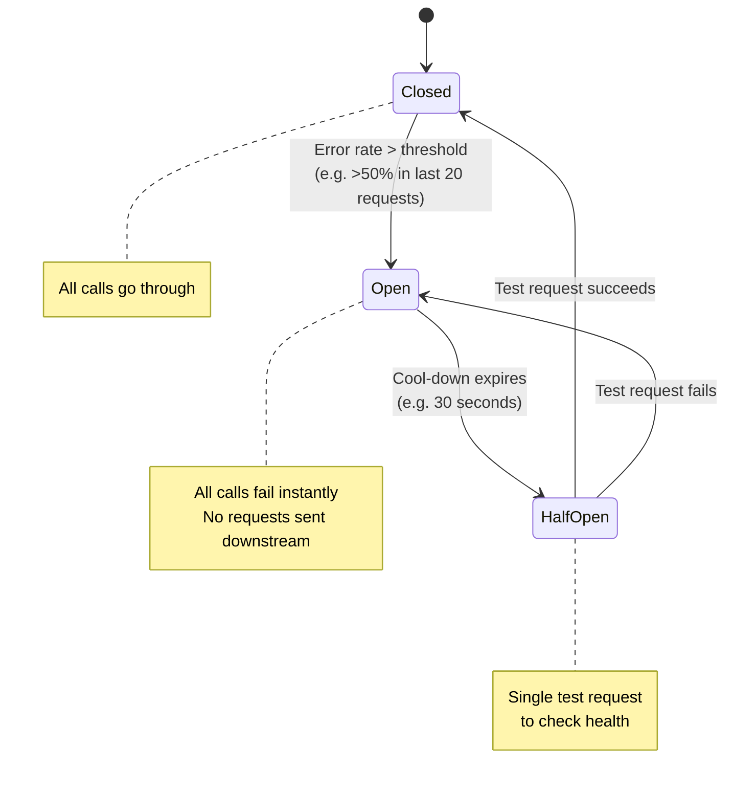

# Day 53 — The Uber Retry Storm That Almost Broke Surge Pricing
## How a `Thread.sleep(100)` Loop Turned a 3-Second Hiccup Into a Cascading Failure

> **Series:** System Design Interview Preparation Series  
> **Difficulty:** Mid / Senior  
> **Core Concept:** Retry Patterns, Exponential Backoff, Jitter, Circuit Breakers, Retry Budgets  
> **Prerequisite:** Day 6 — Design For Failure, Day 51 — Chaos Engineering

---

## 🎬 The Story

It is a Friday evening in San Francisco. Rush hour. A Warriors game just ended. Uber is processing roughly 30,000 ride requests per minute. Surge pricing has kicked in at 2.4×. Everything is humming.

Then, at 19:47:02, an analyst on the data team runs an "innocent" `SELECT COUNT(*) GROUP BY user_id` query directly against the production payments database. It is supposed to take 2 seconds. It locks a key index for 3.

For exactly 3 seconds, the Payment Service starts returning timeouts.

At 19:47:05, the database recovers. The Payment Service is healthy again.

At 19:47:35 — **30 seconds after the database has fully recovered** — Uber's Payment Service is on its knees. P99 latency: 18 seconds. Error rate: 47%. Customers are getting "Payment Failed" errors. The Ride Matching service is queueing requests. Surge pricing recalculation is delayed. Drivers are getting incorrect fare estimates.

The database is fine. The network is fine. The Payment Service hardware is fine.

**The system is killing itself.**

```
19:47:02  Payment DB lock starts  →  Payment Service starts timing out
19:47:05  Payment DB lock ends    →  Payment Service ready to serve again
19:47:35  Payment Service P99 = 18s, error rate 47%, climbing
19:48:10  Ride Matching Service starts queueing — 200K requests deep
19:48:45  Auto-scaler spins up 80 new Payment Service pods
19:49:20  New pods immediately overloaded by retry traffic
19:50:00  Senior engineer hits the "disable retries" config flag
19:50:08  Payment Service P99 drops from 18s to 80ms in 8 seconds
19:50:30  Full recovery
```

A 3-second blip became a 3-minute outage. Nothing failed except one thing — **the code that was supposed to handle failure**.

This is the story of how the most well-intentioned line of code in distributed systems — `if (failure) retry()` — became the most common cause of cascading failures in production.

---

## 🐍 The Code That Caused It

Here is the actual pattern that was in the Payment Service. Junior engineer. Code reviewed. Approved. Merged. Lived in production for 8 months without incident.

```java
public PaymentResponse charge(PaymentRequest req) {
    int retries = 3;
    for (int i = 0; i < retries; i++) {
        try {
            return paymentClient.call(req);
        } catch (TimeoutException e) {
            Thread.sleep(100);   // fixed 100ms delay
        }
    }
    throw new RuntimeException("Payment failed");
}
```

Three properties make this code lethal:

1. **Fixed delay** — every retry happens at the same time interval
2. **No coordination across callers** — every thread runs its own loop, independently
3. **No circuit breaker** — retries continue even when the downstream service is clearly dead

Each property in isolation is survivable. The combination, under concurrency, is catastrophic.

---

## 🧠 The Retry Storm — In Numbers

Let us do the math. This is the part most engineers never work out, and it explains everything.

### Baseline traffic

Uber's Payment Service handles **~2,000 concurrent in-flight requests** at peak. Let us trace what happens when all 2,000 hit a timeout in the same window.

### t = 0ms: Database lock begins

All 2,000 in-flight requests start their 100ms timer waiting for a response.

```
Active load on Payment Service:  2,000 requests (original)
```

### t = 100ms: First retry wave

All 2,000 requests time out. All 2,000 fire their first retry — *at exactly the same moment*, because `Thread.sleep(100)` is deterministic.

```
Active load on Payment Service:  2,000 retries (wave 1)
                                + 2,000 NEW requests that arrived in this window
                                ─────────
                                = 4,000 concurrent requests
```

### t = 200ms: Second retry wave

The wave-1 retries also time out. They fire wave 2. Meanwhile, the new requests that joined at t=100ms have started their own retries.

```
Active load on Payment Service:  2,000 retries (wave 2 of original)
                                + 2,000 retries (wave 1 of t=100ms cohort)
                                + 2,000 NEW requests
                                ─────────
                                = 6,000 concurrent requests
```

### t = 300ms

```
Active load on Payment Service:  2,000 (wave 3 of original cohort)
                                + 2,000 (wave 2 of t=100ms cohort)
                                + 2,000 (wave 1 of t=200ms cohort)
                                + 2,000 NEW requests
                                ─────────
                                = 8,000 concurrent requests
```

### t = 3000ms: Database recovers

The database is healthy again. But the Payment Service is now drowning. The original 2,000 requests have generated **3 retries each = 6,000 retry calls**. Plus 30 seconds of additional traffic stacking on. The thread pool is exhausted. The connection pool is exhausted. Newly recovered database connections are immediately consumed by backed-up retry traffic.

```
Effective amplification:  ~4× the baseline load, sustained for minutes
```

The system has become a perpetual motion machine for failure. Every retry timeout generates new retries. The Payment Service has no way to catch up because every freshly available capacity is consumed by the existing retry backlog before any new traffic gets through.

This is the **retry storm**.

---

## 🌪️ Why It Happens — The Three Mechanisms

```
Mechanism 1: SYNCHRONIZATION
─────────────────────────────
Every client retries at exactly the same moment.
With 2,000 clients, you get 2,000 simultaneous packets — every 100ms.
The downstream service sees periodic spikes, not steady load.

Mechanism 2: AMPLIFICATION
───────────────────────────
1 user request → 3 retries → up to 4× total traffic.
With downstream retries at multiple layers, this compounds:
  Layer 1 (API gateway): 3 retries
  Layer 2 (service):     3 retries  
  Layer 3 (DB client):   3 retries
  Effective amplification: 3 × 3 × 3 = 27× original load.

Mechanism 3: PERSISTENCE
────────────────────────
Retries keep firing even when the downstream is clearly unhealthy.
The system has no signal that says "stop trying — it's not coming back."
Capacity that recovers gets immediately consumed by stale retry backlog.
```

The retry storm is the distributed-systems equivalent of someone in a crowded room saying *"What?"* — and everyone yelling louder simultaneously, drowning out everything.

---

## 🛡️ The Architect's Fix — Four Patterns Layered Together

A robust retry strategy is not one technique. It is four techniques composed:

### Pattern 1 — Exponential Backoff

Instead of a fixed delay, **double the wait time** after each failure.

```
Attempt 1: 100ms
Attempt 2: 200ms
Attempt 3: 400ms
Attempt 4: 800ms
Attempt 5: 1600ms (cap at maxBackoff)
```

This serves two purposes:
- The downstream service gets progressively more breathing room between waves
- The total request volume drops over time as the backoff grows

But exponential backoff alone is not enough. All clients still backoff *in sync*. The waves get spaced further apart, but each wave is still 2,000 simultaneous requests.

### Pattern 2 — Jitter

The fix for synchronization is **jitter** — randomness added to the backoff interval.

```
Attempt 1: 100ms ± random(0, 50ms)   = somewhere between 100-150ms
Attempt 2: 200ms ± random(0, 100ms)  = somewhere between 200-300ms
Attempt 3: 400ms ± random(0, 200ms)  = somewhere between 400-600ms
```

Each client backs off for a *slightly different* duration. Instead of a 2,000-request spike at exactly 100ms, you get 2,000 requests *spread across a 50ms window*. The downstream sees smooth load, not waves.

There are three flavors of jitter — and the choice matters:

```
Full jitter:        sleep = random(0, exponential_backoff)
                    Best for: cold-start storms
                    
Equal jitter:       sleep = backoff/2 + random(0, backoff/2)
                    Best for: typical use
                    Used by: AWS SDK
                    
Decorrelated jitter: sleep = random(base, prev_sleep × 3), capped at max
                    Best for: very large retry pools
                    Used by: AWS recommended pattern
```

For most production systems, **equal jitter** is the right default.

### Pattern 3 — Circuit Breaker

Even with backoff and jitter, a fundamentally dead downstream service should not be retried. The circuit breaker is a small state machine that watches the error rate and **fails fast** when the downstream is clearly unhealthy.



**Closed:** Traffic flows normally. The breaker counts failures.

**Open:** Once failure threshold is breached, the breaker "opens." Now every call fails immediately with `CircuitBreakerOpenException`. **No requests reach the downstream.** This is the critical property — it gives the downstream time to recover without retry traffic suffocating it.

**Half-Open:** After a cool-down period (typically 30-60s), the breaker lets a single test request through. If it succeeds, the breaker closes. If it fails, the breaker goes back to open for another cool-down period.

The brilliance: **the breaker is the only signal in the system that says "stop trying."** Without it, retries continue forever.

### Pattern 4 — Retry Budgets

The most underappreciated pattern. A retry budget is a **per-service quota** on how much extra load retries are allowed to generate.

> *Maximum 10% of total traffic to a downstream service can be retries.*

If the budget is exceeded, retries are refused — even if the policy says "retry up to 3 times." This is implemented with a token bucket: each retry consumes a token, tokens refill at a rate proportional to successful (non-retry) traffic.

```
Token bucket capacity:    10% of recent request volume
Refill rate:              1 token per 10 successful requests
Cost per retry:           1 token

If bucket is empty:       refuse to retry, return error immediately
```

This is the pattern that *bounds* the maximum amplification. Even in pathological scenarios, retries can never generate more than 10% extra load. This is what Google, Netflix, and Uber actually use in production.

---

## ✅ The Production-Grade Solution

Here is what the corrected Payment Service code looks like — combining all four patterns:

```java
public class ResilientPaymentClient {

    private final CircuitBreaker circuitBreaker;
    private final RetryBudget retryBudget;
    private final PaymentClient paymentClient;

    private static final int MAX_RETRIES = 3;
    private static final long INITIAL_BACKOFF_MS = 100;
    private static final long MAX_BACKOFF_MS = 5000;

    public PaymentResponse charge(PaymentRequest req, Duration deadline) {
        Instant start = Instant.now();

        for (int attempt = 1; attempt <= MAX_RETRIES; attempt++) {

            if (Duration.between(start, Instant.now()).compareTo(deadline) > 0) {
                throw new DeadlineExceededException(
                    "No retry budget left in deadline for " + req.getId()
                );
            }

            if (circuitBreaker.isOpen()) {
                metricsClient.increment("payment.circuit_breaker_rejected");
                throw new CircuitBreakerOpenException("Payment service is unhealthy");
            }

            try {
                PaymentResponse response = paymentClient.call(req);
                circuitBreaker.recordSuccess();
                return response;

            } catch (TimeoutException | TransientFailureException e) {
                circuitBreaker.recordFailure();

                if (attempt == MAX_RETRIES) {
                    metricsClient.increment("payment.retries_exhausted");
                    throw e;
                }

                if (!retryBudget.tryAcquire()) {
                    metricsClient.increment("payment.retry_budget_exhausted");
                    throw new RetryBudgetExhaustedException(
                        "Refusing retry — too many retries already in flight"
                    );
                }

                long sleepMs = computeBackoffWithJitter(attempt);

                Duration remaining = deadline.minus(Duration.between(start, Instant.now()));
                if (remaining.toMillis() < sleepMs) {
                    throw new DeadlineExceededException(
                        "Backoff would exceed deadline for " + req.getId()
                    );
                }

                Thread.sleep(sleepMs);

            } catch (NonRetryableException e) {
                throw e;
            }
        }

        throw new RuntimeException("Payment failed after " + MAX_RETRIES + " attempts");
    }

    private long computeBackoffWithJitter(int attempt) {
        long backoff = INITIAL_BACKOFF_MS * (1L << (attempt - 1));
        backoff = Math.min(backoff, MAX_BACKOFF_MS);

        long halfBackoff = backoff / 2;
        long jitter = ThreadLocalRandom.current().nextLong(0, halfBackoff + 1);
        return halfBackoff + jitter;
    }
}
```

Notice the additions beyond the source pattern:

- **Deadline propagation** — every retry checks if there is time left in the upstream caller's deadline before sleeping. If your caller has a 500ms timeout, don't sleep for 800ms.
- **Non-retryable exception distinction** — a `400 Bad Request` should never be retried. Only transient errors (`TimeoutException`, `503`, `429`) get retry treatment.
- **Metric emission at every decision point** — every rejection has an observable cause.

---

## 📊 The Hidden Multi-Layer Problem

There is one more thing that makes retry storms so deadly in microservice architectures: **retries compound across layers**.

```
              ┌──────────────────────────────────────────┐
              │  Client App (3 retries)                  │
              └─────────────────┬────────────────────────┘
                                │
                                ▼
              ┌──────────────────────────────────────────┐
              │  API Gateway (3 retries)                 │
              └─────────────────┬────────────────────────┘
                                │
                                ▼
              ┌──────────────────────────────────────────┐
              │  Order Service (3 retries)               │
              └─────────────────┬────────────────────────┘
                                │
                                ▼
              ┌──────────────────────────────────────────┐
              │  Payment Service (3 retries)             │
              └─────────────────┬────────────────────────┘
                                │
                                ▼
              ┌──────────────────────────────────────────┐
              │  Payment DB Client (3 retries)           │
              └──────────────────────────────────────────┘

Effective amplification at the database:  3 × 3 × 3 × 3 × 3  =  243×
```

A single user-facing request can become **243 database queries** if every layer is configured to retry independently. This is not a theoretical problem — this is what caused the **AWS DynamoDB outage of September 2015**, the **GitHub outage of October 2018**, and at least three Cloudflare incidents.

The architectural rule: **retry only at the lowest layer that has the context to know what is retriable.** Higher layers should fail fast and surface the error.

```
✓ DB client retries on transient DB errors          (layer that knows)
✗ Payment service retries on DB client errors       (already retried below)
✗ Order service retries on Payment service errors   (compounds further)
✗ API Gateway retries on Order Service errors       (catastrophic)
```

Pick one layer. Retry there. Fail fast everywhere else.

---

## 🚀 Advanced Pattern — Hedged Requests

This is what Google does for latency-sensitive services like Search. Instead of waiting for one request to fail before retrying, **send a second request after the P95 latency** — and use whichever response arrives first.

```
t=0ms:    Send request A
t=80ms:   If A hasn't responded yet (P95 = 80ms), send request B
t=82ms:   B responds first → use B's response, cancel A
t=400ms:  A would have timed out, but we already have the answer
```

This trades a small amount of extra traffic (the hedged copy) for dramatically lower tail latency. Used carefully, hedging can reduce P99 latency by 40-60%.

Important: hedging is *not* retrying. Both requests are in flight simultaneously. You are not waiting for failure — you are racing against latency. And you must combine it with **request cancellation** so the slower copy stops doing work once the fast one wins. Otherwise you've just added 2× load to the downstream.

---

## 📊 Real-World Impact at Uber

After implementing exponential backoff + jitter + circuit breakers + retry budgets across the Ride Matching, Payment, and Surge Pricing services:

| Metric | Before (Fixed Retries) | After (Architect's Pattern) |
|--------|----------------------|------------------------------|
| Payment timeout incidents/month | 15 | 2 |
| Retry amplification factor (P99) | 4× – 10× | 1.2× – 1.5× |
| Recovery time after dependency failure | 5 – 10 minutes | 30 – 60 seconds |
| PagerDuty alerts from retry storms | 80% of all alerts | < 5% of all alerts |
| Customer-visible "Payment Failed" rate during incidents | 12% | 0.3% |

The wins are not subtle. They are 10× improvements.

---

## 🏛️ The Architect's Golden Rules for Retries

| Rule | Why It Matters |
|------|----------------|
| **Never fixed-delay retry under concurrency** | Synchronizes retries into thundering herds |
| **Always exponential backoff** | Gives the downstream progressively more breathing room |
| **Always jitter** | Spreads retry waves across time, smoothing the spike |
| **Always circuit breaker** | The only signal that says "stop trying" — without it, retries are forever |
| **Always retry budget** | Bounds the maximum amplification, even in pathological scenarios |
| **Retry only at one layer** | Compounding retries across layers can hit 100× – 1000× amplification |
| **Propagate deadlines** | Don't sleep 500ms if your caller has 200ms left |
| **Distinguish retryable from non-retryable** | `400 Bad Request` should never be retried — only transient failures |
| **Emit metrics at every retry decision** | You cannot debug retry storms without observability |
| **Load-test retry behavior** | Unit tests don't reveal storms — load tests with injected failures do |

---

## 🧪 How to Test Retry Behavior

This is the part most engineers skip. Retry bugs are invisible in unit tests. You need to test:

```
1. Inject latency into the downstream service (use a Toxiproxy or chaos tool).
2. Run a sustained load test at production-like concurrency.
3. Measure:
   - Retry traffic as percentage of total
   - Latency distribution under failure
   - Time to recovery after the downstream is restored
   - Circuit breaker open/close transitions
4. Look for:
   - Retry amplification > 1.5× (your budget should prevent this)
   - Recovery time > 60s after downstream is restored
   - Circuit breaker NOT opening during failures (bug)
   - Circuit breaker NOT closing after recovery (bug)
```

```yaml
chaos_test_retry_behavior:
  scenario: "Downstream Payment DB locks for 5 seconds"
  
  inject:
    target: payment-db
    fault: latency_increase
    value: 10000ms
    duration: 5s
    
  load:
    target: order-service
    rps: 2000
    duration: 30s
    
  assertions:
    - payment_service.retry_amplification.p99 < 1.5x
    - circuit_breaker.open_within_seconds < 2
    - recovery_time_after_fault_clear < 60s
    - customer_visible_error_rate < 1%
```

If your load test does not include scenarios like this, you do not know how your system behaves under failure. You only know how it behaves under success.

---

## 🎤 Interview Questions

**Q1: What is a retry storm and why is it dangerous?**
> A retry storm is when many clients of a service simultaneously retry failed requests, generating multiplicative load that prevents the service from recovering. It is dangerous because the retry traffic itself becomes the bottleneck — every bit of recovered capacity in the downstream is immediately consumed by stale retry backlog before any new requests can succeed. A 3-second downstream blip can produce a 5-minute service outage purely from retry traffic, even though nothing is fundamentally broken.

**Q2: Why is exponential backoff alone insufficient?**
> Exponential backoff spaces retries apart in time, which helps, but it does not solve synchronization. If all 2,000 clients hit a timeout at the same moment, they all back off for the same duration and all retry simultaneously — just at exponentially-spaced intervals. The waves are bigger, just less frequent. Jitter (randomness added to the backoff) is required to break the synchronization and spread the retry traffic across time rather than into discrete spikes.

**Q3: When should a circuit breaker NOT be used?**
> Three scenarios. (1) Operations that have no meaningful fallback — if the only correct behavior is to wait for the downstream, opening the breaker doesn't help. (2) Idempotent reads with no SLA where waiting is acceptable. (3) Low-volume operations where you don't have enough samples to compute a meaningful error rate — a breaker that opens on 2-out-of-3 failures with only 3 requests in flight is noise. For everything else — especially synchronous calls in user-facing flows — circuit breakers are mandatory.

**Q4: A retry storm is happening in production. The downstream service is recovering but your service is still failing. What do you do, immediately?**
> First, hit the kill switch — disable retries with a feature flag if your service has one. This breaks the storm immediately. Second, manually trip the circuit breaker for the affected downstream — force it open so traffic stops flowing. Third, shed load at the ingress layer — start returning 429s to upstream callers until the backlog drains. Only after the storm is broken do you investigate the root cause. The order matters: stabilize first, diagnose second.

**Q5: How does retry amplification compound across microservice layers, and how do you prevent it?**
> Each layer that retries independently multiplies the retry traffic at every layer below it. A 5-layer chain with 3 retries each produces 3⁵ = 243× amplification at the bottom layer. The fix is to retry at exactly one layer — the lowest one that has the context to know what is retriable. Higher layers should fail fast and surface errors. This requires explicit architectural discipline: every service must document its retry policy, and reviewers must reject changes that add a retry layer above a layer that already retries.

---

## 🚀 The Takeaway

> *"Retries are like medicine — the right dose heals; an overdose kills."*

The retry loop is the most common piece of code in distributed systems and the most commonly misunderstood. Junior engineers add retries because failures should be retried. Senior engineers add backoff because retries should be spaced. Architects add jitter, circuit breakers, retry budgets, and deadline propagation because they have lived through what happens when only the first two are present.

The lesson is not "don't retry." The lesson is **retry intelligently** — with backoff, with jitter, with a circuit that can open, with a budget that caps amplification, and with a deadline that respects what the caller actually wants.

A 3-second database query nearly took down Uber's surge pricing. The fix was not to remove retries. The fix was to make them architect-grade.

---

## 📖 Related Reading

- **Day 6** — Design For Failure
- **Day 49** — The Kafka OOM Crash That Charged 1000 Customers Twice (idempotency + retries)
- **Day 51** — Chaos Engineering & Chaos Monkey
- **Day 52** — Chaos Kong: Full Region Failure

---

## 📚 External References

- **AWS Architecture Blog** — *Exponential Backoff and Jitter*
- **Google SRE Book** — *Chapter 22: Addressing Cascading Failures*
- **Netflix Tech Blog** — *Performing Chaos at Netflix Scale*
- **gRPC documentation** — *Retry budgets and hedging policies*
- **Resilience4j** — production-grade Java library for circuit breakers, bulkheads, retries

---

*Day 53 · System Design Interview Preparation Series · How to Think Like an Architect · [YouTube](https://www.youtube.com/@CodeWithSunchitDudeja) · [Instagram](https://www.instagram.com/sunchitdudeja/)*
