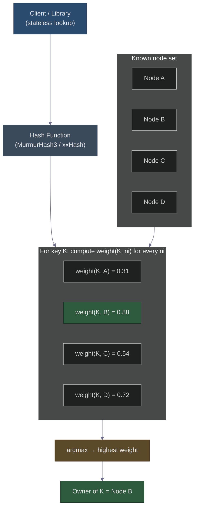

# Rendezvous Hashing: The Elegant Cousin of Consistent Hashing
### Day 54 of 50 - System Design Interview Preparation Series

**By Sunchit Dudeja**

---

## 🎯 The Core Idea

**Rendezvous Hashing** — also known as **Highest Random Weight (HRW)** hashing — is a distributed hashing algorithm that maps a **key** (user ID, request, file name) to a **node** (cache, shard, server) such that:

- The **same key** always picks the **same node** (deterministic, no coordination).
- When the **node set changes**, **only the keys that belonged to the affected node** get reassigned — no avalanche remapping.
- There is **no ring**, **no virtual nodes**, **no metadata store** — just a list of nodes and a hash function.

It was introduced by **Thaler & Ravishankar (1996)** — actually **predating consistent hashing** — and quietly powers things like **memcached clients**, **edge routing**, and **metadata services**.

> **One-line intuition:** *For every key, compute `hash(key, node)` for each node and pick the node with the **highest** weight. That’s it.*

> **📐 Excalidraw:** Open [day54-rendezvous-hashing-add-delete.excalidraw](./day54-rendezvous-hashing-add-delete.excalidraw) at [excalidraw.com](https://excalidraw.com) — dark background (`#1e1e1e`), 3 panels showing **BEFORE → DELETE node A → ADD node D** with per-key weights and winners.

> **Companion read:** See [Day 28 — Consistent Hashing](./Day28_Consistent_Hashing_Resharding.md) for the classic alternative. Rendezvous is the **simpler, ring-free sibling**.

---

## 🧠 Why Should You Care?

The naive answer to “which node owns this key?” is `hash(key) % N`. It works… until a node joins or leaves. Then almost **every key** gets remapped — an effect called **avalanche remapping**. In a cache, that means a **stampede of misses** straight into your database.

| Approach | Behavior when a node joins/leaves |
|----------|------------------------------------|
| `hash(key) % N` | **~70% of keys move**. Cache hit rate collapses. |
| **Consistent Hashing** | Only ~`1/N` of keys move. Needs a **ring + virtual nodes**. |
| **Rendezvous (HRW)** | Only the keys mapped to the **affected node** move. **No ring**, **no virtual nodes**. |

---

## 🔧 How It Works (Step by Step)

For a given **key `K`** and set of nodes `N = {n1, n2, …, nm}`:

**Step 1 — Compute a pseudo-random weight per `(key, node)` pair:**

```text
weight(K, ni) = hash(concat(K, ni))
```

- Use a **uniform** hash: **MurmurHash3**, **xxHash**, **CityHash**, **SHA-1** are all fine.
- Avoid weak hashes (e.g., Java’s `hashCode()`) — they cluster badly.
- The concatenation makes every `(K, ni)` weight **unique** and **independent**.

**Step 2 — Pick the node with the highest weight:**

```text
assigned_node(K) = argmax over ni in N of weight(K, ni)
```

That is the **entire algorithm**. No ring, no virtual nodes, no shared state.

---

## 📊 Worked Example

Three nodes `A`, `B`, `C` and key `user123`:

| `(key, node)` | weight |
|---------------|--------|
| `hash("user123A")` | **0.92** |
| `hash("user123B")` | 0.45 |
| `hash("user123C")` | 0.78 |

**Winner:** `A` (highest weight = 0.92) → `user123` goes to **node A**.

Now suppose **node B is removed**. Recompute only over `{A, C}`:

- `A` → 0.92
- `C` → 0.78

Winner is **still A**. **The key did not move.** That is the whole point.

If instead **node A is removed**, the next-highest weight (`0.78 → C`) takes over. **Only the keys that previously belonged to A** need to be reassigned.

---

## 🏛️ High-Level Design (Mermaid)



**What this shows:** Every client independently does the same `O(N)` scan and lands on the **same** winner — **no coordinator** required.

---

## 🟣 Why “No Avalanche Remapping” — Deep Dive

This is the single most important property of Rendezvous Hashing. Let’s build it from first principles.

### What is **avalanche remapping**?

In **modulo hashing** (`hash(key) % N`), a small change to `N` causes most keys to jump. Example with 3 nodes → 4 nodes:

| Key | `% 3` | `% 4` | Moved? |
|-----|-------|-------|--------|
| 1   | 1     | 1     | no |
| 2   | 2     | 2     | no |
| 3   | 0     | 3     | **yes** |
| 4   | 1     | 0     | **yes** |
| 5   | 2     | 1     | **yes** |

**~60–70% of keys moved** just because one node was added. In a cache layer that means **mass cache misses** → **database meltdown**.

### How Rendezvous avoids it

Rendezvous Hashing computes a **per-`(key, node)` weight** independently. The key’s owner is whichever **currently-present node has the highest weight**.

**When a node fails / is removed:**

- For each key whose previous winner **was** the removed node → recompute weights over the **remaining** nodes and pick the new highest.
- For **every other key** → its previous winner is **still in the list with the same weight**, so its mapping is **unchanged**.

**When a node is added:**

- For each key, compute `hash(key, new_node)` and compare with the previous winner.
- The key moves **only if** the new node’s weight is **strictly higher**.
- On average, a new node steals a `1/(N+1)` fraction of keys — exactly its **fair share**.

### Tiny illustration

Three nodes `A`, `B`, `C`. Four keys with current owners:

| Key | Owner |
|-----|-------|
| K1  | A |
| K2  | B |
| K3  | A |
| K4  | C |

**Node A fails.** Only `K1` and `K3` need to be re-evaluated against `{B, C}`. Suppose:

- `K1 → B`
- `K3 → C`

`K2` and `K4` are **never touched** — their highest-weight node is still in the cluster.

> **The takeaway:** A node addition or removal affects **only the keys that belonged to that node**. Everything else stays **perfectly still**.

---

## 📋 Properties Cheat-Sheet

| Property | Why it matters |
|----------|----------------|
| **Monotonicity** | Add/remove a node → only keys mapped to that node are reassigned. **No avalanche.** |
| **Load balancing** | With a uniform hash, keys distribute **almost evenly** across nodes (in expectation). |
| **No virtual nodes** | Unlike consistent hashing, **no replicas** needed to balance load. |
| **Tiny memory** | No ring. Just hold the **node list** and compute on the fly. |
| **Deterministic** | Every client computes the **same mapping** without coordination. |
| **Replica-friendly** | Pick the **top-k** highest-weight nodes for **free replication**. |

---

## ⚖️ Rendezvous vs Consistent Hashing

| Aspect | **Rendezvous Hashing** | **Consistent Hashing** |
|--------|------------------------|------------------------|
| **Core idea** | Highest weight of `(key, node)` | Hash circle + virtual nodes |
| **Lookup complexity** | **`O(N)`** per key | **`O(log V)`** (`V` = total virtual nodes) |
| **Memory footprint** | Minimal — just the node list | A **ring** with many virtual nodes per physical node |
| **Load balancing** | Good **out-of-the-box** with a uniform hash | Requires **virtual-node tuning** |
| **Hotspot handling** | Automatic if the hash is uniform | Needs **more virtual nodes** to smooth hotspots |
| **Implementation** | **A few lines of code** | Ring + virtual nodes + sorted lookups |
| **Best for** | **Small/mid-sized clusters**, metadata services | **Large dynamic clusters** (Dynamo, Cassandra, Discord) |

> **Rule of thumb:** `O(N)` per lookup is **perfectly fine up to a few hundred nodes**. Past that — thousands of nodes — consistent hashing’s `O(log V)` starts to matter.

---

## 🛠️ Common Use Cases

- **Distributed caching** — memcached client libraries famously use HRW.
- **Sharded databases** — especially when the number of shards is modest.
- **Leader / coordinator election** — each key deterministically elects an owner node.
- **Stateless service load balancing** — sticky affinity to a specific backend.
- **CDN edge routing** — map a user to the most appropriate POP.
- **Object placement in object stores** — with **top-k** for replication.

---

## 💻 Reference Implementation (Java)

```java
import java.util.*;

public class RendezvousHashing {
    private final List<String> nodes;
    private final HashFunction hash; // e.g., MurmurHash3, xxHash

    public RendezvousHashing(List<String> nodes, HashFunction hash) {
        this.nodes = new ArrayList<>(nodes);
        this.hash = hash;
    }

    public String getNode(String key) {
        long maxWeight = Long.MIN_VALUE;
        String selected = null;
        for (String node : nodes) {
            long weight = hash.hash(key + node);
            if (weight > maxWeight) {
                maxWeight = weight;
                selected = node;
            }
        }
        return selected;
    }

    public List<String> getTopK(String key, int k) {
        PriorityQueue<long[]> heap = new PriorityQueue<>(Comparator.comparingLong(a -> a[0]));
        for (int i = 0; i < nodes.size(); i++) {
            long w = hash.hash(key + nodes.get(i));
            if (heap.size() < k) {
                heap.offer(new long[]{w, i});
            } else if (w > heap.peek()[0]) {
                heap.poll();
                heap.offer(new long[]{w, i});
            }
        }
        List<String> result = new ArrayList<>(k);
        for (long[] entry : heap) result.add(nodes.get((int) entry[1]));
        return result;
    }
}
```

**Production refinements:**

- **Cache weights** when the node set is stable to skip recomputation on every request.
- **Pre-hash node identifiers** once at startup; combine with the key hash using a fast mixer.
- Prefer **non-cryptographic hashes** (MurmurHash3, xxHash, CityHash) unless you specifically need crypto properties.
- Use **`getTopK`** above for **N-way replication** without any extra metadata.

---

## 💬 How to Talk About It in an Interview

When asked something like:

> *“Design a distributed cache that minimises remapping when a server goes down.”*

A strong answer:

> “Two clean choices. **Consistent hashing** with virtual nodes is the classic. An equally strong alternative is **Rendezvous Hashing** — for each key, compute `hash(key, node)` for every node and pick the highest. It is `O(N)` per lookup, ideal for clusters up to a few hundred nodes. Its key property: adding or removing a node reassigns **only the keys that belonged to that node** — no avalanche remapping, no virtual nodes, no ring, no coordinator. For thousands of nodes I would still pick consistent hashing because of `O(log V)` lookups; below that, Rendezvous is **simpler, smaller, and equally correct**.”

That one paragraph signals you understand:

- the **problem** (avalanche remapping),
- **two solutions** (consistent vs rendezvous),
- the **trade-offs** (`O(N)` vs `O(log V)`, memory, complexity),
- and **when to pick which**.

---

## 🧾 Quick Recap

- **Rendezvous Hashing** = for each key, pick the node with the **highest `hash(key, node)`**.
- **Remaps only the keys** that belonged to a failed or newly added node — **no collateral damage**.
- **Simpler than consistent hashing** for moderate cluster sizes.
- **`O(N)` per lookup** — perfect up to a few hundred nodes.
- **No ring, no virtual nodes, no coordinator** — just a node list and a good hash function.
- Use the **top-k** variant when you need **replication for free**.

Whether you’re designing a cache layer, a sharded store, or just sharpening your system-design vocabulary, **Rendezvous Hashing deserves a permanent slot in your mental toolkit**.

---

*If this saved you from explaining “why isn’t modulo hashing good enough?” one more time — share it with the next engineer who asks.* 🎯
