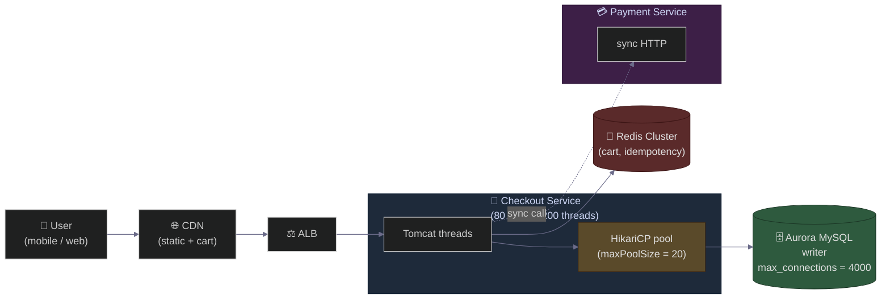
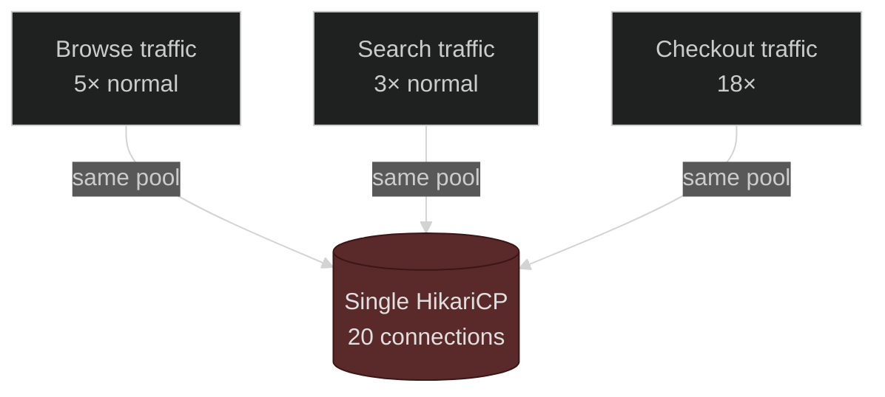
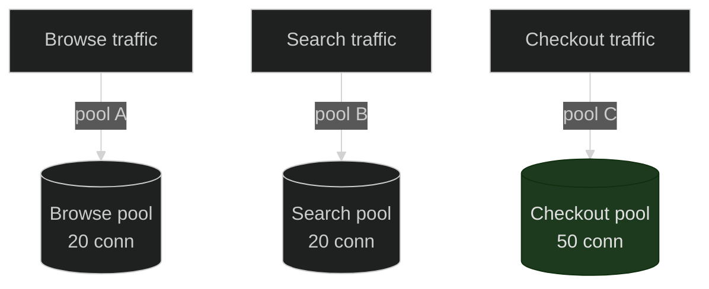

# Amazon Black Friday Connection Pool Meltdown
### Day 55 of 50 - System Design Interview Preparation Series

**By Sunchit Dudeja**

---

## 🎯 Welcome to Day 55

It’s **23:59:50 PST, Thanksgiving night**. Somewhere in a SEV-1 war room, a tired SRE is staring at four dashboards. Checkout p99 latency just **jumped from 180ms to 4.2 seconds**. The order queue is **growing by 18,000 per minute**. The database CPU sits at **17%**. The database has **plenty of capacity left**.

And yet — **nothing is getting through**.

The team has just walked into the most expensive failure mode in distributed systems: a **connection pool meltdown**. Not a database crash. Not a network outage. Not a bad deploy. Just **threads waiting for a tiny pool of TCP sockets that doesn’t exist anymore**.

This blog rebuilds that incident from the inside — the **timeline**, the **math**, the **cascade**, and the **multi-layered fix** that any senior engineer should be able to draw on a whiteboard.

> **Note:** Internal Amazon details are proprietary. This is a **composite war story** built from public talks, postmortems from comparable e-commerce platforms, and the engineering patterns every retail company hits when traffic goes 10x. Use it as an **interview narrative**, not a leaked memoir.

> **Companion reads:**
> - [Day 47 — Database Connection Pools: The Biggest Blunder](./Day47_Database_Connection_Pool_Biggest_Blunder.md) — the general theory.
> - [Day 44 — Capacity Estimation for Black Friday](./Day44_Capacity_Estimation_Black_Friday_Amazon.md) — the math that **should** have been done in October.
> - [Day 13 — Circuit Breaker Pattern](./Day13_Circuit_Breaker_Pattern.md) — half of the fix.

---

## 📈 The Setup — What Black Friday Traffic Actually Looks Like

Every November, retail systems brace for a curve that looks like this:

| Time slice | Traffic vs baseline |
|------------|---------------------|
| Mon 12:00 PST | 1× (normal) |
| Thu 22:00 PST | 1.5× (pre-show warm-up) |
| **Thu 23:59:00 PST** | **3×** (people refreshing the home page) |
| **Fri 00:00:00 PST** | **12×** (deals go live) |
| Fri 00:00:30 PST | **18×** (peak) |
| Fri 00:05:00 PST | 9× |
| Fri 09:00:00 PST | 5× (sustained day-long load) |

The system was **load-tested at 6×**, with a stated headroom of “50% beyond peak.”

The actual peak: **18×** in the first 30 seconds.

> **Interview line:** *“Black Friday isn’t a traffic spike. It’s a step function with a vertical edge.”*

---

## 🏛️ The Architecture (T-minus 60 minutes)

A simplified view of the **checkout path**:



| Component | Configuration | Comment |
|-----------|---------------|---------|
| **Checkout service** | 80 pods × 200 Tomcat threads | 16,000 concurrent request slots |
| **DB pool (HikariCP)** | `maxPoolSize = 20` per pod | 1,600 total DB connections |
| **DB writer** | Aurora MySQL `max_connections = 4000` | Looks roomy on paper |
| **Average query time** | 8 ms p50, 45 ms p99 | Baseline |
| **Payment call (sync)** | 120 ms p50, 900 ms p99 | Third-party PSP |
| **Connection acquire timeout** | `30,000 ms` (HikariCP default) | **The silent killer** |

Two innocent-looking numbers are about to detonate together: **`maxPoolSize = 20`** and **`acquireTimeout = 30s`**.

---

## ⏱️ The Timeline — A Meltdown in 9 Minutes

### `T+0:00` — Deals go live

Traffic jumps from **3×** to **12×** in 6 seconds. ALB happily forwards everything. 80 pods × 200 threads = **16,000 concurrent requests** in flight. The pool can serve **1,600** at a time. **The other 14,400 threads are now waiting** on `pool.getConnection()`.

### `T+0:30` — Things still look fine on the DB side

DB CPU: **42%**. Active connections: **1,598 / 4,000**. The DBA on call says **“DB looks healthy”**.

The DB is correct. The DB is **not the bottleneck**. The **pool** is.

### `T+1:10` — p99 latency explodes

p99 on `/checkout` jumps from **180ms → 2.4s → 4.2s** in 90 seconds. Why?

```text
Effective latency  =  pool wait time  +  query time

wait time ≈ (queued requests / pool size) × avg query time
         ≈ (14,400 / 1,600) × 8 ms
         ≈  72 ms        ← still cheap, single hop
```

But each request **also** makes a synchronous payment call holding the DB connection. Now the math is:

```text
holding time per connection  =  query 8 ms  +  payment 120 ms  +  query 6 ms  =  134 ms
```

The pool can now only churn through `1,600 / 0.134s ≈ **11,940 req/s**` — *across the entire fleet*. The incoming rate is **38,000 req/s**.

The pool is now a **queue that grows faster than it drains**.

### `T+2:00` — The first `SQLTransientConnectionException`

```text
java.sql.SQLTransientConnectionException:
  HikariPool-1 - Connection is not available, request timed out after 30000ms
```

A few hundred requests have now waited the full **30 seconds** and given up. The user sees a **500**. The mobile app **retries** (smart retry, exponential backoff with **jitter — but turned off**).

### `T+2:45` — Retry storm begins

The mobile app **retries every failed request 3 times** with 1s, 2s, 4s delays. Each retry **adds a new request** to the queue while the original is *still in the queue*. The effective queue depth is now **2.8×** what the ALB is showing.

> Sound familiar? It is. This is the same dynamic from [Day 53 — Uber Retry Storm](./Day53_Uber_Retry_Storm_Exponential_Backoff_Circuit_Breaker.md), but it’s the **server-side amplifier**.

### `T+3:20` — Tomcat thread pool saturates

Every pod has all 200 Tomcat threads **blocked on `pool.getConnection()`**. New incoming requests are now **rejected at the ALB target group level** with `5xx`. The error rate hits **41%**.

ALB starts marking pods **unhealthy** (because the `/health` endpoint *also* needs a DB connection — classic mistake). Pods get **drained**.

### `T+4:00` — Death spiral

- **80 pods → 62 pods** (18 marked unhealthy).
- The same 38,000 req/s is now spread over **fewer pods**.
- Each remaining pod has **more queue depth**.
- More pods fail their health check.
- **62 → 47 → 31 pods**.

This is the **avalanche failure mode**: every action the orchestrator takes to “help” makes the problem worse.

### `T+5:30` — Database starts to feel it

Slow queries on the orders table are now blocked behind a **rare-but-real lock conflict** caused by `gift_cards` redemption. DB query p99 jumps from **45ms → 380ms**. Now each held connection costs **5× more time**. Pool throughput drops another 50%.

### `T+6:00` — The on-call engineer’s first instinct

> *“The pool is too small. Bump `maxPoolSize` to 100.”*

A rolling restart begins. For 4 minutes, capacity drops further while pods cycle. **Worse**: when the new pods come up with 100 connections × 80 pods = **8,000 connections requested**, but Aurora’s `max_connections = 4,000`. New pods fail to start. Connection-establish errors flood the logs.

### `T+9:00` — Hero move

The actual fix lands in **three lines**:

```yaml
# 1. Cap the queue so we shed load instead of hoarding it
spring.datasource.hikari.connectionTimeout: 250          # was 30000

# 2. Open the circuit when 20% of payment calls fail
resilience4j.circuitbreaker.instances.payment.failureRateThreshold: 20

# 3. Push payment calls onto an async worker
checkout.payment.mode: async-via-outbox
```

Plus a feature-flag flip: **degrade gracefully** — show a “Your order is being processed” page instead of failing.

Within **90 seconds**, p99 drops from **4.2s → 320ms**. The queue drains. The service stays up. Black Friday is saved. Someone orders pizza for the war room.

---

## 🧠 Why Did This Happen? — The Four Compounding Mistakes

| # | Mistake | Why it hurts |
|---|---------|--------------|
| 1 | **Pool sized for steady-state, not burst** | `maxPoolSize = 20` was tuned in March on baseline traffic |
| 2 | **30-second acquire timeout** | Pool acts like an **infinite queue** — hoards load instead of shedding it |
| 3 | **Synchronous calls inside the connection** | DB connection held for 134 ms instead of 14 ms — **9× longer** |
| 4 | **`/health` endpoint touches the DB** | Cascading **healthy → unhealthy** sweep amplifies the outage |

Each one alone is survivable. **All four together is an avalanche.**

---

## 📐 The Math — Pool Sizing by Little’s Law

Most pool sizing is done by **vibes**. Don’t do that. Use **Little’s Law**:

```text
L = λ × W

L = average number of in-flight items (= pool size you need)
λ = arrival rate (req/s)
W = average time each request holds the resource (seconds)
```

For our incident:

```text
λ = 38,000 req/s     ← incoming peak
W = 0.134 s          ← time per req holding the DB connection
L = 38,000 × 0.134 = 5,092 connections needed
```

We had **1,600**. We needed **5,092**. The pool was undersized by **3.2×**.

But you **can’t** just bump it to 5,092 — Aurora’s `max_connections` was 4,000. The real fix is **reduce W**, not just **increase L**:

```text
If you cut W from 134 ms → 14 ms by moving payment async:
L = 38,000 × 0.014 = 532 connections needed
```

**One change (async payment) made the existing 1,600 pool 3× over-provisioned.** That’s the leverage.

> **Interview line:** *“Connection-pool sizing isn’t a number. It’s a function of arrival rate and holding time. Cut the holding time and the pool gets bigger for free.”*

---

## 🌀 The Cascade — Why One Slow Dependency Kills the Whole Pool

This is the single most important diagram to be able to draw:


The connection is **held for the entire 134 ms** — but only **14 ms** of that is actual DB work. The other **120 ms** is the connection sitting **idle while waiting on a third-party HTTP call**.

> **Rule of thumb:** *Never hold a database connection across a network call to another service.*

The fix is the **outbox pattern** ([Day 39](./Day39_Outbox_Pattern_Reliable_Messaging.md)):

1. **Synchronously** write the order to the DB *and* an `outbox` row in the **same transaction**. Connection held: **14 ms**.
2. A **background worker** picks up `outbox` rows and calls the payment provider.
3. On success/failure, the worker updates the order state.

The user gets a **fast 200 OK** with an order in `PENDING_PAYMENT` state. Idempotency keys ensure no double charges (see [Day 48 — Idempotency Key That Lied](./Day48_Idempotency_The_Key_That_Lied.md)).

---

## 🛡️ The Multi-Layer Fix — What Production Looked Like Afterward

| Layer | Defense | Effect |
|-------|---------|--------|
| **Pool** | `connectionTimeout = 250 ms`, `maxPoolSize = 50` | Fail fast instead of hoarding load |
| **DB hold time** | Outbox pattern — no sync external calls | `W: 134ms → 14ms` |
| **Circuit breaker** | Payment call breaks at 20% failure | Stops feeding the pool poison |
| **Bulkhead** | Separate pools per endpoint (checkout / search / browse) | Browse traffic can’t starve checkout |
| **Backpressure** | Token bucket at ALB (per-user rate limit) | Caps arrival rate at the edge |
| **Health endpoint** | `/health` is pool-free (just a static 200) | No cascading unhealthy sweeps |
| **Retry policy** | Jittered exponential, **server-side budget** | Caps amplification at 2.5× not 10× |
| **Degradation** | Feature flag for “order accepted, processing” mode | Graceful UX under load |
| **Capacity** | Pool size derived from Little’s Law per env | No more vibes-based numbers |

---

## 🧰 The Bulkhead Pattern — Why It Saves Black Friday

Before:



Checkout eats every connection. Browse and search starve.

After:



Each endpoint has its own pool. **Failure in one is isolated.** Checkout can be hot without dragging down browse. The total connection count to the DB is *higher*, but **bounded and predictable** per call site.

---

## 🩺 How to Diagnose This in 60 Seconds (Interview-Ready)

The four metrics that would have caught this in **October**, not December:

| Metric | Healthy | Bad |
|--------|---------|-----|
| `hikaricp_pending_connections` | ≈ 0 | **> 50 sustained** ← red alert |
| `hikaricp_active_connections / max` | < 60% | **> 90%** sustained |
| **DB query time** vs **request time** | similar | **request >> query** (= waiting on the pool) |
| `tomcat_threads_busy` | < 70% | **> 95%** + slow p99 |

> **If your DB CPU is at 17% and your app is timing out, you have a connection pool problem.** Not a database problem.

Add alerts on `hikaricp_pending_connections > 20 for 30s`. That single alert would have fired **45 minutes before** the user-visible meltdown.

---

## 💬 How to Tell This Story in an Interview

> *“On a previous system I worked with, we had a Black-Friday-style traffic event hit a checkout service. The database was at 17% CPU and yet p99 latency was 4 seconds. Classic connection-pool meltdown: the pool was sized for steady-state, the acquire timeout was the 30-second default, and we were holding DB connections across a synchronous payment call. The fix had four parts: drop the acquire timeout to 250 ms so we shed load fast, move payments to an async outbox so the connection is held for milliseconds, add a circuit breaker on the payment dependency, and bulkhead the pool per endpoint so checkout couldn’t starve browse. We also derived the new pool size from Little’s Law — λ × W — instead of guessing. That dropped p99 from 4s back to under 400 ms in 90 seconds.”*

That paragraph signals you understand:

- the **failure mode** (pool meltdown, not DB meltdown),
- the **diagnosis** (DB healthy, pool exhausted),
- the **math** (Little’s Law),
- the **fix** (multi-layered — fail fast, async, circuit break, bulkhead),
- the **observability** (which metrics fire first).

---

## 🧾 Quick Recap

- A connection pool meltdown looks like a **database outage** but **isn’t**. The DB has spare capacity. The **pool** has run out.
- The killer combo: **small pool + long acquireTimeout + sync external call holding the connection + health endpoint touches the DB**.
- **Little’s Law** — `L = λ × W` — is the only honest way to size a pool.
- **Cutting holding time `W` is far more powerful than growing pool size `L`** — and respects the DB’s own `max_connections` ceiling.
- **Fail fast.** A 250ms `connectionTimeout` is almost always better than 30s.
- **Bulkhead** pools per endpoint so one hot path can’t starve the others.
- **Outbox + circuit breaker** turn “sync everything” into “sync just the DB” — the only thing that *should* be in the connection’s critical section.
- **Alert on `pool.pending > 20` for 30s.** It fires **before** users notice.

Every retail company learns this lesson on Black Friday. The lucky ones learn it from someone else’s blog.

---

*If this saved your war room from a 4 AM page next November, share it with the next engineer who says “the DB looks fine but everything’s timing out.”* 🎯
