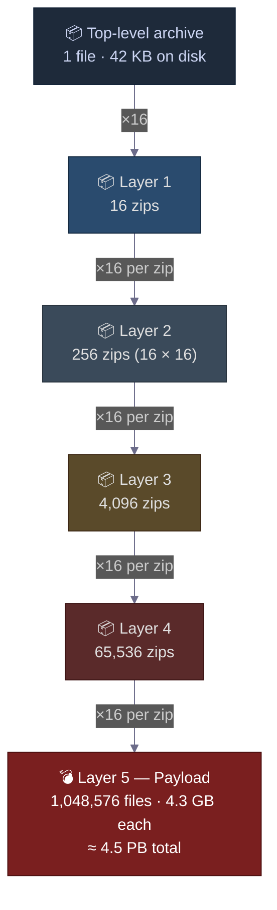

# The 42 KB Upload That Detonates Into 4.5 Petabytes: Decompression Bombs and the Architect's Defense Playbook
### Day 56 of 50 - System Design Interview Preparation Series

**By Sunchit Dudeja**

---

## 🎯 The Core Idea

A **decompression bomb** (popularly known as a **zip bomb**) is a tiny archive — sometimes as small as **42 KB** — that, when fully extracted, expands to **4.5 petabytes** of data. That is an amplification ratio of roughly **100,000,000 : 1**.

The most famous example is **42.zip**, structured like a Russian Matryoshka doll: 5 nested layers, each layer containing 16 identical zip files, with the deepest layer holding ~1 million highly-compressible payload files.

It is not malware in the classic sense. It contains **no exploit code**. Its weapon is the **gap between bytes-on-disk and bytes-in-memory** — the exact gap your file-upload endpoint, antivirus scanner, mail gateway, and CI pipeline all rely on being small.

The architect's move is one sentence:

> **Never trust a compressed file's claimed size. Enforce a hard cap on **decompressed bytes, recursion depth, and entry count** — *before* any of it lands on disk or in RAM.**

This is the same defense pattern that protects you from **billion-laughs XML attacks**, **GraphQL query bombs**, **regex catastrophic backtracking**, and **JSON depth bombs**. They are all the same class of bug: **algorithmic complexity attacks** that exploit the difference between input size and processing cost.

---

## 🧠 Why You Should Care

Every modern backend touches user-uploaded archives somewhere:

- **File-upload endpoints** that scan attachments for malware.
- **Mail servers** that inspect compressed attachments.
- **Cloud functions** (Lambda, Cloud Run) triggered on object storage uploads.
- **CI/CD pipelines** that unpack build artifacts.
- **Backup agents** that walk every file on a filesystem.
- **Image / document preview services** that open uploaded PDFs, DOCX, or PPTX files (which are all zip archives under the hood).

A single carelessly-written `unzip()` call in any of those code paths is the difference between "user uploads a 42 KB file" and "production filesystem fills, all writes fail, on-call gets paged at 3 AM, MTTR measured in hours."

The interview question that gets asked here — *"You're building a public file-upload service. What can go wrong with archives?"* — is testing one thing: **do you know that archive size is a lie?**

> **Companion reads:**
> - [Day 35 — Distributed Systems Failure Modes](./Day35_Distributed_Systems_Failure_Modes_HLD.md) — the broader catalogue this attack belongs to.
> - [Day 13 — Circuit Breaker Pattern](./Day13_Circuit_Breaker_Pattern.md) — the same "fail fast on suspicious behavior" instinct.
> - [Day 57 — Rate Limiting Algorithms](./Day57_Rate_Limiting_Algorithms_Fixed_Window_Boundary_Bug.md) — the request-level cousin; this post is the **bytes-level** equivalent.

---

## ❌ The Developer Mistake — "Just Unzip It"

The textbook upload handler:

```java
// THE NAIVE VERSION — DO NOT SHIP THIS
public void handleUpload(MultipartFile file) throws IOException {
    File dest = new File("/var/uploads/" + file.getOriginalFilename());
    file.transferTo(dest);

    try (ZipInputStream zis = new ZipInputStream(new FileInputStream(dest))) {
        ZipEntry entry;
        while ((entry = zis.getNextEntry()) != null) {
            File out = new File("/var/uploads/extracted/" + entry.getName());
            Files.copy(zis, out.toPath(), StandardCopyOption.REPLACE_EXISTING);
        }
    }
}
```

Twelve lines. Looks reasonable. **It fails for four independent reasons**, and any one of them is fatal.

| # | Failure | Why it kills you |
|---|---------|------------------|
| 1 | **No decompressed-size cap** | A 42 KB upload writes **4.5 PB** to `/var/uploads/extracted/`. Your disk fills in **seconds**. |
| 2 | **No recursion limit** | If the inner entries are also zips and you recurse, you descend through 5 layers and write **1 million files**. |
| 3 | **No entry-count limit** | Even a single-layer bomb (no nesting) can claim **65,535 entries** — the zip format's maximum — and exhaust your inode table. |
| 4 | **`Files.copy` reads the whole stream** | The JVM dutifully unzips into RAM/disk as fast as it can. There is **no early-abort signal** when something is wrong. |

Each is individually survivable. **All four together** is the difference between "uploader returns 400" and "the entire upload service is down for an hour while you `rm -rf` 1 million 4.3 GB files."

---

## 🔬 How the Amplification Actually Works (No Magic)

The 100,000,000 : 1 ratio is not from any exotic compression. It is from two boring properties of the DEFLATE algorithm and the zip format, multiplied together.

### 🔹 Property 1 — DEFLATE eats repetition for breakfast

A file of all zeros (or any single repeated byte) compresses to a tiny **back-reference**: *"the next 4.3 GB is the same byte, repeated."* That alone gives roughly **1000 : 1** compression for the innermost payload file.

This is not a zip-specific trick. **gzip, zstd, lz4, brotli** — every general-purpose compressor will produce a similarly small output for highly repetitive input. The compressor is doing its job correctly. The asymmetry is *intrinsic to information theory*: low-entropy input has a small Kolmogorov-complexity representation.

### 🔹 Property 2 — Nested archives multiply the ratio

A zip file **cannot literally contain itself** (the bytes wouldn't match), but it can contain **16 identical copies** of the layer below it. The compressor sees those 16 identical blobs and stores them once with 16 references. That gives roughly another **~16 : 1** per layer.

Stack 5 layers of that on top of the 1000 : 1 inner payload and you get the full amplification.

> **The architect-grade insight:** This is **not a zip vulnerability**. The zip format is doing exactly what it was designed to do. The vulnerability is in **systems that decompress without a budget**.

### 🔹 A note on modern variants

42.zip is a **recursive** bomb — it only "detonates" if a scanner descends through every nested layer. A simple "stop after 2 levels of recursion" rule defuses it entirely.

Newer bombs (e.g., the **non-recursive** designs published by David Fifield in 2019) achieve massive expansion in a **single decompression pass** by exploiting overlapping local file headers within one zip. Depth limits do nothing against those. **The only universal defense is a hard cap on decompressed bytes.**

---

## 🌳 The Matryoshka Structure (Mermaid Tree)

The 42.zip structure visualised. Each box represents *one* zip file; the `×16` badge means "this node has 16 children of the type below."



### 📊 The Exponential Math, Step by Step

| Layer | Number of zip files at this layer | If fully extracted, total bytes |
|-------|----------------------------------:|--------------------------------:|
| 0 (top) | 1 | **42 KB** on disk |
| 1 | 16 | (still bytes of zips — payload is deeper) |
| 2 | 256 | (still zips) |
| 3 | 4,096 | (still zips) |
| 4 | 65,536 | (still zips) |
| 5 (payload) | **1,048,576** files of 4.3 GB each | **≈ 4.5 PB** |

> **The hockey-stick effect:** the disk footprint stays tiny through layers 0–4. The entire 4.5 PB explosion happens **only at the final layer**. That is why a scanner that "looks reasonable" through the first few levels suddenly takes down the host.

---

## 💥 What Actually Happens When Your Server Tries to Extract It

The failure mode depends on what the server does on upload. Five concrete scenarios.

### 🔸 Scenario 1 — Mail / file-upload scanner

The scanner extracts attachments to a temp directory to feed each file to the AV engine.

```
T+0s    upload accepted (42 KB)
T+0.3s  layer 1 extracted → 16 zips (~700 KB on disk)
T+1s    layer 2 extracted → 256 zips (~11 MB)
T+10s   layer 3 extracted → 4,096 zips (~180 MB)
T+90s   layer 4 extracted → 65,536 zips (~3 GB)
T+???   layer 5 begins → writes start failing as disk hits 100%
```

The mail queue backs up. Legitimate mail stops flowing. The AV process is killed by the OOM killer. The **only signal** that anything was wrong before the disk filled was the **exponential growth in extracted size per layer** — which, if measured, would have tripped a circuit breaker.

### 🔸 Scenario 2 — Serverless extraction (Lambda / Cloud Functions)

```
- Lambda triggered by S3 PutObject
- Function downloads the zip, calls zipfile.ZipFile.extractall() to /tmp
- /tmp on Lambda is capped at 512 MB → extractall() throws after ~30s
- Function times out, retries 3× by default
- Attacker uploads the same 42 KB file 1000 times → 3000 failed Lambda invocations
- AWS bill for one afternoon: hundreds of dollars per attacker per region
```

**This is the "financial DoS" variant.** The attacker doesn't need to take you down — they just need to **make your AWS bill an executive incident**.

### 🔸 Scenario 3 — CI/CD artifact handling

A developer (or attacker who got commit access to a low-privilege repo) pushes a zip as a build artifact. The CI runner unpacks it to run tests.

```
- Build agent disk fills
- Disk-full causes every other build on the same agent to fail
- The agent is marked unhealthy by the orchestrator and removed from the pool
- Build queue depth doubles → cascading slowdown across the whole org
```

### 🔸 Scenario 4 — Backup agent walking a filesystem

If an attacker can write a bomb to a directory the backup agent watches, the agent itself becomes the amplifier. It dutifully reads every file it finds and ships them to the backup destination — which fills, fails the backup window, and triggers retention failures.

### 🔸 Scenario 5 — Document preview service

`.docx`, `.xlsx`, `.pptx`, `.odt`, `.epub`, `.apk`, `.jar` are **all zip archives**. A preview service that opens "documents" is implicitly an unzipper. A bomb dressed as `quarterly_report.docx` will detonate inside a preview worker that does not enforce decompression budgets.

> **The architect-grade observation:** "We don't accept zip uploads" is not a defense. **Every Office document, Android APK, and Java JAR is a zip.** If you process *any* of those, you are exposed.

---

## 🛡️ The Architect's Defense Playbook

Defense in depth. Each layer assumes the one before it failed.

```mermaid
%%{init: {'theme': 'dark', 'themeVariables': {
  'primaryTextColor': '#cdd6f4',
  'lineColor': '#6c6c8a'
}}}%%
graph LR
    Upload["📥 Upload"]
    L1["🚪 Layer 1<br/>Pre-flight checks<br/>(claimed entries, depth)"]
    L2["🧮 Layer 2<br/>Streaming decompression<br/>with byte budget"]
    L3["📊 Layer 3<br/>Compression ratio cap<br/>(per entry)"]
    L4["🧱 Layer 4<br/>Sandbox<br/>(container/cgroup quota)"]
    L5["🚨 Layer 5<br/>Telemetry & alerts<br/>on suspicious ratios"]

    Upload --> L1 --> L2 --> L3 --> L4 --> L5

    style Upload fill:#1e2a3a,stroke:#0f1f33,color:#cdd6f4
    style L1 fill:#2a4b6e,stroke:#152a40,color:#e0e0e0
    style L2 fill:#3a4a5a,stroke:#2a3540,color:#e0e0e0
    style L3 fill:#5a4a2a,stroke:#3d2815,color:#e0e0e0
    style L4 fill:#2e5a3e,stroke:#1a3524,color:#e0e0e0
    style L5 fill:#5a2a2a,stroke:#3d1515,color:#e0e0e0
```



### The seven concrete rules

| # | Rule | Why it matters |
|---|------|----------------|
| 1 | **Hard cap on total decompressed bytes** (e.g., 100 MB) | The single most important defense. Works against **every** known bomb — recursive, non-recursive, future variants. |
| 2 | **Hard cap on per-entry compression ratio** (e.g., 100 : 1) | Catches single-file bombs (a 1 MB entry that decompresses to 10 GB). |
| 3 | **Hard cap on entry count** (e.g., 10,000 per archive) | Defends against inode-exhaustion attacks. |
| 4 | **Hard cap on recursion depth** (e.g., 2 levels) | Defuses classic Matryoshka bombs cheaply. |
| 5 | **Stream, don't materialize** | Read decompressed bytes through a `LimitInputStream` and abort the moment the budget is exceeded — **before** anything hits disk. |
| 6 | **Sandbox the decompression** in a container with a small disk quota (e.g., `tmpfs` mounted at 200 MB) and a CPU-time limit | Even if all five rules above have a bug, the blast radius is one ephemeral worker, not the host. |
| 7 | **Emit metrics on compression ratio and abort rate** | A spike in `decompress_aborted_total{reason="ratio_exceeded"}` is the earliest signal you're under attack. Wire it to an alert. |

> **Rule 1 alone defeats 42.zip and every variant.** Everything else is depth.

---

## 💻 Reference Implementation — Safe Extraction in Java

A drop-in `safeExtract` that enforces all four hard caps and streams data through a byte budget. The whole point: **abort early**, never let an unsafe entry touch disk.

```java
import java.io.*;
import java.nio.file.*;
import java.util.zip.*;

public final class SafeExtractor {

    // Tune these for your service. These are conservative defaults.
    private static final long MAX_TOTAL_BYTES   = 100L * 1024 * 1024; // 100 MB
    private static final int  MAX_ENTRIES       = 10_000;
    private static final int  MAX_DEPTH         = 2;
    private static final long MAX_RATIO         = 100; // decompressed:compressed

    public static void safeExtract(Path zipPath, Path destDir) throws IOException {
        extractInternal(zipPath, destDir, 0, new long[]{0});
    }

    private static void extractInternal(Path zipPath, Path destDir,
                                        int depth, long[] totalBytes) throws IOException {
        if (depth > MAX_DEPTH) {
            throw new SecurityException("Recursion depth exceeded: " + depth);
        }

        int entryCount = 0;
        try (ZipInputStream zis = new ZipInputStream(
                new BufferedInputStream(Files.newInputStream(zipPath)))) {

            ZipEntry entry;
            while ((entry = zis.getNextEntry()) != null) {
                if (++entryCount > MAX_ENTRIES) {
                    throw new SecurityException("Too many entries: " + entryCount);
                }

                Path target = safeResolve(destDir, entry.getName()); // also blocks ../ traversal

                if (entry.isDirectory()) {
                    Files.createDirectories(target);
                    continue;
                }

                Files.createDirectories(target.getParent());

                // Stream-copy with a hard byte budget and a per-entry ratio check.
                long compressedSize = Math.max(1, entry.getCompressedSize());
                long perEntryCap    = Math.min(MAX_TOTAL_BYTES - totalBytes[0],
                                               compressedSize * MAX_RATIO);

                try (OutputStream os = Files.newOutputStream(target)) {
                    byte[] buf = new byte[8192];
                    long writtenForEntry = 0;
                    int n;
                    while ((n = zis.read(buf)) > 0) {
                        writtenForEntry += n;
                        totalBytes[0]   += n;
                        if (writtenForEntry > perEntryCap) {
                            throw new SecurityException(
                                "Compression ratio exceeded for " + entry.getName());
                        }
                        if (totalBytes[0] > MAX_TOTAL_BYTES) {
                            throw new SecurityException(
                                "Total decompressed size exceeded: " + totalBytes[0]);
                        }
                        os.write(buf, 0, n);
                    }
                }

                // If the extracted file is itself a zip, recurse — bounded by MAX_DEPTH.
                if (target.toString().toLowerCase().endsWith(".zip")) {
                    extractInternal(target, target.getParent(), depth + 1, totalBytes);
                }
            }
        }
    }

    /** Defends against zip-slip (../ in entry names). */
    private static Path safeResolve(Path destDir, String entryName) throws IOException {
        Path resolved = destDir.resolve(entryName).normalize();
        if (!resolved.startsWith(destDir.toAbsolutePath().normalize())) {
            throw new SecurityException("Zip-slip detected: " + entryName);
        }
        return resolved;
    }
}
```

**Why this shape:**

1. **`totalBytes` is a shared mutable budget** across recursion. The whole archive — including all nested layers — shares a single 100 MB cap.
2. **The byte budget is checked inside the read loop**, not at the end. The attacker cannot wait until 4 PB is written to discover the cap.
3. **The per-entry ratio cap** stops a single bloated entry, even if the archive only has one file.
4. **`safeResolve` also defends against the unrelated *zip-slip* vulnerability** (entry names like `../../etc/passwd`). Free defense, same code path.
5. **Recursion is bounded**, but it is also the **first thing to set to 0** if you don't need it. Most applications shouldn't auto-recurse at all.

The same pattern translates directly to Python (`zipfile` + a wrapping `io.RawIOBase` with a counter), Go (`archive/zip` + `io.LimitReader`), or Node (`yauzl` + a transform stream).

---

## ⚖️ Junior vs Architect — Side by Side

| Junior approach | Architect approach |
|-----------------|---------------------|
| `unzip` the upload, then check sizes | Stream-decompress with a **byte budget**; abort before anything lands |
| Trusts `ZipEntry.getSize()` from the archive header | Treats the header as **attacker-controlled metadata**; counts bytes actually read |
| Recurses into nested archives unconditionally | **Depth-capped recursion**, or no recursion at all |
| Single layer of validation in the app | **Defense in depth**: app caps + container disk quota + cgroup memory limit + metrics |
| Returns HTTP 500 on failure | Returns HTTP 422 with a specific error code (`archive_too_large`, `ratio_exceeded`) that ops can grep for |
| No telemetry on extraction | Counters: `decompress_bytes_total`, `decompress_aborted_total{reason}`, `decompress_ratio_p99` |
| Same code path for `.zip` and "trusted" formats like `.docx` | Treats **every zip-based format** (docx, xlsx, apk, jar) with the same caps |

---

## 🟣 The Simpler Version — Explain It Like the Reader Has 2 Minutes

### The trap

> *"A 42 KB file someone uploaded just filled my 4 TB disk in under a minute."*

That's not a bug in the OS, the language, or the zip library. It's a bug in **your code**, which treated a compressed file's size as if it told you anything useful about how much memory and disk you needed.

### The mental model

> **A compressed file is a recipe for bytes, not a measurement of them.**

A tiny recipe can produce a giant cake. If you trust the recipe's weight as the cake's weight, you'll build a kitchen that collapses the first time someone hands you a recipe for a million cakes.

### The right way

> **Decide in advance how big a cake your kitchen can handle (say, 100 MB). Start baking. The moment the scale crosses 100 MB, throw it out and tell the customer "no."**

That's it. Stream the bytes through a counter. Stop when the counter says stop. Everything else — depth limits, ratio caps, sandboxes — is **defense in depth** behind that one rule.

### The one-line summary

> 🎯 **Never trust the claimed size of a compressed file. Enforce a hard cap on decompressed bytes — and abort the moment it's exceeded, before anything touches disk.**

---

## 💬 How to Talk About It in an Interview

When asked *"You're building a file-upload service. What can go wrong?"* — a strong answer includes:

> "Three classes of problems. First, **classic file-upload risks** — path traversal (zip-slip), MIME-type spoofing, malware. Second, **algorithmic complexity attacks** — decompression bombs being the canonical example: a 42 KB zip can expand to **4.5 petabytes** if you naively unpack it. And third, **side-channel resource attacks** — a bomb can fill disk, exhaust inodes, OOM-kill the AV scanner, or rack up serverless invocation costs.
>
> The single most important defense against decompression bombs is a **hard cap on total decompressed bytes**, enforced inside a streaming decompression loop — not after extraction. I'd back that up with per-entry compression-ratio limits, entry-count caps, and recursion-depth limits, all running inside a sandboxed worker with a small `tmpfs` disk quota and a cgroup memory limit. That way the failure of any single layer is contained.
>
> Two architectural details that trip up most candidates: **every Office document, APK, and JAR is a zip** — so 'we don't accept zip uploads' is not a defense. And the `compressed_size` and `uncompressed_size` fields in the zip header are **attacker-controlled** — your code has to count the bytes it actually reads, not the bytes the archive claims it will produce.
>
> Three architectural levers make this safe: **stream don't materialize, budget don't trust, sandbox don't centralize.**"

That paragraph signals you understand:
- The **amplification math** (the reason caps matter),
- **Untrusted metadata** (the reason for counting bytes yourself),
- **Format pervasiveness** (the reason for treating docx/apk/jar identically),
- **Defense in depth** (the reason for sandbox + metrics + caps),
- **Operational reality** (specific error codes, specific metrics).

That is the **architect-level answer** — the one that wins the round.

---

## 🧾 Quick Recap

- **The trap:** A 42 KB upload can expand to 4.5 PB. The amplification is mathematical, not magical — DEFLATE compresses repetition extremely well, and nesting multiplies the effect.
- **The threat model:** Anything that decompresses untrusted input — mail scanners, upload endpoints, serverless functions, CI runners, document preview services, backup agents.
- **Modern variants** (non-recursive bombs) defeat depth limits. **Only a hard byte cap defeats all variants.**
- **The seven defenses:**
  1. Cap total **decompressed bytes**.
  2. Cap per-entry **compression ratio**.
  3. Cap **entry count**.
  4. Cap **recursion depth** (or disable recursion).
  5. **Stream**, don't materialize — abort inside the read loop.
  6. **Sandbox** the worker (container, cgroup, `tmpfs` quota).
  7. **Telemetry** — count aborts, alert on ratio spikes.
- **The reminder:** Every Office document, Android APK, and Java JAR is a zip. The defense applies to all of them.
- **The mental model:** **A compressed file is a recipe for bytes, not a measurement of them.**

Every system that processes user uploads eventually rediscovers this pattern. The lucky ones learn it from a blog. The unlucky ones learn it from a production incident where a 42 KB email attachment took down the mail server for an entire Friday afternoon.

---

*If this saved you from shipping a file-upload endpoint that trusts a compressed file's claimed size — share it with the next engineer who says "we'll just call `unzip` on it."* 🎯
