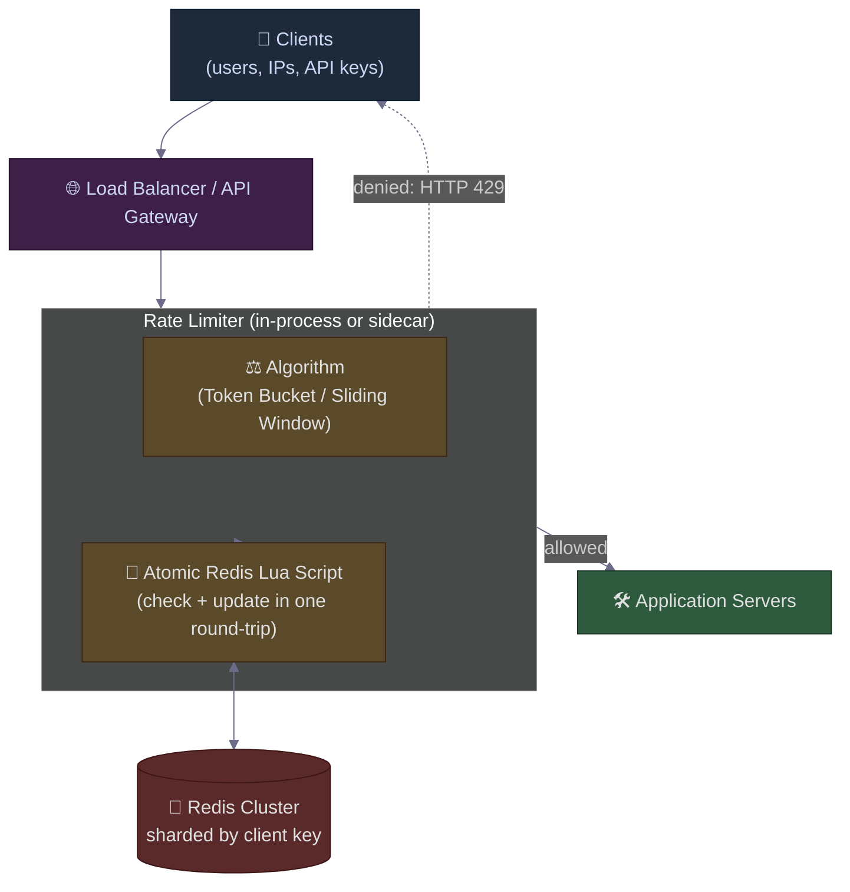

# The Rate Limiter That Let 2× Traffic Through: Why Fixed Window Counters Lie at the Boundary
### Day 57 of 50 - System Design Interview Preparation Series

**By Sunchit Dudeja**

---

## 🎯 The Core Idea

A rate limiter answers one question on every request:

> *"Has this client (user, IP, API key) sent more than `N` requests in the last `T` seconds?"*

Sounds trivial. It is not. The most common implementation — a **fixed window counter** — silently allows **up to 2× the configured limit** at the boundary between windows. Your "100 requests per minute" limit becomes "200 requests in 2 seconds" at exactly the wrong moment.

The architect's move is to know **four algorithms**, the **failure mode of each**, and **which one to reach for in which situation**:

| Algorithm | Memory | Accuracy | Burst behavior |
|-----------|--------|----------|----------------|
| **Fixed Window Counter** | 1 int per client | ❌ 2× burst at boundary | Allows bursts at window edges |
| **Sliding Window Log** | O(N) per client | ✅ Exact | No burst — costly memory |
| **Sliding Window Counter** | 2 ints per client | ✅ ~99% accurate | Smooths bursts |
| **Token Bucket** | 2 ints + timestamp | ✅ Exact | **Allows controlled bursts** (often desired) |
| **Leaky Bucket** | 1 queue + timer | ✅ Exact | **Smooths to constant rate** (no bursts) |

> **One-line intuition:** *Fixed window counters are easy. Token buckets are right. Leaky buckets are strict. Sliding windows are precise. Pick by the **burst behavior** you want — not by which is easiest to code.*

---

## 🧠 Why You Should Care

Rate limiting is the **first line of defense** for every public API. It is what prevents:

- A buggy client from accidentally DDoS-ing your service.
- A scraper from draining your database.
- A retry storm (see [Day 53](./Day53_Uber_Retry_Storm_Exponential_Backoff_Circuit_Breaker.md)) from becoming a self-inflicted outage.
- A bad actor from brute-forcing your `/login` endpoint.

It is also one of the **most-asked system design questions** — *"Design a rate limiter"* shows up in interviews at Stripe, Cloudflare, Google, Amazon, and every fintech you can name. The interviewer is testing whether you know the **boundary bug**, the **distributed coordination problem**, and the **burst-vs-smooth trade-off**.

A junior answer of *"I'll use a Redis counter with EXPIRE"* loses the round. That counter has a hole big enough to drive a truck through.

> **Companion reads:**
> - [Day 13 — Circuit Breaker Pattern](./Day13_Circuit_Breaker_Pattern.md) — the downstream defense; rate limiting is the upstream defense.
> - [Day 53 — Uber Retry Storm](./Day53_Uber_Retry_Storm_Exponential_Backoff_Circuit_Breaker.md) — what happens when there is no rate limiter.
> - [Day 48 — Idempotency Key That Lied](./Day48_Idempotency_The_Key_That_Lied.md) — the other half of every "robust API" answer.

---

## ❌ The Developer Mistake — The "Naive Redis Counter"

The typical junior answer:

> *"I'll use Redis. For each user, `INCR rate:{user_id}` on every request and `EXPIRE rate:{user_id} 60` on the first hit. If the counter exceeds 100, return 429."*

The code is six lines. It "works" on a laptop. It is **broken in production**. Here is why.

### 🔴 The Boundary Bug — A 2× Burst Hiding in Plain Sight

Suppose the limit is **100 requests per minute** and the window is `12:00:00 → 12:01:00`.

```text
12:00:59  →  client sends 100 requests   → all allowed (counter: 100/100)
12:01:00  →  window resets, counter = 0
12:01:00  →  client sends another 100   → all allowed (counter: 100/100)

Result: 200 requests in ~1 second across the boundary.
```

The client never crossed the limit **in any single window** — but it sent **2× the rate** the limiter was supposed to enforce. Cloudflare and Stripe documented this exact behavior in their public engineering blogs. It is not a theoretical bug. It is the **default behavior** of every "INCR + EXPIRE" rate limiter ever written.

### 🔴 Three more failures of the naive approach

| # | Failure | Why it kills you |
|---|---------|------------------|
| 1 | **Race condition on first request** | `INCR` succeeds, then the process crashes before `EXPIRE`. The key now lives **forever** at whatever count it hit. |
| 2 | **No fairness across nodes** | If two app servers race on the same key, both may see "99" before either increments past 100. **101 requests are allowed.** |
| 3 | **No burst capacity** | Some APIs *should* allow short bursts (e.g., a UI that fires 5 requests on page load). A pure counter blocks them. |

Each is fixable. **All four together** is the difference between a working rate limiter and a security incident.

---

## 🏛️ The Architect's Approach (High-Level Design)



**The three architectural moves:**

| Move | What it does | Why it matters |
|------|--------------|----------------|
| **1. Run the rate limiter at the edge** | Reject denied requests at the API gateway, **before** they touch business logic | Saves CPU, DB connections, and downstream queue depth |
| **2. Atomic check-and-update** | Use a Redis **Lua script** (single round-trip) so two app servers cannot interleave | Eliminates the race-condition over-allow |
| **3. Pick the algorithm by burst behavior** | Token bucket for "bursty but bounded", leaky bucket for "smooth at all costs", sliding window for "exact count" | The wrong algorithm produces correct-looking but wrong results |

---

## 🔧 The Four Algorithms — How They Actually Work

### 🔹 Algorithm 1 — Fixed Window Counter (the broken one)

```text
key  = "rate:{user_id}:{current_minute}"
count = INCR key
if count == 1: EXPIRE key 60
if count > 100: return 429
```

**Pros:** O(1) memory, dead simple.
**Cons:** **The boundary bug** — 2× the limit at window edges. Use only if you genuinely don't care about precision (e.g., loose abuse detection).

### 🔹 Algorithm 2 — Sliding Window Log (the exact but expensive one)

Store a sorted set of request timestamps per client. On every request:

```text
1. ZREMRANGEBYSCORE  log:{user_id}  -inf  (now - 60s)   ← drop old entries
2. ZADD              log:{user_id}  now  request_id
3. ZCARD             log:{user_id}                       ← current count
4. If count > 100: return 429
```

**Pros:** **Exact** — every request is timestamped, no boundary bug.
**Cons:** O(N) memory per client. A user making 1000 req/min stores 1000 timestamps. **Use only when precision matters more than memory** (security-sensitive endpoints).

### 🔹 Algorithm 3 — Sliding Window Counter (the practical compromise)

Keep **two counters**: current minute and previous minute. Estimate the rate as a **weighted blend**:

```text
estimated_count = current_minute_count
                + previous_minute_count × (1 - elapsed_in_current_minute / 60)
```

**Worked example.** Limit is 100/min. It's `12:01:30` (30s into the current minute).

- Previous minute (12:00:00–12:01:00) saw 80 requests.
- Current minute (12:01:00–12:02:00) so far has 30 requests.
- Estimated rate over the trailing 60s = `30 + 80 × (1 - 30/60)` = `30 + 40` = **70**.

The estimate is **smoother** than a fixed window and uses only **2 integers per client**. Cloudflare published research showing this approximation is accurate to ~99% under realistic traffic. **This is the algorithm most large-scale public APIs actually deploy.**

### 🔹 Algorithm 4 — Token Bucket (the one that allows controlled bursts)

Each client has a "bucket" with capacity `B` (max burst). Tokens are added at rate `R` per second. Each request **consumes one token**. If the bucket is empty → reject.

```text
state: { tokens, last_refill_ts }

on request:
    now = current_time()
    elapsed = now - last_refill_ts
    tokens = min(B, tokens + elapsed × R)     ← refill
    last_refill_ts = now
    if tokens >= 1:
        tokens -= 1
        return allow
    else:
        return deny (429)
```

**Pros:** Allows a **burst of up to `B` requests**, then enforces the steady rate `R`. Matches real user behavior (page load fires 5 requests at once, then idles). This is what **AWS API Gateway**, **Stripe**, and most cloud APIs use.

**Cons:** Slightly more state than a counter. **Worth it.**

### 🔹 Algorithm 5 — Leaky Bucket (the one that smooths everything)

Requests enter a **fixed-size queue**. A worker drains the queue at a **constant rate**. If the queue is full → reject.

```text
              ┌─────────────────┐
  requests →  │ queue (size B)  │  → leak at R req/sec → downstream
              └─────────────────┘
                  (full → 429)
```

**Pros:** Output rate is **perfectly smooth**. Protects fragile downstreams (legacy systems, third-party APIs with strict limits).

**Cons:** Adds **latency** — requests wait in the queue. **Bursts get smoothed, not allowed.** Use when smoothness matters more than throughput.

---

## ⚖️ Token Bucket vs Leaky Bucket — The Decision That Trips Up Most Candidates

These two are often confused because both use a "bucket" metaphor. The mental model:

| Aspect | **Token Bucket** | **Leaky Bucket** |
|--------|------------------|------------------|
| What's in the bucket | **Tokens** (permission to send) | **Requests** (waiting to be sent) |
| What "full" means | Maximum burst capacity available | Queue is full → reject |
| Output rate | **Bursty up to B, then `R`** | **Constant `R`** always |
| Adds latency? | **No** (reject is instant) | **Yes** (requests wait in queue) |
| Best for | **Public APIs** where bursts are normal | **Downstream protection** where smoothness matters |

> **Rule of thumb:** *Token bucket says "you can burst, but earn it back over time." Leaky bucket says "no matter how fast you arrive, you leave at a constant pace."*

---

## 💻 Production-Grade Implementation — Atomic Token Bucket in Redis

This is the one to memorize. A token bucket that is **race-free across N app servers** because the entire check-and-update happens **inside Redis** as a single atomic Lua script.

```lua
-- token_bucket.lua
-- KEYS[1] = "rate:{user_id}"
-- ARGV[1] = capacity (B)
-- ARGV[2] = refill_rate (tokens per second)
-- ARGV[3] = now (epoch seconds, float)
-- ARGV[4] = requested (usually 1)

local capacity    = tonumber(ARGV[1])
local refill_rate = tonumber(ARGV[2])
local now         = tonumber(ARGV[3])
local requested   = tonumber(ARGV[4])

local state = redis.call('HMGET', KEYS[1], 'tokens', 'ts')
local tokens = tonumber(state[1]) or capacity
local last_ts = tonumber(state[2]) or now

local elapsed = math.max(0, now - last_ts)
tokens = math.min(capacity, tokens + elapsed * refill_rate)

local allowed = 0
if tokens >= requested then
    tokens = tokens - requested
    allowed = 1
end

redis.call('HMSET', KEYS[1], 'tokens', tokens, 'ts', now)
redis.call('EXPIRE', KEYS[1], math.ceil(capacity / refill_rate) * 2)

return { allowed, tokens }
```

**Why this is the right shape:**

1. **One round-trip per request.** Latency overhead is one Redis call (~0.5ms).
2. **Atomic.** Lua scripts in Redis run single-threaded — no interleaving. Two app servers cannot both see "1 token left" and both decrement.
3. **Self-cleaning.** `EXPIRE` ensures idle keys don't pile up forever.
4. **Returns remaining tokens.** Echo it back to the client as `X-RateLimit-Remaining` — standard HTTP header.

> **The single most common mistake** I see in interviews: candidates run `GET` then `SET` separately. That's a race. **Always Lua, always atomic.** See [Day 15](./Day15_Redis_Single_Threaded_Magic.md) for why Redis single-threadedness makes this possible.

---

## 📡 The Response — Tell the Client What to Do

Returning `429 Too Many Requests` is half the job. The **architect-grade** response includes guidance:

```http
HTTP/1.1 429 Too Many Requests
Content-Type: application/json
X-RateLimit-Limit: 100
X-RateLimit-Remaining: 0
X-RateLimit-Reset: 1716537660
Retry-After: 12

{
  "error": "rate_limited",
  "message": "API limit exceeded. Retry in 12 seconds.",
  "retry_after_seconds": 12
}
```

`Retry-After` is **not optional**. Without it, well-behaved clients retry immediately, turning your rate limiter into a **retry-storm amplifier** — see [Day 53](./Day53_Uber_Retry_Storm_Exponential_Backoff_Circuit_Breaker.md). With it, smart clients back off exactly long enough to slip into the next allowed window.

---

## 🌍 Distributed Rate Limiting — The Hard Part

A single Redis works up to a point. Past that, you face two questions every architect must answer.

### 🔸 Question 1 — Per-node limits or global limits?

**Per-node:** Each app server enforces `N/M` requests/sec where `M` is the node count. Cheap, no coordination — but inaccurate when load is uneven (one client routed to one node by sticky session blows past the limit).

**Global:** All nodes share a single Redis-backed counter. Accurate — but Redis becomes a hot dependency. Use **Redis Cluster sharded by client key** so each user maps to a single shard.

### 🔸 Question 2 — What if Redis is down?

This is the **fail-open vs fail-closed** decision:

| Choice | Behavior on Redis outage | Use when |
|--------|--------------------------|----------|
| **Fail-open** | Allow all requests | Availability matters more than abuse protection (general APIs) |
| **Fail-closed** | Reject all requests | Security-critical (`/login`, payments) |

> **Most production systems fail-open with an alert** — the cost of false rejections on a critical bug is worse than the cost of letting a few extra requests through during a 2-minute Redis blip. **Document the choice explicitly in your runbook.**

---

## ⚖️ Junior vs Architect — Side by Side

| Junior approach | Architect approach |
|-----------------|---------------------|
| `INCR + EXPIRE` fixed window counter | Token bucket or sliding window counter — chosen by burst behavior |
| Two-step `GET` then `SET` (race condition) | Atomic Lua script — single round-trip, no interleaving |
| Returns `429` with no body | Returns `429` + `Retry-After` + `X-RateLimit-*` headers |
| Same limit for everyone | Tiered limits (free / paid / internal), per-endpoint limits |
| Rate limiter inside the app | Rate limiter at the **API gateway / edge** |
| No plan for Redis outage | Explicit **fail-open vs fail-closed** policy, monitored |
| One algorithm everywhere | Token bucket for public API, leaky bucket for downstream protection, sliding window log for `/login` |
| Per-node counters with sticky sessions | Sharded Redis cluster, global counters per client key |

---

## 🟣 The Simpler Version — Explain It Like the Reader Has 2 Minutes

Forget Redis, Lua, and Cloudflare blogs. The mental model in one breath:

### The wrong way

> *"Count requests per minute. If the count exceeds 100, block."*

This is broken because **the minute boundary is arbitrary**. A client can send 100 requests in the **last second of minute X** and 100 more in the **first second of minute X+1** — that's **200 requests in 2 seconds**, but the counter never sees a single window exceed 100.

### The right way (token bucket, in one paragraph)

> *"Imagine each user has a piggy bank holding up to **B** tokens. Tokens drip in at rate **R** per second. Every request costs one token. If the bank is empty, the request is rejected with a `429` and a `Retry-After`. The bank can hold a burst of `B` requests instantly — but the long-run rate can never exceed `R`."*

That single paragraph is **the architect-grade answer** to *"design a rate limiter."* Everything else — Redis, Lua, sharding, fail-open — is **implementation detail** in service of that mental model.

### The one-line summary

> 🎯 **Don't count requests. Hand out tokens. Bursts are allowed up to `B`; the long-run rate is capped at `R`.**

---

## 💬 How to Talk About It in an Interview

When asked *"Design a rate limiter,"* a strong answer goes:

> "I'd pick the algorithm based on burst behavior. **Fixed window counter** is tempting but has the **boundary bug** — clients can sneak 2× the limit across the window edge. **Sliding window log** is exact but O(N) memory per client. **Sliding window counter** is a 2-integer approximation that's ~99% accurate and what most public APIs deploy. **Token bucket** allows controlled bursts and is the right default for public APIs. **Leaky bucket** smooths to a constant rate and is right for protecting fragile downstreams.
>
> For implementation: rate limiter at the API gateway, not the app — saves CPU and DB connections. State in Redis, sharded by client key. The check-and-update runs as a **single atomic Lua script** so two app servers can't race past the limit. Response includes `Retry-After` so well-behaved clients don't turn the limiter into a retry-storm amplifier.
>
> Two policy calls to make explicit: **per-node vs global** limits — global if accuracy matters, per-node if Redis is a hot dependency — and **fail-open vs fail-closed** when Redis is down — fail-open for general APIs, fail-closed for `/login` and payments.
>
> The three architectural levers: **run at the edge, atomic Lua for race-freedom, pick the algorithm by burst shape.**"

That paragraph signals you understand:
- The **boundary bug** (the reason fixed-window counters are unsafe),
- **Race conditions** (the reason for Lua),
- **Burst behavior** (the reason for token vs leaky bucket),
- **Tiered policy** (the reason for `Retry-After` and `X-RateLimit-*`),
- **Operational reality** (fail-open vs fail-closed).

That is the **architect-level answer** — the one that wins the round.

---

## 🧾 Quick Recap

- **The trap:** Fixed window counters allow **2× the limit at boundary** — the most common rate-limiter bug in production.
- **The four algorithms:**
  - **Fixed Window Counter** — easy, broken at boundaries.
  - **Sliding Window Log** — exact, O(N) memory.
  - **Sliding Window Counter** — 2-integer approximation, ~99% accurate.
  - **Token Bucket** — allows controlled bursts, the default for public APIs.
  - **Leaky Bucket** — smooths output to constant rate, protects downstreams.
- **The implementation move:** Atomic Redis **Lua script**, run at the **API gateway**, sharded by **client key**.
- **The response:** `429` + `Retry-After` + `X-RateLimit-*` headers — without them, you've built a retry-storm amplifier.
- **The two policy calls:** per-node vs global limits, fail-open vs fail-closed.
- **The mental model:** **don't count requests — hand out tokens.**

Every system that takes traffic from strangers eventually rediscovers this pattern. The lucky ones learn it from a blog. The unlucky ones learn it from a billing incident when a single buggy client racks up 10M requests in an hour and there was no limiter in front of the metering service.

---

*If this saved you from shipping an `INCR + EXPIRE` rate limiter that lets 2× traffic through at the minute boundary — share it with the next engineer who says "we'll just use a Redis counter."* 🎯
