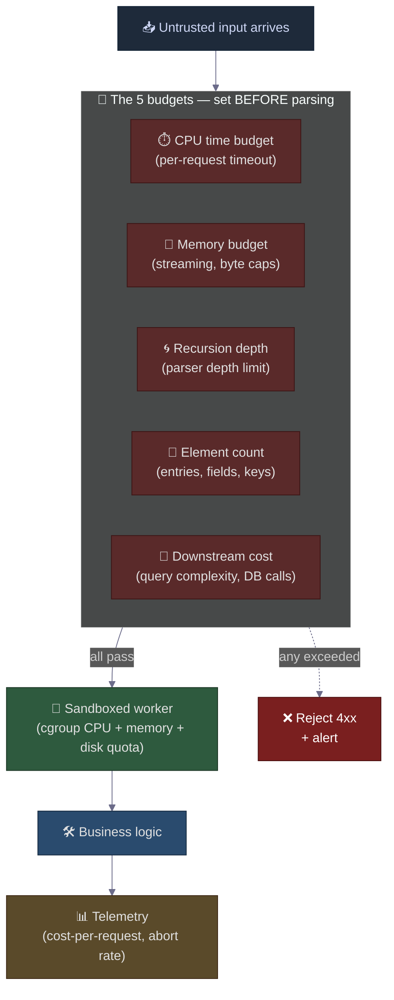

# Beyond 42.zip: The Algorithmic Complexity Attack Family — Billion Laughs, ReDoS, GraphQL Bombs, and the One Defense Pattern That Beats All of Them
### Day 58 of 50 - System Design Interview Preparation Series

**By Sunchit Dudeja**

---

## 🎯 The Core Idea

Yesterday (Day 56) we dissected the **zip bomb** — a 42 KB file that detonates into 4.5 PB. That post left an unanswered question:

> *"If a 42 KB input can produce 4.5 PB of output, what other inputs have the same shape?"*

The answer is: **a lot of them.** Zip bombs are one species in a family called **algorithmic complexity attacks**. Every member of the family exploits the same fundamental asymmetry:

> **Tiny, well-formed input → disproportionately massive processing cost.**

The cost can be CPU time, RAM, disk, file descriptors, database queries, or network bandwidth. The input format varies. The defense pattern — **budgets at every layer** — is identical.

The architect's move is to recognise the family on sight, because every public API endpoint you ever ship has exposure to at least three of them.

---

## 🧠 Why You Should Care

Defending against *one* of these attacks is a checkbox. Recognising the *family* is what makes you an architect. Once you see the pattern, every untrusted input gets the same set of questions:

1. **How much output can this input produce?**
2. **How much CPU can this input consume?**
3. **How deep can this input recurse?**
4. **How many downstream calls can this input trigger?**

If you cannot answer those four questions for an input format, you have not finished designing the endpoint. You have only finished the happy path.

> **Companion reads:**
> - [Day 56 — Decompression Bombs (42.zip)](./Day56_Zip_Bomb_Decompression_Amplification_Defense.md) — the canonical example.
> - [Day 13 — Circuit Breaker Pattern](./Day13_Circuit_Breaker_Pattern.md) — the same "fail fast on suspicious behaviour" instinct, applied to downstream calls.
> - [Day 35 — Distributed Systems Failure Modes](./Day35_Distributed_Systems_Failure_Modes_HLD.md) — the broader catalogue this whole family belongs to.

---

## 👥 Meet the Family — Five Attacks, One Shape

Each row below is a **real, named CVE-class vulnerability** that has taken down production systems at companies you have heard of.

| # | Attack | Input format | Amplification | Resource consumed |
|---|--------|--------------|--------------:|-------------------|
| 1 | **Zip bomb** (42.zip, zblg.zip) | `.zip`, `.docx`, `.apk`, `.jar` | ~10⁸ × | Disk + RAM |
| 2 | **Billion Laughs** (XXE expansion) | XML | ~10⁹ × | RAM |
| 3 | **ReDoS** (catastrophic backtracking) | String matched by a bad regex | ~10¹² × | CPU |
| 4 | **GraphQL query bomb** | GraphQL query | ~10⁶ × | DB calls, RAM |
| 5 | **JSON / YAML depth bomb** | Deeply-nested JSON or YAML | ~10⁴ × | Stack space (segfault / crash) |
| 6 | **Hash flooding** (CVE-2011-4815) | URL params, form data, JSON keys | O(N²) | CPU |

Let's walk each one — what it looks like, why it works, and the **one-line defense**.

---

## 🦷 Attack 1 — Billion Laughs (XML Entity Expansion)

A 1 KB XML file. Looks innocent. Parsers used to die instantly.

```xml
<?xml version="1.0"?>
<!DOCTYPE lolz [
  <!ENTITY lol "lol">
  <!ENTITY lol2 "&lol;&lol;&lol;&lol;&lol;&lol;&lol;&lol;&lol;&lol;">
  <!ENTITY lol3 "&lol2;&lol2;&lol2;&lol2;&lol2;&lol2;&lol2;&lol2;&lol2;&lol2;">
  <!ENTITY lol4 "&lol3;&lol3;&lol3;&lol3;&lol3;&lol3;&lol3;&lol3;&lol3;&lol3;">
  <!-- ... continues to lol9 -->
]>
<lolz>&lol9;</lolz>
```

Each entity expands to 10 of the previous. By `lol9` you have **10⁹ = 1 billion copies** of the string `"lol"`. A naive XML parser tries to materialise all of it in RAM. **Java's default `DocumentBuilderFactory` was vulnerable until ~2014.** Apache Struts, Spring, .NET — all shipped with this enabled.

> **The one-line defense:** Disable DTD processing entirely (`FEATURE_SECURE_PROCESSING`, `disallow-doctype-decl`). If you actually need DTDs, set entity-expansion limits explicitly.

```java
// Java — the line every XML parser should have
DocumentBuilderFactory dbf = DocumentBuilderFactory.newInstance();
dbf.setFeature("http://apache.org/xml/features/disallow-doctype-decl", true);
dbf.setFeature(XMLConstants.FEATURE_SECURE_PROCESSING, true);
```

---

## 💥 Attack 2 — ReDoS (Regex Catastrophic Backtracking)

The single most underrated of the family. A regex that looks fine on paper takes **hours of CPU** on a 50-character input.

```java
Pattern p = Pattern.compile("^(a+)+$");
String input = "aaaaaaaaaaaaaaaaaaaaaaaaaaaaaa!";  // 30 a's then !
p.matcher(input).matches();  // Blocks the thread. For hours.
```

**Why it's catastrophic.** The regex `(a+)+$` is **ambiguous** — for input `aaaa`, the engine can split it as `(aaaa)`, `(aaa)(a)`, `(aa)(aa)`, `(aa)(a)(a)`, … exponentially many ways. When the input fails to match (because of the trailing `!`), a backtracking engine like Java's, Python's `re`, JavaScript's, or PCRE tries **every single splitting**. Adding one more `a` to the input **doubles** the time.

**This took down Cloudflare in July 2019.** A single regex (`(?:(?:\"|'|\]|\}|\\|\d|(?:nan|infinity|true|false|null|undefined|symbol|math)|`…) processing user-submitted firewall rules went exponential and CPU-pegged half the global edge fleet for 27 minutes.

**This took down Stack Overflow in July 2016.** A regex normalising whitespace went exponential on a particular post.

> **The one-line defense:** Use a **linear-time regex engine** (Go's `regexp` package, Rust's `regex` crate, RE2 from Google) — they are guaranteed O(N). If you must use a backtracking engine, **run every untrusted regex match with a hard timeout** (e.g., `CompletableFuture.get(100, MILLISECONDS)`).

```java
// Java — bounded regex match on untrusted input
ExecutorService pool = Executors.newSingleThreadExecutor();
try {
    Future<Boolean> future = pool.submit(() -> pattern.matcher(input).matches());
    return future.get(100, TimeUnit.MILLISECONDS);
} catch (TimeoutException e) {
    log.warn("regex_redos_aborted pattern={} input_len={}", pattern, input.length());
    return false;
}
```

---

## 🕸️ Attack 3 — The GraphQL Query Bomb

The newest member of the family. A 2 KB query → 100,000 database calls.

```graphql
query bomb {
  user(id: "1") {
    friends {                          # 100 friends
      friends {                        # × 100 = 10,000
        friends {                      # × 100 = 1,000,000
          friends {                    # × 100 = 100,000,000
            name
          }
        }
      }
    }
  }
}
```

A naive GraphQL resolver fires **one database query per field per object**. Four levels of `friends` × 100 each = **100 million SELECT statements**. The database melts in seconds.

This is the **N+1 problem weaponised**. It was the **exact** failure mode that caused the GitHub GraphQL API to ship rate limits expressed in **"points" rather than requests** — because a single request can cost a million times more than another.

> **The one-line defense:** **Query cost analysis** before execution. Compute the worst-case number of resolver calls; reject if above a threshold. Plus query depth limits, plus persisted queries (only allow known query hashes from clients).

```javascript
// Node — query depth limit middleware (Apollo)
import depthLimit from 'graphql-depth-limit';
import { createComplexityLimitRule } from 'graphql-validation-complexity';

const server = new ApolloServer({
  schema,
  validationRules: [
    depthLimit(7),                                       // max 7 levels deep
    createComplexityLimitRule(1000, { scalarCost: 1 })   // max 1000 cost units
  ]
});
```

---

## 📚 Attack 4 — JSON / YAML Depth Bomb

Send `[[[[[…[[[[[]]]]…]]]]]` — 100,000 opening brackets, 100,000 closing brackets. Total payload: 200 KB.

A **recursive-descent parser** (which is what `JSON.parse`, Jackson, Python's `json.loads`, and Go's `encoding/json` use under the hood) will recurse 100,000 levels deep on this. The thread stack overflows. The JVM aborts. The Node process segfaults.

**This is the YAML attack that took down `kubectl`** in mid-2018 — a crafted YAML in a `ConfigMap` crashed every `kubectl apply` until the deeply-nested key was deleted directly via the API.

> **The one-line defense:** Use a **non-recursive (iterative) parser** for untrusted input, OR enforce a depth limit explicitly. Jackson supports `StreamReadConstraints.builder().maxNestingDepth(200).build()` since 2.15.

```java
// Jackson 2.15+ — bounded depth, max length
JsonFactory factory = JsonFactory.builder()
    .streamReadConstraints(
        StreamReadConstraints.builder()
            .maxNestingDepth(200)
            .maxNumberLength(1_000)
            .maxStringLength(1_000_000)   // 1 MB string cap
            .build())
    .build();
ObjectMapper mapper = new ObjectMapper(factory);
```

---

## 🧮 Attack 5 — Hash Flooding (CVE-2011-4815)

In 2011, Alexander Klink and Julian Wälde demonstrated that you could **craft form-data keys** that all hash to the same bucket in PHP, ASP.NET, Java, Python, Ruby, and Node — turning the O(1) average-case `HashMap.put()` into **O(N²)**. A single POST request with 30,000 carefully chosen keys consumed **minutes of CPU** on the server. PHP, Tomcat, IIS — every major web stack patched it within weeks.

The patch: **randomised hash seeds** so the attacker cannot precompute collisions. Modern languages do this by default. **Older codebases doing custom hashing on user input do not.**

> **The one-line defense:** Use the language's default hash table (with randomised seed). If you're storing user-controlled keys in your own hash structure, **cap the number of keys per request** before parsing.

---

## 🏛️ The One Pattern That Defeats All of Them

Stare at the five attacks. They look like five different bugs in five different formats. They are **one bug** dressed in five costumes:

> **An attacker controls the input. The cost of processing that input is unbounded in some dimension. Therefore the attacker controls a resource (CPU, RAM, disk, DB, stack) of the server.**

The universal defense follows directly from the universal threat:

> **Bound every dimension the attacker controls — before processing, not during, and certainly not after.**



### The 5 budgets, summarised in one table

| Budget | Default I'd ship | What it defeats |
|--------|------------------|-----------------|
| **CPU time per request** | 1 second wall clock | ReDoS, hash flooding |
| **Memory / decompressed bytes** | 100 MB streamed | Zip bombs, billion laughs |
| **Parser recursion depth** | 200 levels | JSON / YAML depth bombs |
| **Element / entry / field count** | 10,000 | Hash flooding, zip-entry attacks |
| **Downstream call cost** | 1,000 query-points | GraphQL bombs, N+1 amplification |

> **Notice:** None of these budgets is format-specific. They are **resource-specific**. That's the architect-grade insight. You stop chasing one CVE at a time and start enforcing **resource budgets uniformly across every input boundary**.

---

## 💥 The "What Actually Breaks on the Server" Catalogue

When *any* of these attacks lands on an unprotected server, the failure modes are the same — only the resource that exhausts first differs.

| Component | What it does normally | What breaks under attack |
|-----------|----------------------|--------------------------|
| **Antivirus / file scanner** | Recursively unpacks archives | Runs for hours, OOM-killed, **gives the next request a free pass** — the malware scanner becomes the malware vector |
| **File upload handler** | Validates metadata of uploaded archives | Worker threads block on extraction; the **whole upload endpoint** becomes unresponsive |
| **Backup agent** | Reads every file on the filesystem | Backup storage fills with payload junk; backup window blown; **retention SLA violated** |
| **Log / monitoring agent** (inotify, auditd, Filebeat) | Watches directories for changes | Sees millions of new "files" from the bomb; **agent memory bloats**, system load spikes, log volume explodes |
| **Mail server / scanning gateway** | Inspects attachments | Mail queue backs up; legitimate mail stops flowing; **outage measured in hours** |
| **Cloud function** (Lambda, Cloud Run) | Triggered on object upload | Times out and retries 3×; **attacker pays nothing, you pay the bill** — the "financial DoS" variant |
| **CI/CD runner** | Unpacks build artifacts | Build agent disk fills; agent marked unhealthy; **cascading slowdown across the whole org** |
| **Document preview service** | Opens `.docx`, `.xlsx`, `.pptx` (all zips) | Preview worker OOMs; the queue depth grows unboundedly |

> **The architect-grade insight:** *Notice the pattern. None of these components were designed to be a security control. They became the attack surface because they all do the same dangerous thing — **process untrusted input without a budget**.*

---

## 🛡️ The Defense-in-Depth Stack — From Network to Kernel

A single budget at one layer is a single point of failure. **Real systems stack budgets at five layers** so that a bug in any one of them is contained by the next.

| Layer | Defense | Example |
|-------|---------|---------|
| **L1 — Network edge** | Body-size limit, request-rate limit | `client_max_body_size 10m;` in nginx; WAF rule on payload entropy |
| **L2 — Framework** | Parser depth limit, max field count | Jackson `maxNestingDepth(200)`, Spring `multipart.max-file-size` |
| **L3 — Application** | Format-specific budgets in code | `SafeExtractor` from [Day 56](./Day56_Zip_Bomb_Decompression_Amplification_Defense.md); GraphQL query-cost analysis |
| **L4 — Process** | CPU/memory/disk quotas | cgroup limits, container resource limits, `ulimit -v` |
| **L5 — Observability** | Cost-per-request metrics, abort-rate alerts | `parse_aborted_total{reason}`, `query_cost_p99`, `decompress_bytes_p99` |

> **The architect's question to ask in every design review:** *"If an attacker controls the input shape, what dimension of resource can they consume — and where in this stack does each one get capped?"* If you cannot point to a specific layer for each dimension, you have a gap.

---

## ⚖️ Junior vs Architect — Side by Side

| Junior approach | Architect approach |
|-----------------|---------------------|
| Treats each CVE as a separate bug to patch | Recognises **algorithmic complexity** as a class; budgets every resource uniformly |
| Validates **input size** | Validates **post-processing cost** — size after decompression, CPU after regex, calls after GraphQL resolution |
| Uses default parsers (backtracking regex, recursive JSON) | Uses **bounded-complexity parsers** (RE2, iterative JSON) or sets explicit limits |
| One layer of validation in the application | **Defense in depth** — edge body limit + framework parser limit + app budget + cgroup quota + telemetry |
| Returns HTTP 500 on parser timeout | Returns HTTP 422 with a specific code (`input_too_complex`, `depth_exceeded`); ops greps the log |
| No metrics on parser cost | `parse_cost_p99`, `parse_aborted_total{reason}` — wired to alerts |
| Same upload code path for "trusted" vs "user" sources | Different parsers, different budgets for different trust boundaries |
| Reacts after a postmortem | Threat-models on every new input format in the design review |

---

## 🟣 The Simpler Version — Explain It Like the Reader Has 2 Minutes

### The pattern

> **An attacker who controls your input also controls how hard your server has to work to process it — unless you have a budget.**

That is *the* entire mental model. Five attacks. Five formats. One bug.

### The defense

> **Decide the maximum amount of CPU, RAM, disk, and downstream calls a single request is allowed to consume. Enforce it at every layer — network edge, parser, application, OS quota, telemetry. Abort early. Return a 4xx. Move on.**

### What this looks like in code

```text
For every untrusted input, before you parse it:

  IF size > MAX_BYTES                    → 413 Payload Too Large
  IF parsing exceeds MAX_TIME            → 408 Request Timeout
  IF parser depth > MAX_DEPTH            → 422 Unprocessable Entity
  IF element count > MAX_ELEMENTS        → 422 Unprocessable Entity
  IF estimated downstream cost > MAX_COST → 429 Too Many Requests
```

That handful of guard clauses defends you against zip bombs, billion laughs, ReDoS, GraphQL bombs, JSON depth bombs, and most CVEs that haven't been invented yet.

### The one-line summary

> 🎯 **An attacker who controls your input controls your CPU, RAM, and disk — unless you decide in advance what each one is worth and refuse to spend more than that.**

---

## 💬 How to Talk About It in an Interview

When asked *"How would you protect a public API from malicious inputs?"* — a strong answer goes:

> "I'd start by recognising that **input-validation bugs and algorithmic-complexity bugs are different problems**. Input validation defends against malformed or malicious *content* — SQL injection, XSS, path traversal. Algorithmic complexity defends against well-formed *inputs that are expensive to process* — zip bombs, billion-laughs XML, regex ReDoS, GraphQL query bombs, JSON depth bombs.
>
> They're the same threat model: **the attacker controls the input shape, so the attacker controls whatever resource the input consumes**. The defense is the same five-layer stack regardless of format — edge body limits, parser limits inside the framework, application-level budgets, OS-level cgroup quotas, and telemetry on cost-per-request so you can alert when an attack starts.
>
> The specific budgets I'd ship by default: 1 second CPU per request, 100 MB of decompressed data, 200 levels of parser nesting, 10,000 elements per structured input, and 1,000 cost-points per GraphQL query. Each of those defeats a different family member, and together they defeat the entire class.
>
> Three architectural levers: **threat-model by resource not by format, bound every dimension the attacker controls, fail fast with a 4xx and a specific error code so ops can detect the attack in the metrics.**"

That paragraph signals you understand:
- The **pattern recognition** (the reason the universal defense works),
- **Resource-oriented threat modelling** (the reason you don't chase CVEs one at a time),
- **Defense in depth** (the reason for five layers),
- **Operational reality** (the reason for specific error codes and metrics).

That is the **architect-level answer** — the one that wins the round.

---

## 🧾 Quick Recap

- **The family:** Zip bomb, billion laughs XML, ReDoS, GraphQL query bomb, JSON depth bomb, hash flooding. Different formats, **same shape**: small input → massive processing cost.
- **The unified threat model:** The attacker controls the input shape, so the attacker controls whatever resource processing it consumes — CPU, RAM, disk, downstream calls, stack space.
- **The 5 budgets to ship by default:**
  1. **CPU time** per request (e.g., 1 second).
  2. **Memory / decompressed bytes** (e.g., 100 MB).
  3. **Parser recursion depth** (e.g., 200).
  4. **Element count** (e.g., 10,000).
  5. **Downstream call cost** (e.g., 1,000 query-points).
- **The 5-layer stack:** Network edge → framework parser → application code → OS cgroup quota → telemetry.
- **The components that break** when no budget is enforced: AV scanners, file-upload handlers, backup agents, log/monitoring agents, mail gateways, cloud functions (with the **financial DoS** twist), CI runners, document preview services.
- **The mental model:** **bound every dimension the attacker controls — before processing, not after.**

42.zip taught us the shape of the bug. Billion laughs, ReDoS, and the GraphQL bomb show us that the **shape is everywhere**. The architect's job is not to memorise every variant — it is to ship the budget pattern so that the next variant is **already defeated when it arrives**.

---

*If this changed how you look at every "innocent" input on your public API — share it with the next engineer who says "it's just a JSON parse, what could go wrong?"* 🎯
