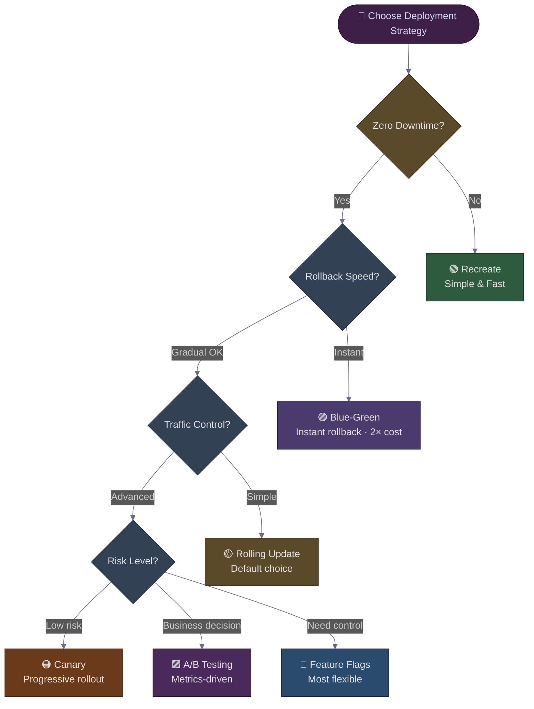

# Rolling, Blue-Green, Canary, or Feature Flags? The Deployment Strategy Decision Tree Every Architect Uses
### Day 59 of 50 - System Design Interview Preparation Series

**By Sunchit Dudeja**

---

## 🎯 The Core Idea

When an interviewer asks *"How would you deploy this service to production?"*, the trap is to name a strategy before naming the **constraints**. Netflix does not pick "canary" because it sounds modern. They pick it because their **risk tolerance**, **rollback SLA**, and **traffic-control needs** point there.

Every deployment strategy is a trade-off across **five dimensions**:

| Dimension | What you're really asking |
|-----------|---------------------------|
| **Downtime** | Can users see an outage during deploy? |
| **Rollback speed** | How fast can you undo a bad release? |
| **Traffic control** | Can you send 5% of users to the new version? |
| **Cost** | Can you afford to run two full environments? |
| **Decision type** | Is this a **technical** release (bug fix) or a **business** experiment (new checkout flow)? |

The architect's move is to walk those five questions in order — like a decision tree — and let the answer **choose the strategy**, not the other way around.

> **One-line intuition:** *Deployment strategy is not a technology choice. It is a risk-management choice expressed in infrastructure.*

> **📐 Excalidraw:** Open [day59-deployment-strategies-decision-tree.excalidraw](./day59-deployment-strategies-decision-tree.excalidraw) at [excalidraw.com](https://excalidraw.com) — dark background (`#1e1e1e`), colour-coded strategy boxes matching the flowchart below.

> **Companion reads:**
> - [Day 25 — Deployment Strategies Decoded](./Day25_Deployment_Strategies.md) — deep dive on each strategy with YAML examples.
> - [Day 42 — Blue-Green Deployment](./Day42_Blue_Green_Deployment_Zero_Downtime.md) — zero-downtime cutover and rollback mechanics.
> - [Day 51 — Chaos Engineering](./Day51_Chaos_Engineering_Netflix_Chaos_Monkey.md) — why Netflix validates deployments under failure, not just under success.

---

## 🧠 Why You Should Care

This is one of the most common **follow-up questions** after any system design — *"Design a payment service"* inevitably becomes *"How do you deploy it without taking payments offline?"*

A junior who answers *"We use Kubernetes rolling updates"* has named a tool, not a strategy. A senior who answers *"It depends — what's the downtime SLA, how fast must we rollback, and is this a schema-breaking change?"* has shown they understand **why** the tool exists.

The decision tree in this post is the **mental model** you walk through in 60 seconds at a whiteboard. The seven strategies at the leaves are the **vocabulary** you need to sound credible.

---

## 🌳 The Decision Tree — Walk It Top to Bottom

This is the same flowchart from the Excalidraw diagram, rendered as Mermaid so it renders in GitHub and interview notes.



**How to read it:** Start at the top. Answer each diamond honestly for *your* service. The leaf you land on is your strategy. If you land on two leaves, you are probably combining strategies (e.g., **Rolling + Feature Flags** — very common in production).

---

## 🔧 The Seven Strategies — One Paragraph Each

### 1. Recreate — *"Stop everything, deploy, start again"*

```text
[v1 running] → STOP ALL → [downtime] → DEPLOY v2 → [v2 running]
```

| | |
|---|---|
| **Downtime** | Yes — full outage during switch |
| **Rollback** | Redeploy v1 (minutes) |
| **Cost** | 1× — only one environment |
| **Best for** | Dev/staging, internal tools, scheduled maintenance windows, breaking schema migrations |
| **Real example** | HR portal migration Sunday 2–4 AM with advance notice |

**Kubernetes:** `strategy: Recreate` on a Deployment — kills all pods before starting new ones.

---

### 2. Rolling Update — *"Replace instances one at a time"*

```text
[v1][v1][v1][v1][v1]  →  [v2][v1][v1][v1][v1]  →  …  →  [v2][v2][v2][v2][v2]
```

| | |
|---|---|
| **Downtime** | No — capacity maintained via `maxSurge` / `maxUnavailable` |
| **Rollback** | Reverse the rollout (minutes — must redeploy old image) |
| **Cost** | ~1× — brief extra capacity during surge |
| **Best for** | **Default for most stateless services** — APIs, microservices, web apps |
| **Risk** | **Mixed versions run simultaneously** — v1 and v2 must be API-compatible |

**Kubernetes default.** The strategy 90% of teams use without thinking about it:

```yaml
strategy:
  type: RollingUpdate
  rollingUpdate:
    maxSurge: 25%        # can temporarily add extra pods
    maxUnavailable: 25%  # can temporarily remove pods
```

> **The trap:** Rolling update is *not* zero-risk. If v2 has a bug, **25% of traffic** hits the bug before you notice. That is why production teams pair rolling with **health checks + automated rollback**.

---

### 3. Blue-Green — *"Two full environments, flip a switch"*

```text
BLUE (v1, live)  ←── traffic ──  Users
GREEN (v2, idle) ←── deploy & test here first
         ↓ cutover (DNS / LB flip)
GREEN (v2, live) ←── traffic ──  Users
BLUE  (v1, idle) ←── instant rollback target
```

| | |
|---|---|
| **Downtime** | No — cutover is a routing change (milliseconds) |
| **Rollback** | **Instant** — flip traffic back to Blue |
| **Cost** | **2×** — two full production-capacity environments |
| **Best for** | Payment systems, auth services, anything where rollback must be < 30 seconds |
| **Gotcha** | **Database schema** — both versions must run against a compatible schema, or you need a migration phase |

See [Day 42](./Day42_Blue_Green_Deployment_Zero_Downtime.md) for the full HLD and cutover sequence.

---

### 4. Canary — *"Send 5% of traffic to the new version, watch, then expand"*

```text
95% → v1 (stable)
 5% → v2 (canary)  ── metrics OK? ──▶  50/50 ──▶  100% v2
                      │
                      └── metrics BAD? ──▶ rollback (shift 5% back)
```

| | |
|---|---|
| **Downtime** | No |
| **Rollback** | Fast — shift traffic weight back (seconds with a service mesh) |
| **Cost** | ~1.05× during canary phase |
| **Best for** | High-traffic services where a full rollout to 100% before validation is too risky |
| **Requires** | **Metrics pipeline** — error rate, latency p99, business KPIs on the canary slice |

**Who uses it:** Netflix (Spinnaker), Google (automated canarying), most large-scale Kubernetes shops with Istio/Linkerd.

```yaml
# Istio VirtualService — 5% canary
http:
  - route:
    - destination: { host: payment-service, subset: v2 }
      weight: 5
    - destination: { host: payment-service, subset: v1 }
      weight: 95
```

---

### 5. A/B Testing — *"Two versions, measure business outcomes"*

Canary asks: *"Is v2 **technically** healthy?"*
A/B testing asks: *"Does v2 **convert better**?"*

| | |
|---|---|
| **Downtime** | No |
| **Rollback** | Traffic shift (same as canary) |
| **Cost** | ~1× + analytics infrastructure |
| **Best for** | Product experiments — new checkout UI, pricing page, recommendation algorithm |
| **Requires** | **Statistical rigour** — sample size, significance, experiment duration |

**The distinction that wins interviews:** Canary is an **ops** decision (error rate, latency). A/B is a **product** decision (conversion, revenue, engagement). You can run both simultaneously — canary gates the technical rollout; A/B gates the business decision to keep it.

---

### 6. Feature Flags — *"Deploy code dark, turn it on when ready"*

```text
Deploy v2 to 100% of servers ── but ── feature.enabled = false
                                      │
User requests ──▶ if (feature.enabled) → new path
                else                    → old path
```

| | |
|---|---|
| **Downtime** | No — code is already deployed |
| **Rollback** | **Instant** — flip the flag off (no redeploy) |
| **Cost** | 1× + flag service (LaunchDarkly, Unleash, or in-house) |
| **Best for** | **Maximum control** — kill-switch, gradual rollout per user segment, trunk-based development |
| **Gotcha** | **Flag debt** — old flags never removed become permanent `if/else` branches |

**The architect-grade insight:** Feature flags decouple **deployment** (code on servers) from **release** (users see the feature). That is why trunk-based development teams deploy 50 times a day but release features once a week.

---

### 7. Shadow / Dark Launch — *"Send real traffic to v2, but don't return its response"*

Not in the decision tree, but worth knowing for interviews:

```text
User request ──▶ v1 (response returned to user)
            └──▶ v2 (response discarded, metrics collected)
```

Used to validate v2 against **real production load** before any user sees it. Expensive (2× compute per request) but catches bugs that synthetic tests miss.

---

## 📊 The Master Comparison Table

| Strategy | Downtime | Rollback speed | Traffic control | Cost | Complexity | Best default for |
|----------|:--------:|:--------------:|:---------------:|:----:|:----------:|------------------|
| **Recreate** | ❌ Yes | Slow (redeploy) | None | 1× | ⭐ | Dev/staging |
| **Rolling** | ✅ No | Medium | Limited (`maxUnavailable`) | ~1× | ⭐⭐ | **Most stateless APIs** |
| **Blue-Green** | ✅ No | **Instant** (LB flip) | All-or-nothing | **2×** | ⭐⭐⭐ | Payments, auth, critical path |
| **Canary** | ✅ No | Fast (weight shift) | **Fine-grained %** | ~1× | ⭐⭐⭐⭐ | High-traffic, risk-averse |
| **A/B Testing** | ✅ No | Fast | Per-user segment | ~1× + analytics | ⭐⭐⭐⭐ | Product experiments |
| **Feature Flags** | ✅ No | **Instant** (flag off) | Per-user, per-segment | 1× + flag svc | ⭐⭐⭐ | Trunk-based dev, kill-switches |
| **Shadow** | ✅ No | N/A (no user impact) | 100% shadow | **2× compute** | ⭐⭐⭐⭐ | Pre-launch validation |

---

## 🏛️ How They Combine in Production (The Real Answer)

No serious company uses exactly one strategy. The **production stack** typically looks like:


| Layer | Strategy | Question it answers |
|-------|----------|---------------------|
| **Deploy** | Rolling update | "Is the new binary on all servers?" |
| **Validate** | Canary | "Is the new binary healthy under real load?" |
| **Release** | Feature flag | "Should users see the new behaviour?" |
| **Decide** | A/B test | "Does the new behaviour improve the business metric?" |

> **Netflix's actual pipeline** (simplified): Spinnaker deploys via rolling → automated canary analysis (ACA) compares error rate and latency → if ACA passes, traffic shifts to 100% → feature flag controls which users see the new UI. Chaos Monkey runs throughout to validate resilience.

---

## ❌ The Developer Mistakes — What Loses You the Interview

| Mistake | Why it's wrong | What to say instead |
|---------|----------------|---------------------|
| *"We always use rolling updates"* | Rolling without health checks sends bad traffic to users gradually | "Rolling with automated rollback on error-rate spike" |
| *"Blue-green is always better"* | 2× cost; schema migration is hard; overkill for internal APIs | "Blue-green when rollback must be instant and we can afford 2× infra" |
| *"Canary and A/B are the same thing"* | Conflates technical validation with business measurement | "Canary gates ops health; A/B gates product decisions" |
| *"Feature flags replace deployments"* | Flags deploy **code**; you still need a deployment strategy for the binary | "Flags decouple release from deployment — both are needed" |
| *"Zero downtime = zero risk"* | Mixed versions, schema drift, and partial rollouts all carry risk | "Zero downtime reduces user impact; canary + flags reduce blast radius" |
| Naming a strategy before naming constraints | Shows tool knowledge, not architectural thinking | Walk the decision tree out loud first |

---

## 🛡️ What Every Strategy Needs Regardless of Choice

The strategy is the **how**. These are the **non-negotiables** that make any strategy safe:

| Requirement | Why |
|-------------|-----|
| **Health checks** (readiness + liveness) | Kubernetes won't route traffic to a pod that isn't ready |
| **Automated rollback trigger** | Error rate > 2× baseline → halt rollout (Argo Rollouts, Flagger, Spinnaker ACA) |
| **Database backward compatibility** | v1 and v2 must coexist during any gradual rollout — expand-contract migrations |
| **Observability on the new version** | Separate dashboards for canary slice; compare p50/p99/error rate |
| **Deployment audit trail** | Who deployed what, when, from which commit — for postmortems |

```yaml
# Argo Rollouts — canary with automated analysis
apiVersion: argoproj.io/v1alpha1
kind: Rollout
spec:
  strategy:
    canary:
      steps:
        - setWeight: 5
        - pause: { duration: 5m }
        - setWeight: 25
        - pause: { duration: 10m }
        - setWeight: 100
      analysis:
        templates:
          - templateName: error-rate-check
        startingStep: 1
```

---

## ⚖️ Junior vs Architect — Side by Side

| Junior approach | Architect approach |
|-----------------|---------------------|
| Names a strategy first ("we use Kubernetes") | Names **constraints** first (downtime SLA, rollback speed, risk) |
| Treats rolling update as risk-free | Pairs rolling with **health checks + automated rollback** |
| Uses blue-green everywhere | Reserves blue-green for **instant-rollback** critical paths; accepts 2× cost consciously |
| Confuses canary with A/B | Separates **technical validation** (canary) from **business measurement** (A/B) |
| Deploys and releases in one step | Decouples with **feature flags** — deploy dark, release when ready |
| No plan for mixed-version compatibility | Designs **backward-compatible APIs and expand-contract DB migrations** |
| Rollback = "redeploy and pray" | Rollback is **automated**, triggered by metrics, tested in staging |

---

## 🟣 The Simpler Version — Explain It Like the Reader Has 2 Minutes

Walk the tree out loud:

1. **Can users see downtime?** No → keep going. Yes → **Recreate** (dev/staging only).
2. **Must rollback be instant?** Yes → **Blue-Green** (pay 2× infra). No → keep going.
3. **Do you need fine-grained traffic control?** No → **Rolling Update** (the default). Yes → keep going.
4. **What's the risk?**
   - Technical risk (will it crash?) → **Canary**
   - Business risk (will users buy more?) → **A/B Testing**
   - Need a kill-switch without redeploying → **Feature Flags**

### The one-line summary

> 🎯 **Don't pick a deployment strategy. Answer five questions about downtime, rollback, traffic control, cost, and decision type — then the strategy picks itself.**

---

## 💬 How to Talk About It in an Interview

When asked *"How would you deploy this service?"* — a strong answer goes:

> "I'd start with constraints. For a payment API with a 99.99% SLA, downtime is not acceptable and rollback must be under 30 seconds — that points to **blue-green** or **canary with automated rollback**, not recreate or naive rolling.
>
> For the deploy mechanism itself, I'd use **rolling updates** in Kubernetes to get the new binary onto all pods — that's the default and it's operationally simple. But I wouldn't consider the deploy 'done' until a **canary phase** validates error rate and p99 latency on 5% of traffic. If metrics degrade, Argo Rollouts or Flagger rolls back automatically.
>
> For the new checkout flow specifically — since it's a **business experiment**, not just a bug fix — I'd wrap it in a **feature flag** so we can deploy the code to 100% of servers but expose it to only 10% of users, measure conversion, and kill it instantly if revenue drops. That decouples deployment risk from product risk.
>
> Three architectural levers: **match strategy to constraints not habit, combine layers (rolling + canary + flags), and automate rollback on metrics not human judgment.**"

That paragraph signals you understand:
- **Constraint-driven selection** (the decision tree),
- **Layered deployment** (rolling ≠ release),
- **Automated safety** (metrics-driven rollback),
- **Business vs technical risk** (canary vs A/B vs flags).

That is the **architect-level answer** — the one that wins the round.

---

## 🧾 Quick Recap

- **Seven strategies:** Recreate, Rolling, Blue-Green, Canary, A/B Testing, Feature Flags, Shadow.
- **Five questions** drive the choice: downtime? rollback speed? traffic control? cost? technical vs business decision?
- **The decision tree** is the interview artifact — walk it out loud before naming a strategy.
- **Production reality:** teams **combine** strategies — Rolling (deploy) + Canary (validate) + Feature Flags (release) + A/B (decide).
- **Non-negotiables regardless of strategy:** health checks, automated rollback on metrics, backward-compatible schema, observability on the new version.
- **The mental model:** **deployment strategy is risk management expressed in infrastructure.**

The next time someone says "we just use rolling updates," ask them what happens when v2 has a bug that only shows up under production load. That one question separates someone who has deployed from someone who has **architected** a deployment.

---

*If this changed how you answer "how would you deploy?" in an interview — share it with the next engineer who names a strategy before naming a constraint.* 🎯
