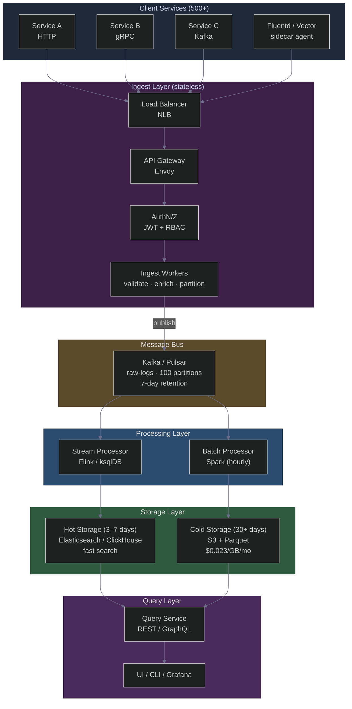
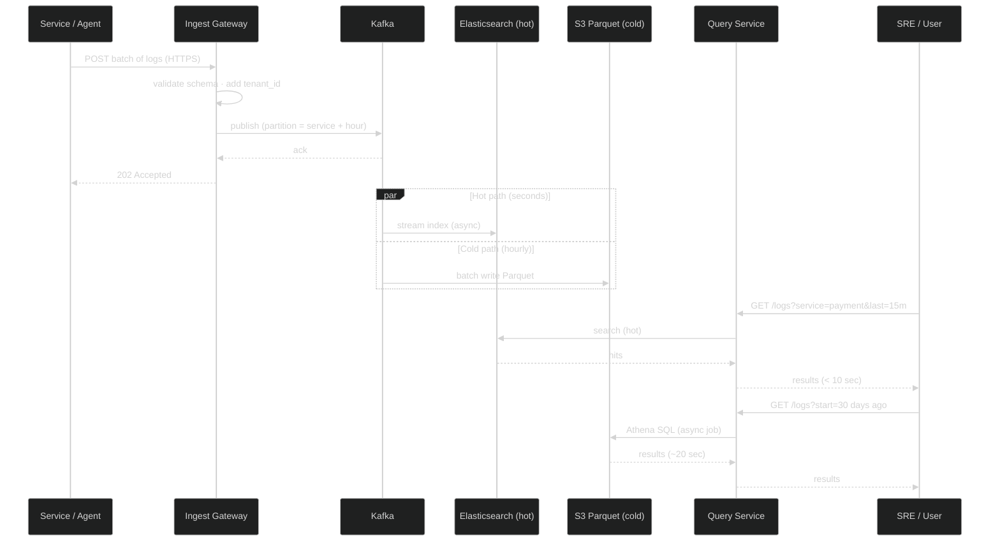
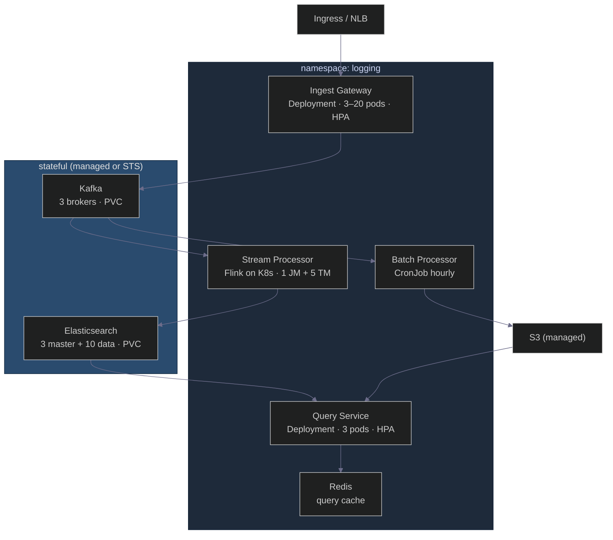

# 10 TB of Logs a Day, 100k Events per Second: Designing a Centralized Logging Server the Architect's Way
### Day 60 of 50 - System Design Interview Preparation Series

**By Sunchit Dudeja**

---

## 🎯 The Core Idea

A **centralized logging server** is not a database that stores log lines. It is a **pipeline** that must:

1. **Ingest** reliably from 500+ microservices without becoming a bottleneck.
2. **Index** recent logs fast enough for incident response ("grep the last hour in < 10 seconds").
3. **Archive** everything else cheaply for compliance and forensics.
4. **Serve** queries across hot and cold tiers without the user knowing which store answered.

The junior instinct is to point every service at **Elasticsearch** and call it done. That works until day one of production, when ingest backpressure takes down the cluster, storage costs exceed the product budget, and a single noisy service's partition hot-spots Kafka.

The architect's move is one sentence:

> **Decouple ingestion from processing, split hot from cold storage, and route queries by time range — reliability and cost efficiency over query completeness on day one.**

> **Companion reads:**
> - [Day 33 — Distributed Tracing IDs](./Day33_Distributed_Tracing_IDs_Complete_Guide.md) — logs without `traceId` are needles without a thread.
> - [Day 36 — RabbitMQ vs Kafka](./Day36_RabbitMQ_vs_Kafka_Architects_Decision_Guide.md) — why Kafka wins for log pipelines.
> - [Day 46 — Kafka Message Ordering](./Day46_Kafka_Message_Ordering_Partitions_Architects_Know.md) — partition key design for logs.
> - [Day 50 — Distributed Tracing for Debugging](./Day50_Microservice_Debugging_Distributed_Tracing.md) — logs + traces together at 3 AM.

---

## 🧠 Why You Should Care

*"Design a centralized logging system"* is a **classic system design interview question** — often asked right after *"Design a metrics system"* or *"Design a monitoring platform."* The interviewer is testing whether you understand:

- **Write amplification** — every log line may be written 3–4 times (Kafka, ES, S3, metrics).
- **Hot vs cold trade-offs** — fast search costs 20× more per GB than S3 Parquet.
- **Backpressure** — what happens when ingest exceeds processing capacity.
- **Multi-tenancy** — 500 services must not read each other's logs.

A senior answer names **constraints first** (durability SLA, retention, query latency), then draws a **pipeline**, not a single box labelled "ELK."

---

## 📐 The Problem Statement (Interview Setup)

| Constraint | Value |
|------------|-------|
| **Services** | 500+ microservices |
| **Volume** | ~10 TB logs/day (~115 MB/sec average) |
| **Peak ingest** | 100k+ events/sec (burstable to 500k/sec) |
| **Retention** | 30 days (90 days for compliance tier) |
| **Hot search SLA** | "grep across last hour" in **< 10 seconds** |
| **Durability** | Zero log loss for audit/incident logs |
| **Multi-tenancy** | Per-service RBAC; tenant A cannot see tenant B |

**Architect's first question:** *"What is the real cost of losing a log?"*

| If logs are… | Ingest protocol | Durability |
|--------------|-----------------|------------|
| Nice-to-have debug noise | UDP / fire-and-forget | Best-effort |
| **Critical for audits / incidents** | HTTP/gRPC with **ACK** | Kafka `acks=all`, replicated storage |

This design assumes **critical logs** — ACKed ingestion, no silent drops.

---

## 🏛️ High-Level Design (HLD)



**The three architectural moves:**

| Move | What it does | Why it matters |
|------|--------------|----------------|
| **1. Decouple with Kafka** | Ingest ACKs after Kafka write, not after ES index | Gateway stays fast; processing scales independently; 7-day replay buffer |
| **2. Hot + cold split** | ES for last 3–7 days; S3 Parquet for 30+ days | Search SLA on 5% of data; 95% of storage cost on cheap tier |
| **3. Federated query** | Query Service routes by time range | User sees one API; backend picks ES vs Athena |

---

## 🔧 Simplified Log Ingestion Flow (Sequence)

The essence in six steps — what you draw on a whiteboard in 90 seconds.



**Read it left to right:**

1. Client sends a **batch** (not one HTTP call per log line).
2. Gateway validates and publishes to Kafka — returns **202** after Kafka ACK, not after indexing.
3. **Two consumers** read the same topic: stream → ES (hot), batch → S3 (cold).
4. Query Service routes **recent** → ES, **old** → Athena on S3.

---

## 📊 Capacity Estimation (Back-of-Envelope)

| Metric | Calculation | Result |
|--------|-------------|--------|
| Average ingest | 10 TB / 86,400 sec | ~**115 MB/sec** |
| Peak (5× avg) | 115 × 5 | ~**575 MB/sec** |
| Events/sec (1 KB avg line) | 115 MB / 1 KB | ~**115k/sec** (matches 100k+ requirement) |
| 30-day raw storage | 10 TB × 30 | **300 TB** on cold tier |
| Hot tier (7 days, 3× replication) | 10 TB × 7 × 3 | ~**210 TB** ES (before compression) |
| With ES compression (~30%) | 210 × 0.3 | ~**63 TB** hot cluster |

> **The cost insight:** Hot tier (Elasticsearch) dominates **opex** if you keep everything hot. Moving data to S3 Parquet after 7 days typically cuts storage cost by **~90%** for the long tail.

---

## 🔩 Component Deep Dive

### 🔹 1. Ingest Gateway (stateless)

| Decision | Choice | Why |
|----------|--------|-----|
| Protocols | HTTP bulk JSON, gRPC, syslog (legacy) | Meet services where they are |
| Auth | Service account API keys + JWT | Per-tenant isolation at the edge |
| Scaling | HPA on CPU > 70%, ~10k req/sec per pod | Stateless — scale horizontally |
| Backpressure | Return **429** (rate limit) or **503** | Client must buffer or drop — never block silently |

```text
Client retry policy: exponential backoff, max 3 attempts
Gateway SLA: p99 ingest latency < 500ms (ACK after Kafka only)
```

**Failure mode:** Gateway flood → per-tenant rate limits + autoscale. Never let one noisy service take down ingest for all 500.

---

### 🔹 2. Kafka (the spine)

| Setting | Value | Why |
|---------|-------|-----|
| Topic | `raw-logs` | Single source of truth |
| Partitions | **100** | Parallel consumers; target < 10 MB/sec per partition |
| Partition key | `service_name + date_hour` | Query locality; efficient retention by service |
| Retention | **7 days** | Replay buffer if ES corrupts or consumer lags |
| Producer | `acks=all`, `compression=snappy`, `batch.size=1MB` | Durability + throughput |

> **Hot-partition risk:** If one service emits 50% of all logs, `service+hour` keys can hot-spot a partition. **Mitigation:** salt high-volume services (`payment#shard3`) or dedicated topic per tier-1 service.

See [Day 46](./Day46_Kafka_Message_Ordering_Partitions_Architects_Know.md) for ordering guarantees per partition.

---

### 🔹 3. Stream Processor → Hot Storage (3–7 days)

**Purpose:** Index logs for real-time search and dashboards.

| Option | Pros | Cons |
|--------|------|------|
| **Elasticsearch** | Rich DSL, Kibana ecosystem, team familiarity | Expensive at scale; JVM heap tuning |
| **ClickHouse** | Better compression, faster aggregations | Smaller ecosystem for log exploration |

**This design picks Elasticsearch** for the interview answer when the team already runs ELK — with **Index Lifecycle Management (ILM)**:

```text
Day 0–3:  hot tier  (SSD, full replicas)
Day 3–7:  warm tier (HDD, fewer replicas)
Day 7+:   delete from ES (data lives in S3)
```

**Cluster sketch:** 3 dedicated master nodes + 10 data nodes (64 GB RAM, SSD). Replicas = 2 for shard failover.

**Side output:** Extract `error_count per service per minute` → Prometheus for alerting (don't grep logs to page someone).

---

### 🔹 4. Batch Processor → Cold Storage (30+ days)

**Purpose:** Compliance, forensic search, cost-efficient long tail.

```text
Hourly Spark job:
  read Kafka (or S3 if retention expired)
  → write Parquet + Snappy to S3
  → partition: s3://logs/dt=2025-05-31/service=payment/part-*.parquet

Query: AWS Athena / Trino (SQL on Parquet)
Retention: S3 lifecycle rule → delete after 30 (or 90) days
```

| Tier | Cost (approx) | Query latency |
|------|---------------|---------------|
| Hot (ES) | ~$0.50/GB/month | p95 < 2 sec |
| Cold (S3) | ~$0.023/GB/month | 10–30 sec (Athena scan) |

---

### 🔹 5. Query Service (federation layer)

```http
GET /logs?service=payment&start=2025-05-01T00:00Z&end=2025-05-31T23:59Z&query=error
```

| Time range | Backend | Response |
|------------|---------|----------|
| Last 3 days | Elasticsearch | Sync, < 10 sec |
| 3–7 days | ES + optional cold merge | Sync, may be slower |
| 7+ days | Athena on S3 | **Async job ID** → poll for results |
| Frequent dashboards | Redis cache (TTL 60s) | Sub-second for "last hour error count" |

**The architect-grade detail:** Never expose ES and Athena URLs to users. One API, one auth model, one query language — routing is an implementation detail.

---

## ⚖️ Key Architectural Decisions (Trade-off Table)

| Decision | Option A | Option B (chosen) | Why |
|----------|----------|-------------------|-----|
| Ingest protocol | UDP (no ACK) | **HTTP/gRPC + ACK** | Audit logs cannot be lost |
| Message bus | RabbitMQ | **Kafka** | Replay, throughput, retention |
| Hot storage | ClickHouse | **Elasticsearch** | Ecosystem + Kibana (swap if cost-critical) |
| Cold storage | HDFS + Hive | **S3 + Athena** | Managed, pay-per-query |
| Partition key | Random | **service + hour** | Query locality; watch hot partitions |
| Index timing | Sync at gateway | **Async via Kafka** | Gateway stays fast under spike |

---

## 🛡️ Non-Functional Requirements

| NFR | Target | Mitigation |
|-----|--------|------------|
| **Availability** | 99.9% | Multi-AZ Kafka, ES, ingest; S3 is 11×9s |
| **Durability** | Zero log loss | Kafka `acks=all`, ES replicas, S3 durability |
| **Ingest latency** | p99 < 500ms | ACK after Kafka only — not after ES |
| **Hot search** | p95 < 2 sec | Time-based indices; always filter `@timestamp` |
| **Cost** | Minimize $/GB-month | ILM: 7 days hot → S3 cold |
| **Multi-tenancy** | Strict isolation | Tenant ID on every line; RBAC at Query Service |

---

## 💥 Failure Scenarios

| What breaks | Impact | Mitigation |
|-------------|--------|------------|
| Kafka broker down | Ingest pauses | RF=3, controller failover; client retries |
| ES data node down | Hot queries slow | Replicas promote; ILM does not delete until green |
| S3 API outage | Cold writes fail | Batch job retries; data still in Kafka (7-day buffer) |
| Ingest gateway flood | 503 to clients | Per-tenant rate limit; HPA; circuit breaker if Kafka lag > 1h |
| Stream processor lag | Stale hot index | Alert on consumer lag; scale Flink tasks; never block ingest |
| Noisy neighbour service | Hot Kafka partition | Salt partition key; dedicated topic for tier-1 |

---

## ☸️ Kubernetes Deployment (Sketch)



| Component | K8s resource | Replicas | Autoscale |
|-----------|--------------|----------|-----------|
| Ingest Gateway | Deployment | 3–20 | HPA on CPU |
| Query Service | Deployment | 3 | HPA on CPU/memory |
| Stream Processor | Flink deployment | 1 JM + 5 TM | HPA on consumer lag |
| Batch Processor | CronJob | hourly | — |
| Kafka | StatefulSet or MSK | 3 | Manual |
| Elasticsearch | StatefulSet or managed | 3m + 10d | Manual |

---

## ✅ Operational Checklist (Before You Sign Off)

- [ ] Can you **replay** logs from the last 7 days if Elasticsearch corrupts? (Kafka retention)
- [ ] **TLS** in transit and **KMS** at rest on S3 and ES?
- [ ] **RBAC**: tenant A cannot query tenant B's `service` field?
- [ ] **Circuit breaker**: stop ingest (503) if Kafka consumer lag > 1 hour?
- [ ] **GDPR delete**: can you purge a user's logs from S3 + ES by `user_id` within SLA?
- [ ] **Cross-AZ transfer** costs budgeted? (10 TB/day × replicas adds up)
- [ ] Every log line has **`traceId`** for correlation with [Day 33](./Day33_Distributed_Tracing_IDs_Complete_Guide.md)?

---

## ❌ Junior vs Architect — Side by Side

| Junior approach | Architect approach |
|-----------------|---------------------|
| "Point all services at Elasticsearch" | **Pipeline**: ingest → Kafka → hot + cold |
| ACK after ES index (slow, fragile) | **ACK after Kafka**; index async |
| One retention policy for everything | **ILM**: 7 days hot → S3 cold → delete |
| Single query endpoint on ES | **Federated Query Service** routes by time range |
| No backpressure | **429/503** + per-tenant rate limits |
| Logs without `traceId` | Structured JSON + **traceId** on every line |
| "We'll add Kafka later" | Kafka **is** the durability and replay layer from day one |

---

## 🟣 The Simpler Version — Explain It Like the Reader Has 2 Minutes

> **Logs are a firehose. You don't catch a firehose in a coffee cup (one database). You point it at a buffer (Kafka), run two hoses off the buffer — one into a fast sink (Elasticsearch for this week), one into a cheap warehouse (S3 for this month) — and give users a single faucet (Query Service) that automatically picks the right sink based on how far back they're looking.**

### The one-line summary

> 🎯 **A logging server is a pipeline that decouples ingestion, hot indexing, and cold archiving — not a database with a REST API.**

---

## 💬 How to Talk About It in an Interview

When asked *"Design a centralized logging system for 500 microservices,"* a strong answer goes:

> "I'd start with scale: ~10 TB/day, 100k events/sec peak, 30-day retention, and a 10-second search SLA on the last hour. The first architectural decision is durability — for audit logs I'd use ACKed HTTP ingest, not UDP.
>
> The shape is a **pipeline**, not a monolith. Stateless **ingest gateways** validate JSON schema, attach tenant ID, and publish to **Kafka** with partition key `service+hour` — the gateway returns 202 after Kafka ACK, not after indexing. That keeps ingest p99 under 500ms even when Elasticsearch lags.
>
> Two consumers read the same topic: a **stream processor** indexes the last 7 days into **Elasticsearch** with ILM rolling to warm then delete; an **hourly batch job** writes **Parquet to S3** for 30-day retention at a tenth of the cost. A **Query Service** federates: last 3 days hit ES synchronously, older ranges submit **Athena** jobs asynchronously.
>
> For multi-tenancy, every line carries `tenant_id` and the Query Service enforces RBAC. For incidents, every line carries `traceId` so logs join traces. I'd alert on Kafka consumer lag and ES cluster health, and circuit-break ingest if lag exceeds one hour so we don't amplify a downstream failure.
>
> Three architectural levers: **decouple with Kafka, split hot from cold, federate queries by time range.**"

That paragraph signals you understand **scale**, **cost**, **durability**, **multi-tenancy**, and **operational failure modes** — the five things interviewers actually grade.

---

## 🧾 Quick Recap

- **Not a database** — a pipeline: ingest → buffer → hot index + cold archive → federated query.
- **Scale:** 10 TB/day, 100k+ events/sec, 500 services, 30-day retention.
- **Kafka** is the spine: decouples, replays, absorbs spikes.
- **Hot (ES):** 3–7 days, sub-10-second search, expensive.
- **Cold (S3 Parquet):** 30+ days, Athena queries, ~90% cheaper.
- **Query Service:** one API; routes by time range.
- **ACK after Kafka**, not after ES — the ingest latency trick.
- **Operational must-haves:** replay, RBAC, circuit breaker on lag, GDPR purge, traceId on every line.

The next time someone proposes "just run ELK," ask them what happens when ingest hits 500k events/sec during a Black Friday incident and Elasticsearch is already at 85% heap. That question separates someone who has **installed** a log stack from someone who has **architected** one.

---

*If this changed how you sketch logging on a whiteboard — share it with the next engineer who draws a single box labelled "Elasticsearch."* 🎯
