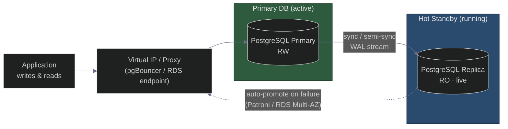
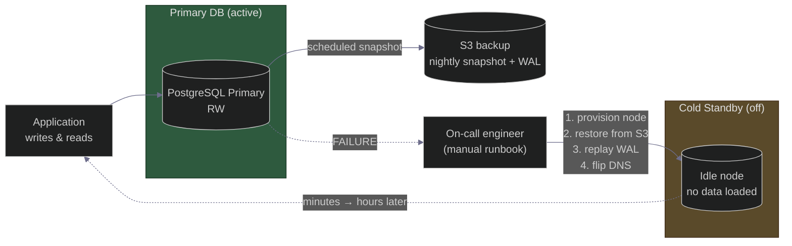
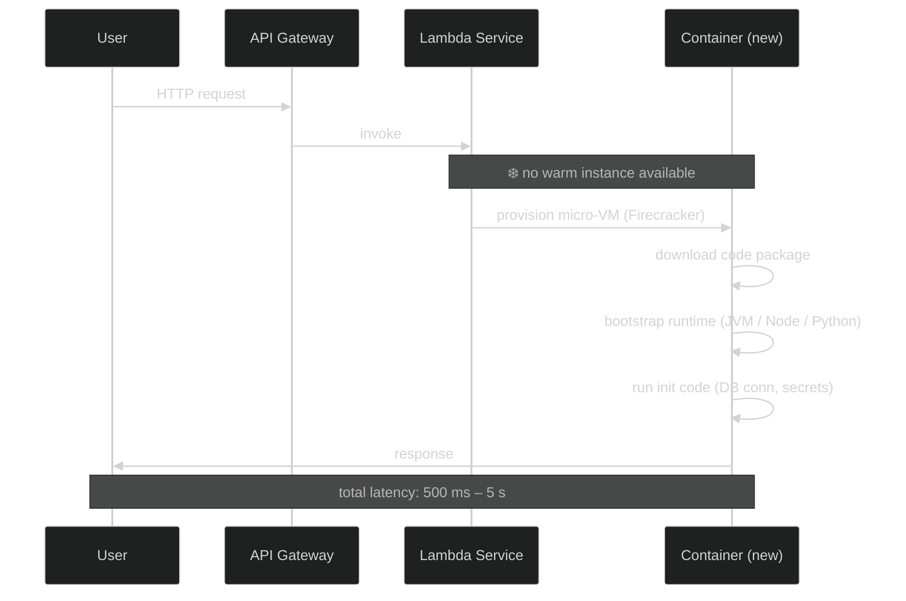
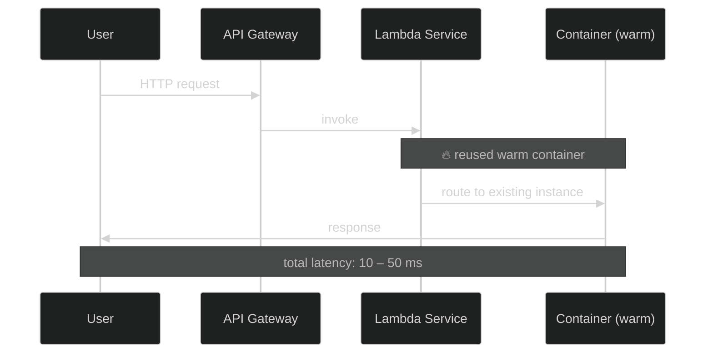
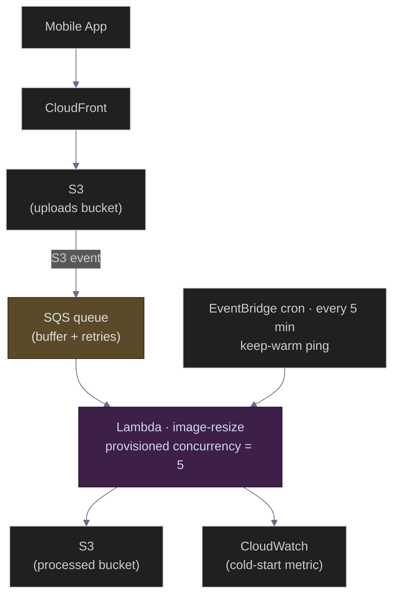
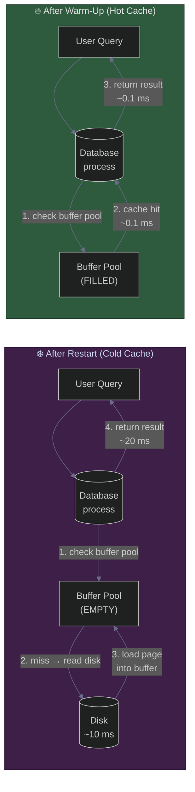
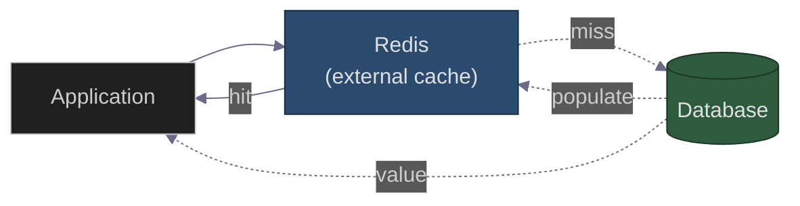

# Hot Standby vs Cold Standby — and Why "Cold Start" Is the Same Trade-off in Serverless, Recommendations, and Databases
### Day 61 of 50 - System Design Interview Preparation Series

**By Sunchit Dudeja**

---

## 🎯 The Core Idea

"How do you keep the system running when one component fails?"

That single question forces every architect into the same trade-off: **how much do you pay to keep a spare warm?**

- A spare that is **always running and up-to-date** takes over in seconds. Expensive.
- A spare that is **off and empty** is cheap, but takes minutes to hours to recover.

This is the **hot vs cold** trade-off. The surprise for most engineers is that the *same* pattern shows up in at least four places in a production system:

| Layer | "Cold" looks like | "Hot" looks like |
|-------|-------------------|------------------|
| **Infra failover** | Cold standby DB sitting idle | Hot standby DB with synchronous replication |
| **Serverless / runtime** | Lambda cold start (2–5 s) | Warm container, 10 ms response |
| **Recommendation engine** | New user, no signals → generic feed | Rich user history → personalised feed |
| **Database cache** | Buffer pool empty after restart | Buffer pool warm, queries served from RAM |

The architect's job is not to pick one answer — it is to **classify which parts of the system tolerate cold and which demand hot**, then pay accordingly.

> **Companion reads:**
> - [Day 42 — Blue-Green Deployment](./Day42_Blue_Green_Deployment_Zero_Downtime.md) — the hot-standby pattern for releases.
> - [Day 47 — DB Connection Pool](./Day47_Database_Connection_Pool_Biggest_Blunder.md) — cold connections are real latency.
> - [Day 51 — Chaos Monkey](./Day51_Chaos_Engineering_Netflix_Chaos_Monkey.md) — failover is only real if you've tested it.
> - [Day 52 — Chaos Kong](./Day52_Chaos_Kong_Region_Failure_Netflix.md) — regional hot standby in practice.
> - [Day 53 — Retry Storm + Circuit Breaker](./Day53_Uber_Retry_Storm_Exponential_Backoff_Circuit_Breaker.md) — what bad failover looks like.

---

## 🧠 Why You Should Care

"Hot vs cold standby" sounds like a checkbox on a DR runbook, but interviewers use it to probe whether you understand **RTO, RPO, cost, and split-brain** — the four words that separate a developer who has *installed* HA from one who has *designed* HA.

If you can also connect it to serverless cold starts, recommendation cold start, and buffer-pool warm-up, you've shown the interviewer something rarer: that you see **patterns**, not just products.

---

## 📐 Definitions (Simple)

| Term | What it means | Analogy |
|------|---------------|---------|
| **Hot standby** | Spare is always running, fully replicated, takes over in seconds or less. | A race car with a second identical engine already idling. |
| **Warm standby** | Spare is powered on and partially current; needs a few minutes to catch up. | Engine warm, but missing the last lap's telemetry. |
| **Cold standby** | Spare is off, no data loaded. Must be started, configured, restored from backup. Minutes to hours. | Spare car in the garage with no fuel — start it, fuel it, then drive. |

Two letters you must say in an interview:

- **RTO** — Recovery Time Objective — *how long can you be down?*
- **RPO** — Recovery Point Objective — *how much data can you afford to lose?*

Hot standby buys you near-zero RTO and near-zero RPO. Cold standby trades both for cost.

---

## 🏛️ Part 1 — Failover HLD: Hot Standby vs Cold Standby for a Database

### Diagram A — Hot Standby (continuous replication)



- WAL streams continuously, replica is queryable.
- On primary failure, a consensus layer (Patroni, RDS HA, Raft) **promotes** the replica and flips the VIP.
- RTO: seconds. RPO: ~zero with synchronous replication.

### Diagram B — Cold Standby (backup-based)



- The "spare" is just a backup in S3 plus an idle VM definition.
- On failure, an operator (or script) provisions, restores, replays, then flips traffic.
- RTO: minutes to hours. RPO: up to last snapshot interval (e.g., 1 hour).

**The one-line difference:** hot standby keeps state in sync; cold standby reconstructs it on demand.

---

## ⚖️ Detailed Comparison

| Aspect | Hot Standby | Cold Standby |
|--------|-------------|--------------|
| **Recovery time (RTO)** | Seconds to minutes | Minutes to hours |
| **Data loss (RPO)** | Near zero (sync replication) | Up to last backup window |
| **Cost** | High — second live server + replication network | Low — backup storage only |
| **Complexity** | High — replication, fencing, split-brain prevention | Low — backups + runbook |
| **Failover** | Automatic | Manual or scripted but slow |
| **Use case** | Payments, sessions, real-time | Batch logs, analytics, dev/stage |

---

## 🎯 Where to Use Each (Real Decisions)

**Hot standby — pay the cost:**
- User database — cannot lose recent writes.
- Session store — silent logout on failover is unacceptable.
- Real-time leaderboard — in-flight updates can't be lost.

**Cold standby — accept the trade-off:**
- Logging server's cold tier — S3 already gives 11×9 durability ([Day 60](./Day60_Centralized_Logging_Server_HLD.md)).
- Batch analytics warehouse — replay from source.
- Development / staging — budget matters more than uptime.

---

## ❌ Common Developer Mistakes (Architect's Fixes)

| Mistake | Consequence | Architect's fix |
|---------|-------------|-----------------|
| Hot standby for **everything** | Cloud bill doubles, over-engineered | Classify data by criticality; hot for user data, cold for logs |
| Cold standby for **user sessions** | Users logged out, data lost on failover | Use hot standby (e.g., Redis Sentinel) |
| **No failover testing** | First real failover fails due to config drift | Chaos engineering — Gremlin, Chaos Mesh ([Day 51](./Day51_Chaos_Engineering_Netflix_Chaos_Monkey.md)) |
| Async replication, **no lag monitoring** | RPO silently grows; data loss on failover | Alert on lag; block writes above threshold |
| Ignoring **split-brain** | Two primaries accept writes after partition | Consensus (Raft) + fencing (STONITH) |

---

## 🧱 Part 2 — Runtime Cold Start: Serverless & Containers

Same pattern, different layer. A serverless function is "cold" when no warm container exists; it has to provision, load runtime, then handle the request.

### Diagram C — Cold Start (no warm container)



### Diagram D — Hot Start (reusing a warm container)



### Comparison

| Aspect | Cold Start | Hot Start |
|--------|------------|-----------|
| Container state | Doesn't exist | Already running |
| Latency | 500 ms – 5 s | 10 – 50 ms |
| Cost when idle | Zero | Pay for provisioned concurrency |
| Triggers | First call after scale-to-zero, scale-out events | Repeat calls inside keep-warm window |
| Mitigation | Provisioned concurrency, smaller runtime, SnapStart | Keep-warm pings, min instances |

**One-line takeaway:** cold start is the **latency tax** for scaling to zero; hot start is the **speed benefit** of paying to keep capacity warm.

---

## 📷 Real Use Case — Image Processing API on Lambda

**Scenario:** social app, users upload profile pictures, Lambda resizes + compresses + converts to WebP. Bursty traffic — quiet most of the day, spikes in the evening.

**The pain:** first request after a quiet period takes ~3 seconds. User sees a spinner, retries, abandons.



### Architect's Mitigations Menu

| Solution | How it works | Cost | Best for |
|----------|--------------|------|----------|
| **Provisioned concurrency** | Keep N instances always warm | Pay for idle | Predictable baseline traffic |
| **Keep-warm ping** | Cron invokes function every 5 min | Pennies | Low-traffic APIs |
| **Smaller runtime** | Python/Go instead of Java/.NET | Free | All |
| **Lambda SnapStart** | Snapshot post-init, restore on cold start | Free (Java) | JVM workloads |
| **Smaller package** | < 10 MB deployment artifact | Free | All |
| **Async via queue** | SQS buffers requests; users don't see cold latency | Cheap | Image, video, email pipelines |
| **Combine functions** | One Lambda does resize + compress instead of chained calls | Cheaper | Latency-critical flows |

**The async-via-queue trick is the unsung hero:** if the user's request returns *"we're processing your image"* immediately, cold start is invisible. Only the **synchronous user-facing path** needs provisioned concurrency.

---

## 🌐 Part 3 — Cold Start in Real Production Systems

The "cold vs hot" pattern doesn't only mean a stopped server. In production at scale, it means **any state that takes time to populate before performance is acceptable**.

### 🚗 Uber Mobile App — Cold App Start

- **Cold:** tap the Uber icon after a week. The app process is created from scratch, code is initialized, several network calls fire for map + location data.
- **Hot:** app already in memory, foregrounded instantly.
- **The fix:** iOS 15 **pre-warms** the app; Uber's [Ramen push system](https://www.uber.com/blog/) replaced polling with server-pushed updates so cold starts don't compete with chatty network calls.

### 🍔 Uber Eats — User Cold Start in the Recommender

A new user signs up. The recommendation engine has **zero history** — what restaurants do you suggest?

- **Cold:** generic city-wide top-N. Bad first impression, retention drops.
- **Hot:** rich click + order history → personalised feed.
- **The fix (blend of three):**
  1. **Explicit signals** — onboarding asks for cuisines, dietary preferences.
  2. **Content-based filtering** — match restaurant attributes (cuisine, price, distance) to similar users.
  3. **Implicit signals** — the first 3 clicks already start building a vector.

### 🎬 Netflix & Amazon — Item Cold Start

When a new movie drops or a new product is listed, it has **no views, no ratings, no purchases**. Pure collaborative filtering can't surface it.

- **Content-based bootstrap:** use metadata (genre, director, synopsis, product specs) to recommend the new item to users who liked similar items.
- **LLM-generated synthetic interactions:** Amazon researchers use LLMs to simulate "likely" interactions for new items based on user demographics, seeding the recommender.
- **Net effect for Netflix live events** (e.g., Paul vs Tyson): a dedicated algorithm for the new content *type* lifted engagement on live events by ~20%.

**The pattern:** every recommender has both a **user cold start** and an **item cold start** — solved with the same trick: bring in *side information* (metadata, demographics, explicit prefs) until enough interactions accumulate to switch to collaborative signals.

---

## 🗄️ Part 4 — Cold Start in Databases (Buffer Pool Warm-Up)

A database that just restarted is *technically* up — but its in-memory cache is empty. Every read goes to disk. Latency can be **100× to 200× worse** until the cache fills.

### Diagram E — Cold Cache vs Hot Cache (database-internal pattern)



**Read both paths the same way:** user query → database process → check internal buffer pool → either disk (cold) or memory (hot) → return.

In the same benchmark, the *same* query is **0.02 s cold** and **0.0001 s hot** — a 200× speedup, all from in-process RAM.

### Why does the query go to the DB *first* and then to the cache?

Because for this pattern the **cache lives inside the database engine** (buffer pool, shared buffers). The application has no choice — it sends SQL to the database, and the database decides whether to satisfy it from RAM or disk.

That's only one of two common patterns:

#### Pattern 1 — Database-internal cache (above)

```text
User Query → Database → internal buffer pool → (miss) disk
```

- **Examples:** MySQL InnoDB buffer pool, PostgreSQL shared buffers, MongoDB WiredTiger cache.
- The DB decides what to cache using LRU + access patterns.
- "Cold start" = buffer pool empty after restart or failover.

#### Pattern 2 — External cache in front of the DB (look-aside)



```python
def get_user(uid):
    v = redis.get(uid)
    if v is None:
        v = db.query(uid)
        redis.set(uid, v, ex=300)
    return v
```

- **Examples:** Redis / Memcached look-aside, CDN in front of an origin.
- "Cold start" here = Redis empty after restart → first wave of requests stampedes the DB.

> Both patterns suffer cold starts — at **different layers**. Architect's choice: where do you want the warm-up cost to land?

### Real-World Mitigations

| Database / scenario | Pain | Mitigation |
|---------------------|------|------------|
| **MySQL** failover to replica | Buffer pool cold; 10–15 min of slow queries | `innodb_buffer_pool_dump_at_shutdown` + `..._load_at_startup` |
| **PostgreSQL** restart | shared_buffers empty for hours | `pg_prewarm` extension loads hot tables/indexes |
| **New read replica** added to cluster | First minutes overwhelm node | Ramp traffic gradually — 5% → 25% → 100% |
| **Serverless app** + DB | New connection per call → cold-start latency spike | RDS Proxy / connection pool with **min idle = N** ([Day 47](./Day47_Database_Connection_Pool_Biggest_Blunder.md)) |
| **Redis** restart | Cache empty → stampede on DB | Pre-warm script replays top-N keys; request coalescing ([Day 37](./Day37_Optimizing_Cache_High_Hit_Rate_Distributed_Systems.md)) |

---

## 📚 Every Major Database Has an Internal Cache

Yes — virtually every persistent database engine ships with its own in-memory cache. It's not a feature, it's a foundational requirement: disk is millions of times slower than RAM.

| Database | Internal cache | Notes |
|----------|----------------|-------|
| **MySQL (InnoDB)** | InnoDB Buffer Pool | Caches table + index pages; supports dump/load across restart |
| **PostgreSQL** | `shared_buffers` | Works alongside OS page cache; `pg_prewarm` for proactive load |
| **MongoDB** | WiredTiger internal cache | Defaults to 50% of (RAM − 1 GB) or 256 MB |
| **Cassandra** | Key Cache + Row Cache | Key cache → partition offsets; row cache → full rows |
| **SQL Server** | Buffer Cache | Part of the SQL Server memory pool |
| **Oracle** | Database Buffer Cache (SGA) | Stores recently accessed data blocks |
| **SQLite** | Page cache | Library-level, relies heavily on OS page cache |
| **Elasticsearch** | Page cache + filter/query caches | Leans on the OS file cache for segment files |
| **Redis** | *It is the cache* | "Cold start" = empty dataset after restart unless RDB/AOF replay |

**Architect's takeaway:** any time you restart, fail over, or add a node to a stateful system, you are paying a **cache warm-up tax**. Plan for it the same way you plan for cold-start mitigation in Lambda — pre-load, ramp traffic, monitor lag.

---

## ❌ Junior vs Architect — Side by Side

| Junior approach | Architect approach |
|-----------------|---------------------|
| "Add a hot standby for everything" | Classify components by **RTO / RPO / cost**; cold is fine for many |
| "Failover will just work" | Tested with chaos engineering ([Day 51](./Day51_Chaos_Engineering_Netflix_Chaos_Monkey.md)) |
| Async replication, no monitoring | Lag alerts; block writes if lag > threshold |
| Two writers after partition | Consensus (Raft) + fencing |
| "Lambda cold starts aren't real" | Async via queue for non-critical paths; provisioned concurrency only on the user-facing edge |
| Recommender = collaborative filtering only | Hybrid: content-based + explicit prefs to defeat user/item cold start |
| Bounce the DB during incident response | Knows the buffer pool will be cold for 10–15 min and routes traffic accordingly |

---

## 🟣 The Simpler Version — Explain It Like the Reader Has 2 Minutes

> **"Hot" means a spare that's already warm — ready to serve in seconds, but you pay for it 24/7. "Cold" means a spare that's off until you need it — cheap, but slow to wake up. The same trade-off appears as standby databases, Lambda cold starts, new users with no recommendation history, and freshly restarted database buffer pools. The architect's job is to spot which layers can afford to be cold and which absolutely can't.**

### The one-line summary

> 🎯 **Hot vs cold is the same RTO/RPO/cost trade-off whether you're failing over a database, booting a Lambda, recommending to a new user, or filling a buffer pool — and the right answer is almost never "everything hot."**

---

## 💬 How to Talk About It in an Interview

When asked *"How would you make this system highly available?"* a strong answer goes:

> "First I'd separate components by RTO and RPO. The user database and session store need **hot standby** with synchronous replication — losing a write or logging users out is unacceptable. The logging cold tier and analytics warehouse can use **cold standby** because S3 is already 11×9 durable and we can replay from source.
>
> For the hot-standby path I'd run a Patroni-managed Postgres cluster behind a virtual IP, with automatic failover and fencing to prevent split-brain. RPO is near zero with semi-sync replication; RTO is seconds. For the cold-standby path, nightly snapshots to S3 plus WAL archiving — RTO measured in minutes, restored by a documented runbook.
>
> The same pattern shows up elsewhere. If we run anything on Lambda, the user-facing API gets **provisioned concurrency**; background workers go through SQS so cold starts are invisible. If we have a recommender, new users get a content-based bootstrap until enough behavioural signal accumulates. And during incidents I assume the database buffer pool will be cold for 10–15 minutes after any restart — so we **ramp traffic** instead of slamming the new primary.
>
> Crucially, none of this is real until chaos-tested. I'd run a quarterly drill that kills the primary and measures actual RTO."

That paragraph signals **RTO/RPO awareness, cost discipline, split-brain understanding, pattern recognition across layers, and operational rigour** — the five things interviewers grade hardest on availability questions.

---

## 🧾 Quick Recap

- **Hot standby** = always-on twin → seconds RTO, near-zero RPO, **expensive**.
- **Cold standby** = sleeping twin → minutes-to-hours RTO, **cheap**.
- **Warm standby** = the in-between — powered on, lagging.
- The decision is **RTO + RPO + cost**, classified per component — never blanket.
- **Cold start** in serverless = the latency tax for scaling to zero; mitigate with provisioned concurrency, keep-warm, async queues.
- **Recommendation cold start** = no signal for new users or new items; bootstrap with content + explicit prefs.
- **Database cold start** = empty buffer pool after restart; mitigate with pre-warm and traffic ramping.
- Every persistent DB ships an **internal cache** — that's why query → DB → buffer pool is the right order in Pattern 1; Pattern 2 (Redis look-aside) flips the order.
- Failover is fiction until you **test it under load** ([Day 51](./Day51_Chaos_Engineering_Netflix_Chaos_Monkey.md), [Day 52](./Day52_Chaos_Kong_Region_Failure_Netflix.md)).

The next time someone says *"just add a standby,"* ask them which RTO and RPO that buys, what it costs per month, and whether they've ever actually failed over to it under production load. That question separates someone who has **bought** HA from someone who has **designed** it.

---

*If this changed how you think about resilience trade-offs — share it with the next engineer who proposes hot standby for every microservice.* 🎯
