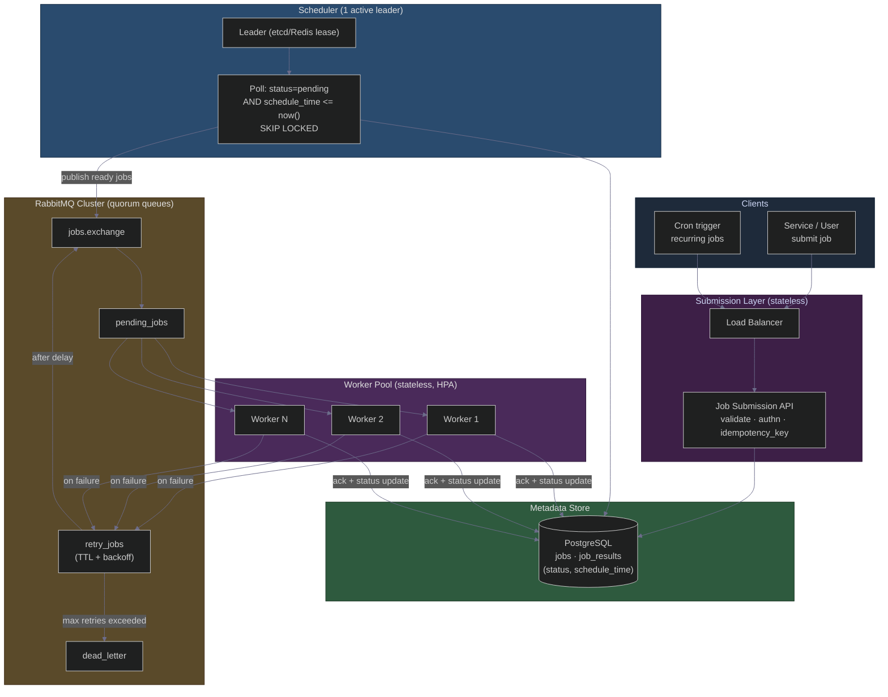
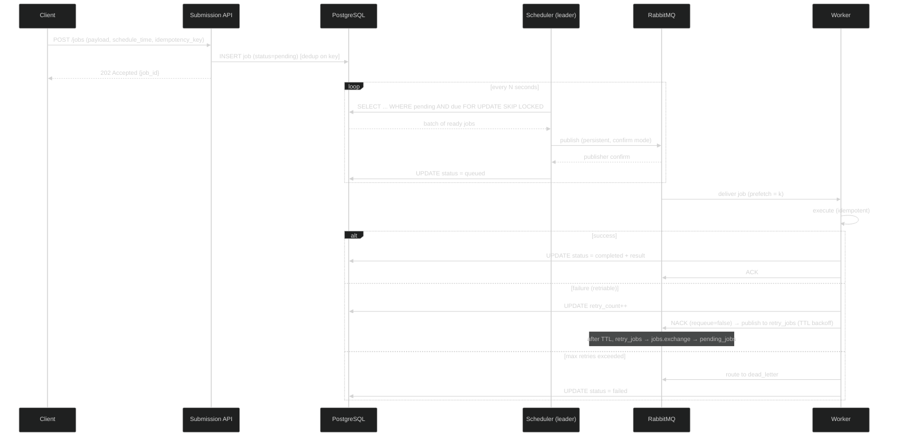

# Design a Distributed Job Scheduler — RabbitMQ Spine, Worker Pool, and the At-Least-Once Discipline
### Day 62 of 50 - System Design Interview Preparation Series

**By Sunchit Dudeja**

---

## 🎯 The Core Idea

*"Design a distributed job scheduler."*

The junior instinct is to reach for a cron table and a thread pool. That works on one box. It collapses the moment you need **more than one machine**, because now you have three hard problems at once:

1. **Who runs each job?** — coordination across many workers without double-execution.
2. **What happens when a worker dies mid-job?** — recovery without losing or duplicating work.
3. **When does a future-dated job actually fire?** — scheduling without a single point of failure.

The architect's move is one sentence:

> **Separate "decide what's ready" (scheduler) from "do the work" (workers) with a durable queue in between — then make every job idempotent so at-least-once delivery is safe.**

A distributed job scheduler is **not** a fancier cron. It is a **pipeline**: submit → persist → schedule → enqueue → execute → acknowledge → record. RabbitMQ is the spine that lets the scheduler and the workers fail independently.

> **Companion reads:**
> - [Day 32 — Scheduled Locks / Distributed Lock](./Day32_Scheduled_Locks_Distributed_Lock_Workflow.md) — leader election so two schedulers don't double-fire.
> - [Day 36 — RabbitMQ vs Kafka](./Day36_RabbitMQ_vs_Kafka_Architects_Decision_Guide.md) — why RabbitMQ wins for per-job ACK + DLQ.
> - [Day 39 — Outbox Pattern](./Day39_Outbox_Pattern_Reliable_Messaging.md) — atomic "save job + publish" without dual-write loss.
> - [Day 48 — Idempotency Key That Lied](./Day48_Idempotency_The_Key_That_Lied.md) — PENDING/COMPLETED dedup for safe retries.
> - [Day 49 — Kafka OOM Duplicate Charge](./Day49_Kafka_OOM_Crash_Duplicate_Charge_Idempotency.md) — what at-least-once does to you without dedup.
> - [Day 53 — Retry Storm + Backoff](./Day53_Uber_Retry_Storm_Exponential_Backoff_Circuit_Breaker.md) — why retries need exponential backoff + DLQ.

---

## 🧠 Why You Should Care

*"Design a distributed job scheduler"* is a **top-tier interview question** because it forces you to talk about the four things interviewers actually grade:

- **Delivery semantics** — at-least-once vs exactly-once (and why exactly-once is a lie without idempotency).
- **Coordination** — how do N schedulers avoid pushing the same job twice?
- **Failure recovery** — worker crash, queue crash, DB crash, network partition.
- **Backpressure & scaling** — what happens when 100k jobs land at once.

A senior answer names **semantics first** (*"I'll target at-least-once with idempotent execution"*), then draws a **pipeline with a durable queue**, not a single box labelled "cron."

---

## 📐 The Problem Statement (Interview Setup)

Design a scheduler that can:

| Requirement | Detail |
|-------------|--------|
| **Submit jobs** | One-time *and* recurring (cron-style) from many clients |
| **Execute concurrently** | Many worker nodes process in parallel |
| **Survive failures** | Worker crash, queue downtime, DB failover — no lost jobs |
| **Delivery semantics** | **At-least-once** (jobs assumed idempotent) |
| **Scale horizontally** | Add workers as load grows, no redeploy |
| **Scheduled execution** | Run at a future time (e.g., "send reminder at 9 AM tomorrow") |

**Constraint (given):** use a distributed message queue — **RabbitMQ** — as the communication backbone. Workers pull tasks from queues.

**Architect's first question:** *"What is the cost of running a job twice vs not at all?"*

| If a job is… | Delivery target | Design implication |
|--------------|-----------------|--------------------|
| Idempotent (send email, recompute cache) | **At-least-once** | Simple — retry freely, dedup at worker |
| Money-moving (charge a card) | At-least-once **+ idempotency key** | Dedup table keyed by `job_id` ([Day 48](./Day48_Idempotency_The_Key_That_Lied.md)) |
| "Run at most once, ever" | Exactly-once *(rare, expensive)* | Two-phase commit / dedup store; avoid if you can |

This design assumes **at-least-once with idempotent jobs** — the right default for 95% of real systems.

---

## 🏛️ High-Level Design (HLD)



**The five components and what each owns:**

| Component | Responsibility | Why it's separate |
|-----------|----------------|-------------------|
| **Submission API** | Validate, authenticate, dedup, persist | Stateless edge — scale on RPS |
| **Metadata store** | Source of truth for job state | Survives queue + worker loss |
| **Scheduler** | Decide *what's ready*, enqueue it | Single brain; leader-elected |
| **RabbitMQ** | Buffer + deliver + retry + dead-letter | Decouples scheduler from workers |
| **Workers** | Execute, ack, record result | The only thing that scales with load |

---

## 🔧 Job Lifecycle (Sequence — Success & Failure)



**Read it top to bottom:**

1. API persists the job **before** acking the client — the DB is the source of truth, not the queue.
2. Scheduler polls in **batches** with `SKIP LOCKED`, publishes with **persistent + confirm**, then marks `queued`.
3. Worker **acks only after** the job completes and the result is recorded.
4. Failures route to `retry_jobs` (delay via TTL), then back to the main queue; exhausted retries land in `dead_letter`.

---

## 🔩 Component Deep Dive

### 🔹 1. Job Submission API (stateless)

| Decision | Choice | Why |
|----------|--------|-----|
| Protocol | REST or gRPC | `POST /jobs`, `GET /jobs/{id}`, `DELETE /jobs/{id}` |
| Auth | API keys / JWT + per-tenant rate limit | Stop one tenant flooding the queue |
| **Idempotency** | Client-supplied `idempotency_key` | Same key → same `job_id`, no duplicate submit |
| Validation | Schema check on payload + schedule | Reject garbage at the edge, not at the worker |

> **The dual-write trap:** "INSERT job into DB" and "publish to RabbitMQ" are two systems. If you do both in the API and the publish fails after the commit, you have a job in the DB that never runs (or vice versa). **Fix:** let the API only write to the DB; the **scheduler** does the publish. If you must publish at submit time, use the [Outbox Pattern (Day 39)](./Day39_Outbox_Pattern_Reliable_Messaging.md).

### 🔹 2. Metadata Store (PostgreSQL)

```sql
-- jobs: the source of truth
job_id (PK) · type · payload · schedule_time · status
  · retry_count · max_retries · idempotency_key (UNIQUE) · created_at

-- job_results
job_id (FK) · status · output · error_message · finished_at

-- the index that makes polling cheap:
CREATE INDEX idx_ready ON jobs (status, schedule_time)
  WHERE status = 'pending';
```

PostgreSQL with replication handles the vast majority of cases. Reach for Cassandra only when write volume genuinely outgrows a sharded Postgres — and accept you lose `SKIP LOCKED` semantics if you do.

### 🔹 3. Scheduler — Two Patterns

| Pattern | How | Pros | Cons |
|---------|-----|------|------|
| **DB polling** | Periodically `SELECT pending AND due` and publish | Simple; no plugin; survives queue restart | Polling load at scale |
| **Delayed messaging** | Publish to RabbitMQ `x-delayed-message` exchange at submit | No polling; less DB load | Plugin dependency; delay ceiling; messages live only in the broker |

**Architect's choice:** for thousands of scheduled jobs/sec, **DB polling with `FOR UPDATE SKIP LOCKED`** — batch-fetch 100–500 due jobs, publish, mark `queued`. The DB stays the durable source of truth. Use delayed messaging only for low/medium volume where simplicity wins.

```sql
-- the heart of the scheduler: lease a batch without two schedulers colliding
SELECT job_id, payload FROM jobs
 WHERE status = 'pending' AND schedule_time <= now()
 ORDER BY schedule_time
 LIMIT 200
 FOR UPDATE SKIP LOCKED;
```

> **Single brain rule:** even with `SKIP LOCKED`, run **one active scheduler** via leader election ([Day 32](./Day32_Scheduled_Locks_Distributed_Lock_Workflow.md)). Standbys wait to take the lease if the leader dies. For very high volume, **partition** jobs by `hash(job_id) % N` and give each partition its own leader.

### 🔹 4. RabbitMQ Cluster Design

| Setting | Value | Why |
|---------|-------|-----|
| Queue type | **Quorum queues** (Raft, 3+ nodes) | Durable, survives node loss |
| Exchange | single `jobs.exchange` (direct/topic) | One routing point |
| Queues | `pending_jobs` · `retry_jobs` · `dead_letter` | Work / backoff / give-up |
| Persistence | `delivery_mode=2` (persistent) | Messages survive broker restart |
| Publisher confirms | `confirm` mode + `mandatory=true` | Scheduler knows the message landed |
| Retry delay | TTL on `retry_jobs` → dead-letter back to main | Exponential backoff: 5s → 1m → 5m |

**The retry mechanism without a cron:** a failed job is published to `retry_jobs` with a per-message TTL. When the TTL expires, RabbitMQ dead-letters it **back** to `jobs.exchange` → `pending_jobs`. Increase TTL per `retry_count` for exponential backoff. After `max_retries`, route to `dead_letter` for a human.

### 🔹 5. Worker Nodes (stateless)

| Decision | Choice | Why |
|----------|--------|-----|
| Deployment | K8s Deployment, HPA on queue depth | Scale with backlog, not CPU |
| Prefetch | `prefetch = 1–5` | Long jobs → low prefetch so one slow worker doesn't hoard |
| **ACK timing** | **After** processing + result write | Crash before ack → RabbitMQ redelivers |
| Failure | NACK `requeue=false` → publish to `retry_jobs` | Controlled backoff, not instant requeue storm |
| Shutdown | On SIGTERM: stop consuming, finish in-flight | Graceful drain, no half-done jobs |
| **Dedup** | Check `job_id` in Redis/DB before executing | At-least-once means redelivery happens |

```text
Worker loop:
  msg = consume(pending_jobs)        # prefetch-limited
  if already_done(msg.job_id): ack; continue   # dedup — see Day 48
  try:
      result = execute(msg.payload)  # idempotent
      record(result); ack(msg)
  except Retriable:
      bump_retry(msg); publish(retry_jobs, ttl=backoff(retry_count)); ack(msg)
  except Fatal:
      route(dead_letter); mark_failed(msg); ack(msg)
```

---

## 💥 Reliability & Fault Tolerance

| Failure | Impact | Mitigation |
|---------|--------|------------|
| **RabbitMQ node crash** | Some deliveries pause | Quorum queues + persistent messages; cluster survives minority loss |
| **Entire MQ cluster down** | No new deliveries | Jobs remain `pending`/`queued` in DB; scheduler republishes on recovery |
| **Worker crashes mid-job** | Job half-done | Message **unacked** → RabbitMQ redelivers; dedup makes re-run safe |
| **Scheduler crashes** | Scheduling pauses | Standby takes the lease ([Day 32](./Day32_Scheduled_Locks_Distributed_Lock_Workflow.md)); `queued` rows reconciled |
| **DB primary fails** | Writes pause | Replica promotion; scheduler reads from replica during failover |
| **Network partition** | Split brain risk | `pause_minority` so the minority side stops; manual heal for critical jobs |
| **Poison message** | Infinite retry | `max_retries` → `dead_letter`; never retry forever ([Day 53](./Day53_Uber_Retry_Storm_Exponential_Backoff_Circuit_Breaker.md)) |

> **Duplicate prevention is non-negotiable.** At-least-once *guarantees* you will occasionally run a job twice (redelivery after a crash between "work done" and "ack"). The worker must check `job_id` in a fast dedup store (Redis or a `completed` row) **before** doing side-effecting work. This is the exact lesson of [Day 49](./Day49_Kafka_OOM_Crash_Duplicate_Charge_Idempotency.md).

---

## 📈 Scaling Considerations

| Component | Scaling strategy |
|-----------|------------------|
| **API** | Stateless behind LB; HPA on RPS |
| **Database** | Read replicas for scheduler polls; partition/shard jobs by tenant or hash if writes saturate |
| **Scheduler** | One leader per partition; partition by `hash(job_id) % N` for throughput |
| **RabbitMQ** | More queues/partitions; **stream queues** (3.12+) for very high fan-in |
| **Workers** | Horizontal — add pods; **autoscale on queue depth**, not CPU |

> **The right autoscale signal is queue depth, not CPU.** A worker waiting on a slow downstream API is at 5% CPU while the backlog explodes. Scale on `pending_jobs` depth ÷ target-drain-time.

---

## 📊 Monitoring & Observability

| Signal | Why it matters | Alert |
|--------|----------------|-------|
| Queue depth (pending/retry/dead) | Backlog & health | `pending` rising 5 min → scale workers |
| **Dead-letter count** | Jobs giving up | DLQ non-empty → page a human |
| Scheduler lag | Polling delay vs `schedule_time` | Lag > 1 min → scheduler unhealthy |
| Job latency | Submit → start → finish | p95 breach → investigate |
| Worker success/failure rate | Code or downstream health | Failure spike → circuit-break downstream |

Trace a job end-to-end with **OpenTelemetry**, carrying `job_id` as the trace correlation key from API → scheduler → worker ([Day 33 — tracing IDs](./Day33_Distributed_Tracing_IDs_Complete_Guide.md)).

---

## ⚖️ Key Architectural Decisions (Trade-off Table)

| Decision | Option A | Option B (chosen) | Why |
|----------|----------|-------------------|-----|
| Delivery semantics | Exactly-once | **At-least-once + idempotency** | Exactly-once is a costly illusion |
| Scheduling | Pure delayed messaging | **DB polling + SKIP LOCKED** | DB stays source of truth; survives MQ loss |
| Publish point | API publishes | **Scheduler publishes** (or Outbox) | Avoid dual-write loss |
| Queue type | Classic mirrored | **Quorum queues** | Raft durability, no split-brain ack loss |
| Retry | Instant requeue | **TTL backoff → retry_jobs** | No retry storm ([Day 53](./Day53_Uber_Retry_Storm_Exponential_Backoff_Circuit_Breaker.md)) |
| Worker autoscale | CPU | **Queue depth** | CPU lies when workers wait on I/O |

---

## ❌ Junior vs Architect — Side by Side

| Junior approach | Architect approach |
|-----------------|---------------------|
| ACK message **before** the job finishes | **ACK after** processing — crash → safe redelivery |
| No idempotency → duplicate runs on retry | Idempotency key + worker-side dedup ([Day 48](./Day48_Idempotency_The_Key_That_Lied.md)) |
| Poll DB one job at a time | `FOR UPDATE SKIP LOCKED`, batch 100–500 |
| Transient (non-persistent) messages | `delivery_mode=2` — survive broker restart |
| Retry forever on failure | `max_retries` → **dead-letter queue** |
| One scheduler, no failover | **Leader election** with lease standby |
| API writes DB *and* publishes (dual write) | Scheduler publishes, or **Outbox** ([Day 39](./Day39_Outbox_Pattern_Reliable_Messaging.md)) |
| Autoscale workers on CPU | Autoscale on **queue depth** |

---

## 🟣 The Simpler Version — Explain It Like the Reader Has 2 Minutes

> **A distributed job scheduler is a kitchen. The waiter (API) writes the order on a ticket and pins it to the rail (database). One head chef (scheduler) reads the rail, and when an order is due, calls it out and drops the ticket into the line (RabbitMQ). Many cooks (workers) grab tickets, cook, and only tear the ticket off the rail once the plate is out (ack after done). If a cook drops a plate, the ticket stays up so someone re-cooks it — which is fine, because every recipe is written to be safe to make twice (idempotent). Orders that keep failing go to the manager's desk (dead-letter queue).**

### The one-line summary

> 🎯 **A distributed job scheduler decouples "decide what's ready" from "do the work" with a durable queue — and makes every job idempotent so at-least-once delivery is a feature, not a bug.**

---

## 💬 How to Talk About It in an Interview

When asked *"Design a distributed job scheduler,"* a strong answer goes:

> "First I'd pin the semantics: **at-least-once** delivery with **idempotent** jobs — exactly-once isn't worth the cost, and idempotency makes redelivery safe.
>
> The shape is a **pipeline**, not a cron box. A stateless **API** validates and writes the job to **PostgreSQL** with an idempotency key — that DB is the source of truth. A leader-elected **scheduler** polls `pending AND due` with `FOR UPDATE SKIP LOCKED` in batches, publishes to **RabbitMQ** with persistent messages and publisher confirms, then marks the row `queued`. I keep the publish in the scheduler — not the API — to avoid a dual-write, or I'd use the Outbox pattern.
>
> **Quorum queues** give durability. Stateless **workers** consume with a small prefetch, execute, write the result, and **ack only after** completion — so a crash means safe redelivery. Failures go to a `retry_jobs` queue with TTL-based exponential backoff that dead-letters back to the main queue; after `max_retries` they land in a `dead_letter` queue for a human.
>
> For coordination I use leader election so two schedulers don't double-fire, and worker-side dedup on `job_id` so at-least-once never charges a card twice. I autoscale workers on **queue depth**, alert on dead-letter count and scheduler lag, and trace each job by `job_id` end to end.
>
> Three levers: **durable queue between scheduler and workers, ack-after-done, and idempotent execution.**"

That paragraph signals you understand **delivery semantics, coordination, failure recovery, and scaling** — the four things interviewers grade on this question.

---

## 🧾 Quick Recap

- **Not a cron** — a pipeline: submit → persist → schedule → enqueue → execute → ack → record.
- **DB is the source of truth**; RabbitMQ is the delivery spine.
- **At-least-once + idempotency** — the right default; dedup on `job_id` before side effects.
- **Scheduler** polls `pending AND due` with `SKIP LOCKED`, batched, single leader.
- **Quorum queues + persistent messages + publisher confirms** — no lost jobs.
- **ACK after processing**, never before — crash → safe redelivery.
- **Retry with TTL backoff**, cap with `max_retries` → **dead-letter queue**.
- **Autoscale on queue depth**, not CPU.
- Watch out for the **dual-write trap** — publish from the scheduler or use the [Outbox](./Day39_Outbox_Pattern_Reliable_Messaging.md).

> **Note on Kafka:** for extreme throughput (>100k jobs/sec) Kafka with consumer groups is a contender — but RabbitMQ's per-message **ack** and **dead-lettering** are first-class, which is exactly what job scheduling needs. Pick the queue for its acknowledgement model, not its throughput headline ([Day 36](./Day36_RabbitMQ_vs_Kafka_Architects_Decision_Guide.md)).

The next time someone says "just use a cron job," ask them what happens when the cron box reboots mid-run, who re-runs the job, and how they stop it from running twice. That question separates someone who has **scheduled** a task from someone who has **architected** a scheduler. 🎯

---

*If this changed how you think about background work — share it with the next engineer who reaches for `@Scheduled` on a single server.* 🎯
