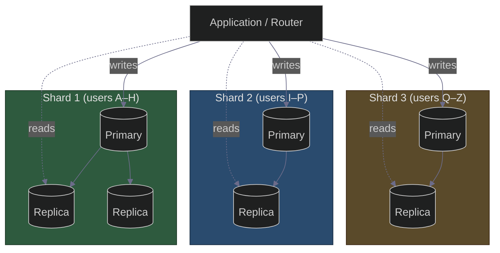
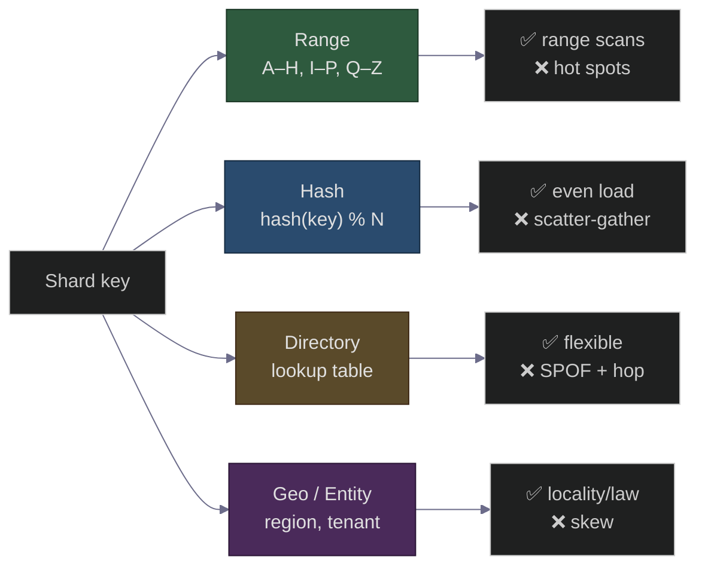
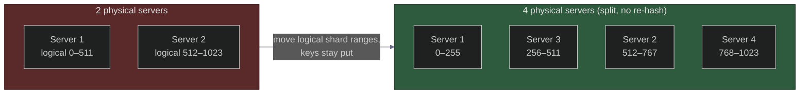

# Database Sharding: When One Database Isn't Enough — Range, Hash, Directory, and the Resharding Nightmare
### Day 64 of 50 - System Design Interview Preparation Series

**By Sunchit Dudeja**

---

## 🎯 The Core Idea

Your database is dying. Reads are slow, writes are slower, and the disk is full. You've already added read replicas ([Day 30](./Day30_Database_Replication_AWS_Architecture.md)) and a cache ([Day 37](./Day37_Optimizing_Cache_High_Hit_Rate_Distributed_Systems.md)). But replicas only scale **reads** — every write still hits the single primary, and that one box has a ceiling.

Sharding is the answer, and it's one sentence:

> **Sharding splits one logical database into many physical databases (shards), each holding a *disjoint subset* of the data, so that writes and storage scale horizontally — at the cost of losing easy joins, easy transactions, and easy schema changes.**

The junior hears "sharding" and thinks "more servers = faster." The architect hears "sharding" and immediately asks the only question that matters: **"What's the shard key?"** — because that one decision determines whether your system scales gracefully or melts into hot spots and cross-shard queries.

> **Companion reads:**
> - [Day 28 — Consistent Hashing](./Day28_Consistent_Hashing_Resharding.md) — how to add/remove shards without remapping everything.
> - [Day 30 — Database Replication](./Day30_Database_Replication_AWS_Architecture.md) — replicas scale reads; sharding scales writes. You usually need both.
> - [Day 38 — Primary Key Strategies](./Day38_Primary_Key_Strategies_SQL_vs_NoSQL.md) — why auto-increment IDs break the moment you shard.
> - [Day 27 — Two-Phase Commit](./Day27_Two_Phase_Commit.md) — the expensive thing you're forced into for cross-shard writes.
> - [Day 45 — Saga Pattern](./Day45_Why_ACID_Breaks_Microservices_Saga_Pattern.md) — the cheaper alternative to 2PC across shards.

---

## 🧠 Why You Should Care

"How would you scale the database?" is the follow-up to *every* system design question. The candidate who says *"add replicas"* gets a nod. The candidate who says *"replicas scale reads, but writes are bottlenecked on the primary, so I'd shard by `user_id` using hash-based partitioning, accept that cross-user queries become scatter-gather, and pre-split into 1024 logical shards so I never have to physically reshard"* — that candidate gets the offer.

Sharding forces you to confront the four things interviewers grade:

- **Shard key choice** — the single most important decision in the whole design.
- **Hot spots** — what happens when one shard gets 10× the traffic.
- **Cross-shard operations** — joins, transactions, and unique constraints that no longer "just work."
- **Resharding** — the operational nightmare of moving live data when you outgrow your shard count.

---

## 📦 Sharding vs Replication vs Partitioning — Clear the Confusion First

These three get muddled constantly. Nail the distinction:

| Term | What it does | Scales | Data per node |
|------|--------------|--------|---------------|
| **Replication** | Copy the *same* data to multiple nodes | Reads + availability | **Full copy** on each node |
| **Partitioning** | Split a table into pieces (often within one DB) | Query performance | Subset (logical) |
| **Sharding** | Partitioning **across separate database servers** | Writes + storage | **Disjoint subset** per server |

> **The mental model:** replication is *photocopying* the whole book for every reader. Sharding is *tearing the book into chapters* and giving each library a different chapter. Real systems do both: shard for write/storage scale, then replicate each shard for read scale and HA.

---

## 🗂️ The Four Sharding Strategies

### 🔹 1. Range-Based Sharding

Split by a contiguous range of the shard key: users `A–H` → Shard 1, `I–P` → Shard 2, `Q–Z` → Shard 3. Time-series data is often ranged by date.

| ✅ Pros | ❌ Cons |
|---------|---------|
| Range queries are efficient (`WHERE created BETWEEN ...` hits few shards) | **Hot spots** — if everyone signs up today, today's shard is on fire |
| Simple to reason about; easy to add a new range | Uneven distribution (lots of `S` surnames, few `Z`) |
| Great for time-series / append-heavy data | The "latest" shard takes all the write load |

> **Classic failure:** sharding a social app by `user_id` auto-increment range means **the newest shard always holds the most active users** (new users are the most engaged), so one shard melts while old shards idle.

### 🔹 2. Hash-Based Sharding

Compute `hash(shard_key) % N` and route to that shard. This is the **default for most OLTP systems** because it spreads load evenly.

| ✅ Pros | ❌ Cons |
|---------|---------|
| **Even distribution** — no natural hot spots | Range queries become **scatter-gather** (hit all shards) |
| Simple routing | `% N` means **changing N reshuffles almost everything** |
| Works great for point lookups by key | Can't exploit data locality |

> **The `% N` trap:** plain modulo hashing means adding one shard (N → N+1) remaps ~**all** keys. The fix is **[Consistent Hashing (Day 28)](./Day28_Consistent_Hashing_Resharding.md)** or **[Rendezvous Hashing (Day 54)](./Day54_Rendezvous_Hashing_Highest_Random_Weight.md)**, which only move ~1/N of keys when the shard count changes.

### 🔹 3. Directory-Based (Lookup Table) Sharding

Keep an explicit **lookup service** that maps each key (or key range) to a shard. The router asks the directory "where does `user_123` live?" before every query.

| ✅ Pros | ❌ Cons |
|---------|---------|
| **Total flexibility** — move any key to any shard | The directory is a **single point of failure** (must be HA + cached) |
| Easy rebalancing — just update the mapping | Extra lookup hop (mitigated by caching the map) |
| Can colocate related data deliberately | The directory itself can become a bottleneck |

> This is what powers systems that need **live rebalancing** — you move a tenant's data and just flip its directory entry. Vitess, many multi-tenant SaaS platforms, and your own [Day 63 UPI wallet → shard mapping](./Day63_UPI_Lite_Offline_Payments_TEE_Double_Spend.md) use this idea.

### 🔹 4. Geo / Entity-Based Sharding

Shard by region (`eu-users` in Frankfurt, `in-users` in Mumbai) or by a top-level entity (tenant, merchant). Often driven by **data-residency law** more than performance.

| ✅ Pros | ❌ Cons |
|---------|---------|
| Low latency (data near users); compliance (GDPR, RBI data localization) | Cross-region queries are slow and rare-but-painful |
| Natural blast-radius isolation per region | Uneven load (US shard ≫ others) |

---

## 🔑 Choosing the Shard Key — The Decision That Makes or Breaks You

Everything hinges on this. A good shard key has three properties:

| Property | Why it matters | Counter-example |
|----------|----------------|-----------------|
| **High cardinality** | Many distinct values → fine-grained spread | Sharding by `country` → only ~200 values, terrible skew |
| **Even access distribution** | No single value gets disproportionate traffic | Sharding by `status` → 90% of rows are `active` |
| **Matches your query pattern** | Most queries should target a single shard | Sharding orders by `order_id` but always querying by `user_id` → scatter-gather every time |

> **The golden rule:** shard by the key you **filter on most**. If 95% of your queries are "get everything for this user," shard by `user_id` — then almost every query is a **single-shard query**. The 5% of cross-user analytics queries go to a separate OLAP store, not your sharded OLTP DB.

**Worked example — what to shard a chat app on:**

| Candidate key | Result |
|---------------|--------|
| `message_id` | ❌ Messages of one conversation scatter across all shards |
| `user_id` | ⚠️ Better, but a 2-person chat lives on 2 shards → still cross-shard |
| `conversation_id` | ✅ All messages of a chat colocate → single-shard reads, the right call |

---

## 💥 The Three Hard Problems Sharding Creates

Sharding doesn't remove complexity — it **moves it into your application layer**. Be honest about the costs.

### Problem 1: Cross-Shard Queries (Scatter-Gather)

A query that can't be answered by one shard must **fan out to all shards and merge** — the scatter-gather pattern. It's as slow as your *slowest* shard, and `JOIN`s across shards essentially don't exist in SQL anymore.

**Mitigations:** denormalize so related data colocates; maintain a separate search index (Elasticsearch) for cross-cutting queries; push analytics to a data warehouse via CDC.

### Problem 2: Cross-Shard Transactions

ACID is trivial on one node. The moment a transaction touches two shards, you're choosing between:

| Option | Cost |
|--------|------|
| **[Two-Phase Commit (Day 27)](./Day27_Two_Phase_Commit.md)** | Strong consistency, but blocking + slow + coordinator is a SPOF |
| **[Saga Pattern (Day 45)](./Day45_Why_ACID_Breaks_Microservices_Saga_Pattern.md)** | Eventual consistency with compensating actions — the usual real-world pick |
| **Avoid it entirely** | Design so transactions never cross shards (best of all) |

> The architect's move is **Problem 2 avoidance**: pick a shard key so that a logical transaction stays inside one shard. A bank that shards by `account_id` keeps a single-account debit on one shard; only inter-account transfers go cross-shard.

### Problem 3: Resharding (The Nightmare)

You picked `% 4`. You now need 8 shards. With naive modulo, **~half your keys move**, while the system is live. This is the operation everyone underestimates.

**Defenses, in order of preference:**

1. **Over-provision logical shards up front.** Create 1024 *logical* shards on day one, map many logical shards to each *physical* server. To scale, move whole logical shards to new servers — keys never re-hash. (This is how Vitess, Citus, and most mature systems do it.)
2. **Consistent / rendezvous hashing** ([Day 28](./Day28_Consistent_Hashing_Resharding.md) / [Day 54](./Day54_Rendezvous_Hashing_Highest_Random_Weight.md)) so only ~1/N keys move.
3. **Directory-based** sharding so you move data and just update the map.

> **Pre-split is the cheat code.** Choosing 1024 logical shards on day one costs almost nothing and saves you from ever doing a live re-hash. Physical resharding becomes "move some logical buckets" — a copy, not a reshuffle.

---

## 🌡️ The Hot Shard / Celebrity Problem

Even perfect hashing fails against a **single hot key**. Justin Bieber's user row, a viral product, the `#1` trending hashtag — one key gets millions of requests and its shard buckles while others idle.

| Mitigation | How |
|------------|-----|
| **Cache the hot key** | Put the celebrity row in Redis; the shard never sees most reads ([Day 37](./Day37_Optimizing_Cache_High_Hit_Rate_Distributed_Systems.md)) |
| **Split the hot key** | Append a bucket suffix (`bieber#1`, `bieber#2` ...) and aggregate — spreads writes |
| **Dedicated shard** | Give whale tenants their own shard (directory-based) |
| **Read replicas of that shard** | Fan reads of the hot shard across replicas |

> This is the same lesson as the **News Feed celebrity fan-out problem** — hot keys break uniform assumptions, and you handle them as *special cases*, not by re-architecting the whole system.

---

## ❌ Junior vs Architect — Side by Side

| Junior approach | Architect approach |
|-----------------|---------------------|
| "Add replicas to handle more writes." | Replicas scale **reads**; sharding scales **writes**. Know which problem you have. |
| Picks shard key = primary key by default | Picks shard key = **the column you filter on most** |
| `hash(key) % N` with N = current server count | **Many logical shards** mapped to few physical servers; `% N` never re-runs |
| Assumes joins still work | Designs to **colocate** related data; cross-shard = scatter-gather |
| Cross-shard transactions via 2PC everywhere | **Avoids** cross-shard transactions by shard-key design; Saga only when unavoidable |
| Auto-increment IDs | **Snowflake / UUID** IDs so two shards never collide ([Day 38](./Day38_Primary_Key_Strategies_SQL_vs_NoSQL.md)) |
| Shards too early ("we might need it") | Shards **only after** replicas + cache + vertical scaling are exhausted |

---

## ⚖️ When NOT to Shard (Read This Before You Shard)

Sharding is a **one-way door** that permanently complicates your system. Exhaust the cheaper options first:

1. **Vertical scaling** — a bigger box buys you a surprisingly long runway.
2. **Read replicas** — if you're read-heavy, this alone may be enough ([Day 30](./Day30_Database_Replication_AWS_Architecture.md)).
3. **Caching** — offload hot reads to Redis ([Day 37](./Day37_Optimizing_Cache_High_Hit_Rate_Distributed_Systems.md)).
4. **Archive cold data** — move old rows out of the hot table.
5. **Connection pooling** — sometimes the "DB is dying" is actually pool exhaustion ([Day 47](./Day47_Database_Connection_Pool_Biggest_Blunder.md)).

> **Shard last, not first.** Every sharded system pays a permanent tax in operational complexity. Reach for it when **write throughput or total storage** genuinely exceeds one machine — not before.

---

## 🟣 The Simpler Version — Explain It Like the Reader Has 2 Minutes

> **Imagine one librarian who has to file and fetch every book in a city. Eventually she can't keep up. Replication is hiring more librarians who each keep a full copy of every book — great for *finding* books faster, useless for *storage* because each still holds everything. Sharding is the real fix: split the books across many libraries by, say, the first letter of the author's name. Now each library is smaller and faster. The catch: if you want "all books by authors whose last name starts with anything," you have to visit *every* library (scatter-gather), and if one author is wildly popular, that one library gets mobbed (hot shard). The trick that saves you is deciding the split rule — the shard key — by how people actually search, and pre-creating lots of tiny libraries so you never have to re-sort every book later.**

### The one-line summary

> 🎯 **Sharding scales writes and storage by splitting data across servers — and the entire game is choosing a shard key that keeps most queries on one shard while spreading load evenly.**

---

## 💬 How to Talk About It in an Interview

When asked *"how do you scale the database past one machine?"*:

> "First I'd confirm the bottleneck. If it's reads, **replicas + cache** may be enough. If it's **write throughput or storage**, that's when I shard — replicas can't help because every write still hits one primary.
>
> The key decision is the **shard key**. I pick the column most queries filter on — say `user_id` for a social app, `conversation_id` for chat — so the common query is a **single-shard** query. I'd use **hash-based** sharding for even distribution, but with **many logical shards** (e.g., 1024) mapped onto fewer physical servers, so scaling out moves logical buckets instead of re-hashing every key.
>
> I'd call out the costs honestly: **cross-shard queries become scatter-gather**, **cross-shard transactions** need Saga or 2PC so I design the shard key to avoid them, and **hot keys** (a celebrity) need caching or key-splitting as a special case. IDs become **Snowflake/UUID** so shards don't collide.
>
> And I'd only do this after vertical scaling, replicas, and caching are exhausted — sharding is a one-way door."

That hits **shard-key choice, hot spots, cross-shard operations, and resharding** — the four things this question grades.

---

## 🧾 Quick Recap

- **Replication scales reads; sharding scales writes + storage.** Real systems do both.
- Four strategies: **range** (scans, hot spots), **hash** (even, scatter-gather), **directory** (flexible, SPOF), **geo/entity** (locality, law).
- **The shard key is everything**: high cardinality, even access, matches query pattern.
- **Pre-split into many logical shards** so you never do a live re-hash — the single best operational decision.
- Sharding moves complexity into the app: **scatter-gather queries, cross-shard transactions, hot shards.**
- Avoid cross-shard transactions by **shard-key design**; use [Saga (Day 45)](./Day45_Why_ACID_Breaks_Microservices_Saga_Pattern.md) when you can't.
- Use **Snowflake/UUID** IDs ([Day 38](./Day38_Primary_Key_Strategies_SQL_vs_NoSQL.md)) and **consistent hashing** ([Day 28](./Day28_Consistent_Hashing_Resharding.md)).
- **Shard last** — after vertical scaling, replicas, caching, and archiving.

---

## 🎬 Final Words

Sharding is the moment your system stops being "a database" and starts being "a distributed data layer your application has to understand." The complexity never disappears — you just decide where it lives. Choose the shard key well and 95% of your queries stay simple, single-shard, and fast. Choose it badly and you'll spend your weekends untangling scatter-gather queries and hand-balancing hot shards.

The next time someone says "let's just shard it," ask them the only question that matters: **"By what key — and what happens to the queries that don't use it?"** That question separates someone who has *heard of* sharding from someone who has *operated* a sharded system. 🎯

---

*If this saved you from sharding on the wrong key, pass it to the next engineer who's about to type `hash(id) % num_servers`.* 🎯
