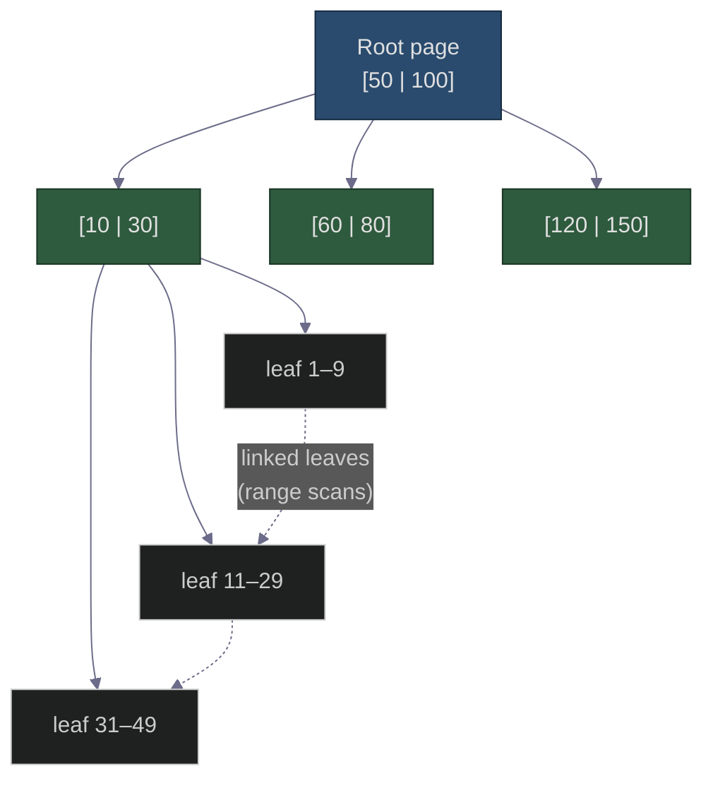
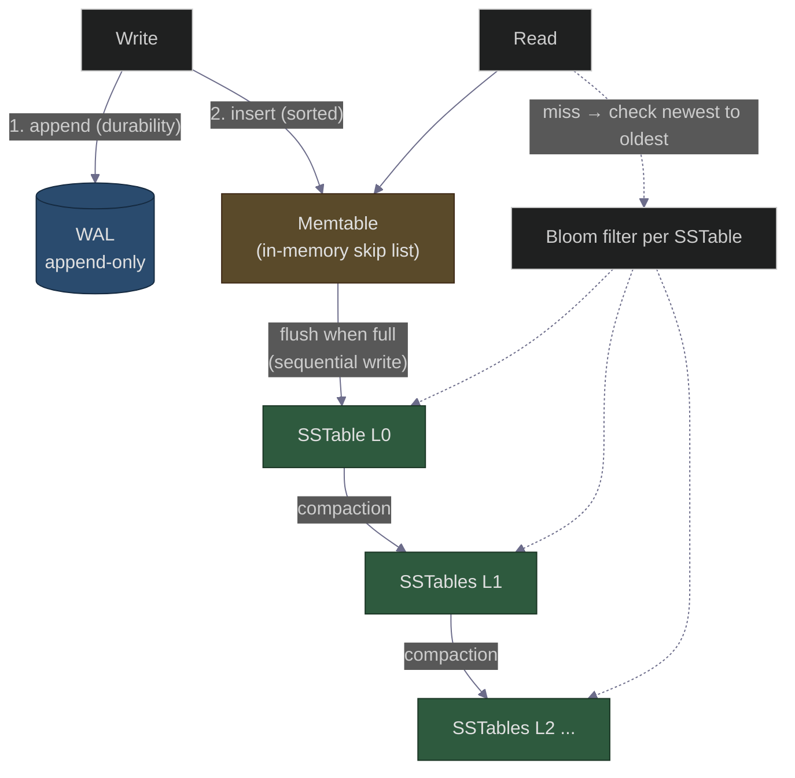

# LSM Trees vs B-Trees: Why Cassandra Eats Writes for Breakfast and Postgres Doesn't
### Day 65 of 50 - System Design Interview Preparation Series

**By Sunchit Dudeja**

---

## 🎯 The Core Idea

When you pick a database ([Day 23](./Day23_Database_Selection_System_Design.md)), you're really picking a **storage engine** — the data structure that decides how bytes hit the disk. And there are essentially two camps in the entire industry:

- **B-Trees** — power Postgres, MySQL (InnoDB), Oracle, SQL Server. **Update data in place.**
- **LSM Trees** (Log-Structured Merge) — power Cassandra, RocksDB, LevelDB, ScyllaDB, HBase, and the internals of Kafka-ish systems. **Never update in place — only append.**

The one sentence that explains the entire difference:

> **B-Trees optimize for fast reads by keeping data sorted and updating it in place (random writes). LSM Trees optimize for fast writes by only ever appending sequentially and sorting later (deferred merges). It is a fundamental read-vs-write trade-off, dictated by the brutal cost of random disk I/O.**

The junior picks a database by its name ("everyone uses Postgres"). The architect picks it by its **write pattern**: *"this is a write-heavy ingest workload, so I want an LSM engine; that's a read-heavy transactional workload, so I want a B-Tree."*

> **Companion reads:**
> - [Day 23 — Database Selection](./Day23_Database_Selection_System_Design.md) — the layer above this: which DB for which job.
> - [Day 7 — Databases: Developer vs Architect](./Day7_Databases_Developer_vs_Architect.md) — thinking about storage like an architect.
> - [Day 38 — Primary Key Strategies](./Day38_Primary_Key_Strategies_SQL_vs_NoSQL.md) — why sequential vs random keys matters *because* of B-Tree page splits.
> - [Day 39 — Outbox Pattern](./Day39_Outbox_Pattern_Reliable_Messaging.md) — the WAL idea (append-only log) shows up everywhere.

---

## 🧠 Why You Should Care

"Why is Cassandra faster at writes than MySQL?" is a senior-level interview question that **filters hard**. Most candidates wave their hands ("NoSQL is just faster"). The real answer is a precise statement about disk physics:

- A spinning disk seek is ~10 ms; an SSD random write triggers expensive read-modify-write at the flash block level.
- **Sequential** writes are 100–1000× faster than **random** writes on almost any storage.
- B-Trees do random writes (update the page where the key lives). LSM Trees turn every write into a **sequential append**.

Understanding this lets you answer the questions interviewers actually care about: **write amplification, read amplification, space amplification, and compaction** — the three "amplifications" that define every storage engine's personality.

---

## 🌳 B-Trees: Sorted, In-Place, Read-Optimized

A B-Tree (B+Tree in practice) keeps keys **sorted in fixed-size pages** (typically 4–16 KB). To find a key you walk from the root down through internal nodes to a leaf — `O(log n)` with a very high fan-out, so even a billion rows is ~3–4 page reads.

**The write path:** find the leaf page for the key → modify it **in place**. If the page is full, **split** it (allocate a new page, move half the keys, update the parent). That split is a **random write** to wherever the new page lands on disk.

| ✅ B-Tree strengths | ❌ B-Tree weaknesses |
|---------------------|----------------------|
| **Fast point reads** — one path, ~3–4 page reads | **Random writes** — every insert touches a specific page |
| **Excellent range scans** — leaves are linked & sorted | **Page splits** under random-key inserts cause fragmentation |
| Reads see the latest value immediately (in place) | Write throughput capped by random I/O |
| Mature, predictable, strong for transactions | Each write also writes the **WAL** → write amplification |

> **Why sequential primary keys matter for B-Trees:** inserting random UUIDs scatters writes across the whole tree, causing constant page splits and cache misses. Inserting **monotonic** keys (auto-increment, time-ordered) appends to the rightmost leaf — far cheaper. This is exactly the [Day 38 primary-key lesson](./Day38_Primary_Key_Strategies_SQL_vs_NoSQL.md), and it's *caused by* the B-Tree.

---

## 📚 LSM Trees: Append-Only, Merge-Later, Write-Optimized

An LSM Tree refuses to do random writes. Every write goes to two places, both cheap:

1. **WAL (append-only log)** on disk — for durability/crash recovery.
2. **Memtable** — an in-memory sorted structure (e.g., a skip list).

When the memtable fills up, it's flushed to disk **sequentially** as an immutable, sorted file called an **SSTable** (Sorted String Table). That's it — writes are *always* a sequential append. Nothing is ever updated in place.

**The read path is where LSM pays the bill:** a key might be in the memtable, or in *any* of many SSTables. So a read checks the memtable first, then SSTables **newest to oldest** until it finds the key. That could be many file lookups — which is why LSM engines lean on two tricks:

- **Bloom filters** ([Day 9](./Day9_Bloom_Filters_Cache_Penetration.md) / [Day 19](./Day19_Google_Email_Uniqueness_BloomFilter.md)) per SSTable: "is this key *definitely not* here?" → skip the file entirely without touching disk.
- **Sparse indexes / block summaries** so a hit jumps near the right offset.

**Updates and deletes are also just appends:**
- An update writes a **new** version of the key in a newer SSTable. The old one is now stale.
- A delete writes a **tombstone** marker. The data is logically gone but physically still there until compaction.

### Compaction — The Heartbeat of an LSM Tree

Since nothing is overwritten, dead data piles up: stale versions, tombstones, duplicate keys. **Compaction** is the background process that merges SSTables, keeps only the newest value per key, drops tombstoned rows, and produces fewer, larger, sorted files.

> Compaction is the LSM tax. It reclaims space and keeps reads fast, but it consumes disk I/O and CPU in the background — and a poorly-tuned compaction can cause **latency spikes** and **write stalls**. Tuning compaction (size-tiered vs leveled) is most of the operational art of running Cassandra/RocksDB.

| ✅ LSM strengths | ❌ LSM weaknesses |
|------------------|-------------------|
| **Blazing writes** — always sequential append | **Slower reads** — may scan multiple SSTables |
| Great for write-heavy / ingest / time-series | **Read amplification** (mitigated by Bloom filters) |
| High compression (sorted immutable files) | **Compaction** burns background I/O + can stall |
| No in-place page splits | **Space amplification** — stale data until compacted |

---

## ⚔️ Head-to-Head

| Dimension | B-Tree | LSM Tree |
|-----------|--------|----------|
| **Write pattern** | Random (in-place) | Sequential (append) |
| **Write throughput** | Lower | **Much higher** |
| **Point read** | **Fast & predictable** | Slower (multi-SSTable, helped by Bloom filters) |
| **Range scan** | **Excellent** (linked sorted leaves) | Good, but merges across SSTables |
| **Write amplification** | WAL + page rewrites | Lower per-write, but **compaction re-writes data** |
| **Space amplification** | Low (in place) | Higher (stale versions + tombstones) |
| **Read amplification** | Low | Higher |
| **Latency profile** | Steady | Mostly fast, **occasional compaction spikes** |
| **Used by** | Postgres, MySQL/InnoDB, Oracle, SQL Server | Cassandra, RocksDB, LevelDB, ScyllaDB, HBase, ScyllaDB |
| **Best for** | Read-heavy, transactional, complex queries | Write-heavy, ingest, time-series, logs, counters |

> **The "three amplifications" framing** is the senior answer. Every storage engine trades among **write amplification** (bytes written per logical write), **read amplification** (bytes read per logical read), and **space amplification** (bytes stored per logical byte). B-Trees minimize read & space amplification; LSM Trees minimize write amplification at the cost of the other two. **You can't win all three — you choose.** (This is RocksDB's famous "RUM conjecture" in plain English.)

---

## 🧪 Reading It Through a Real Workload

| Workload | Pick | Why |
|----------|------|-----|
| Banking ledger, orders, user profiles | **B-Tree** (Postgres) | Read-heavy, needs transactions + complex joins + steady latency |
| IoT/sensor ingest, metrics, event logs | **LSM** (Cassandra/RocksDB) | Massive write volume, append-only, time-ordered |
| Message/chat store, feeds | **LSM** | Write-heavy, partition by key, range scan recent |
| Analytics with frequent updates to same rows | **B-Tree** | In-place updates avoid stale-version pileup |
| Embedded KV / cache state store | **LSM** (RocksDB/LevelDB) | High write rate, compact on-disk format |

> Tie this back to [Day 23](./Day23_Database_Selection_System_Design.md): "choose the right database" is, underneath, mostly "choose the right storage engine for your read/write ratio."

---

## ❌ Junior vs Architect — Side by Side

| Junior approach | Architect approach |
|-----------------|---------------------|
| "NoSQL is just faster than SQL." | "LSM engines are faster at **writes** because they only append; B-Trees are faster at **reads** because they update in place." |
| Picks DB by popularity | Picks storage engine by **read/write ratio + latency needs** |
| "Why is my Cassandra read slow?" 🤷 | Knows reads scan multiple SSTables; checks **Bloom filter hit rate + compaction backlog** |
| Random UUID PKs everywhere | Knows random keys hurt B-Tree page locality; uses ordered/Snowflake IDs ([Day 38](./Day38_Primary_Key_Strategies_SQL_vs_NoSQL.md)) |
| Ignores compaction | Tunes **compaction strategy** (size-tiered vs leveled) for the workload |
| Surprised by latency spikes | Expects **compaction-induced** spikes; plans headroom |

---

## 🟣 The Simpler Version — Explain It Like the Reader Has 2 Minutes

> **Think of two ways to keep notes. A B-Tree is a perfectly organized binder: every new note goes into its exact alphabetical slot. Finding a note later is instant — but every insert means flipping to the right page, and when a page is full you have to physically re-shuffle pages. Lots of little interruptions. An LSM Tree is the opposite: you scribble every new note on the top of a running pile, instantly, never reorganizing as you go. Writing is effortless. The cost comes when you *read* — you might have to flip through several piles from newest to oldest to find the latest version of a note (so you keep a cheat-sheet — a Bloom filter — that tells you "it's definitely not in this pile, skip it"). Every so often a helper quietly merges the piles into one neat sorted stack and throws away outdated notes — that's compaction. Binders (B-Trees) win when you read a lot; piles (LSM) win when you write a lot.**

### The one-line summary

> 🎯 **B-Trees update in place for fast reads; LSM Trees only append for fast writes and merge later — it's a read-vs-write trade-off forced by the cost of random disk I/O.**

---

## 💬 How to Talk About It in an Interview

When asked *"why is Cassandra faster at writes than MySQL?"* or *"how does a write-optimized database work?"*:

> "It comes down to **random vs sequential disk I/O**. MySQL's InnoDB uses a **B-Tree**: a write finds the page where the key belongs and updates it **in place** — a random write, plus page splits when pages fill. That gives great reads and range scans but caps write throughput.
>
> Cassandra uses an **LSM Tree**: every write just appends to a **WAL** and an in-memory **memtable**, then gets flushed sequentially as an immutable sorted **SSTable**. Writes are always sequential, so throughput is much higher. The cost is on reads — a key may live in any SSTable, so reads check newest-to-oldest, using **Bloom filters** to skip files that definitely don't contain the key. Stale versions and tombstones pile up until **compaction** merges files in the background.
>
> So the trade-off is the three amplifications: LSM minimizes **write amplification** at the cost of **read and space amplification**; B-Trees do the reverse. I'd choose LSM for write-heavy ingest/time-series and B-Tree for read-heavy transactional workloads."

That answer signals you understand **disk physics, the write/read paths, Bloom filters, compaction, and the amplification trade-off** — exactly what this question is filtering for.

---

## 🧾 Quick Recap

- **B-Tree** = sorted, **in-place updates**, random writes → **fast reads**, great range scans (Postgres, MySQL, Oracle).
- **LSM Tree** = **append-only** (WAL + memtable → SSTable), sequential writes → **fast writes** (Cassandra, RocksDB, HBase).
- LSM reads check memtable then SSTables newest→oldest, accelerated by **Bloom filters** ([Day 9](./Day9_Bloom_Filters_Cache_Penetration.md)).
- **Compaction** merges SSTables, drops stale versions + tombstones — the LSM "tax" that can cause latency spikes.
- **The three amplifications** (write / read / space) — you can't minimize all three; you choose.
- Sequential keys help B-Trees avoid page splits ([Day 38](./Day38_Primary_Key_Strategies_SQL_vs_NoSQL.md)).
- Choosing a database ([Day 23](./Day23_Database_Selection_System_Design.md)) is mostly choosing a storage engine for your **read/write ratio**.

---

## 🎬 Final Words

Every "SQL vs NoSQL" debate eventually bottoms out at this: **how does the engine put bytes on disk?** Once you can see the B-Tree updating a page in place versus the LSM Tree appending to a pile and merging later, database choice stops being about brand names and starts being about your workload's read/write shape.

The next time someone says "let's use Cassandra because it's fast," ask them: *"Fast at what — and what does that cost us on reads and compaction?"* That question separates someone who memorized a database's marketing page from someone who understands its storage engine. 🎯

---

*If this finally made "why is NoSQL fast at writes" click, share it with the next engineer debugging a mysterious Cassandra read latency spike.* 🎯
