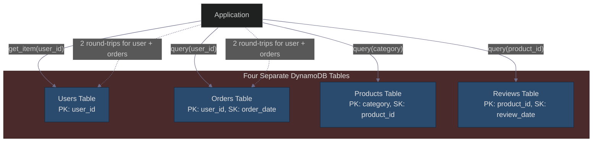
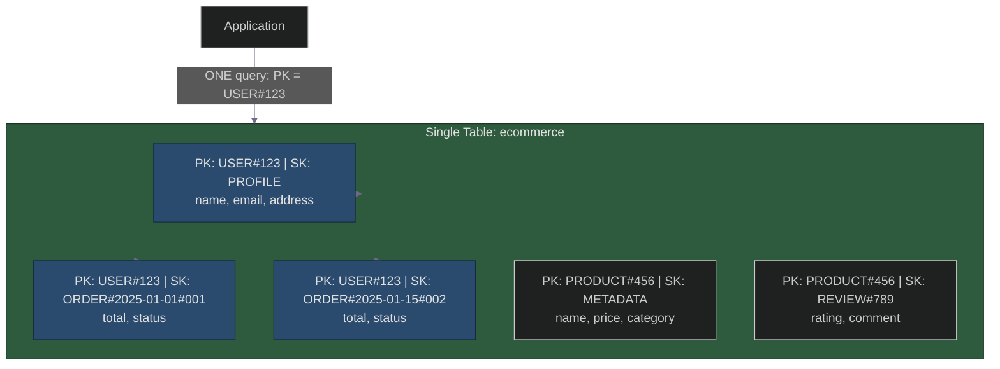
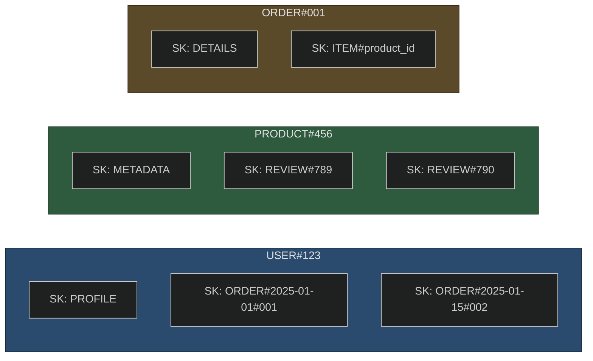
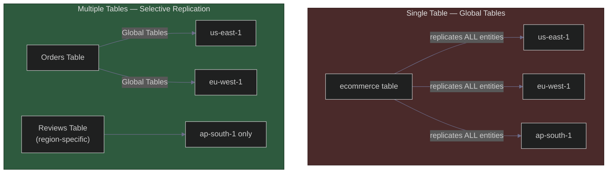
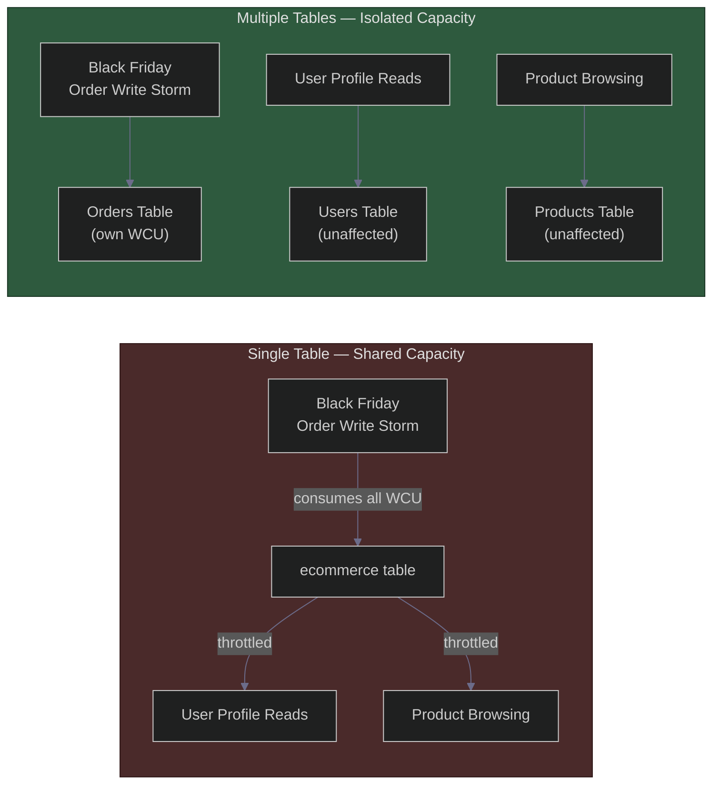
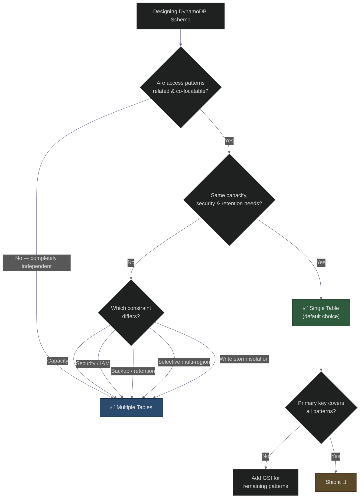

# Single-Table Design in DynamoDB: Anti‑Pattern or Best Practice?
### Day 69 of 50 - System Design Interview Preparation Series

**By Sunchit Dudeja**

*An Architect's Guide to Schema Design in NoSQL*

---

## 📑 Table of Contents

1. [Introduction: The Relational Hangover](#-introduction-the-relational-hangover)
2. [The Problem Statement](#the-problem-statement)
3. [High-Level Architecture: The Two Approaches](#high-level-architecture-the-two-approaches)
   - [Approach 1: Multiple Tables (The RDBMS Hangover)](#approach-1-multiple-tables-the-rdbms-hangover)
   - [Approach 2: Single-Table Design (The DynamoDB Way)](#approach-2-single-table-design-the-dynamodb-way)
4. [The Core Question: Is Single-Table Design an Anti‑Pattern?](#the-core-question-is-single-table-design-an-antipattern)
5. [Part 1: Why Single-Table Design is a Best Practice](#part-1-why-single-table-design-is-a-best-practice)
   - [Operational Simplicity](#1-operational-simplicity)
   - [Flexibility & Evolution](#2-flexibility--evolution)
   - [Powerful Queries in One Round-Trip](#3-powerful-queries-in-one-round-trip)
   - [The Power of Composite Keys](#4-the-power-of-composite-keys)
6. [Part 2: When Should You Use Multiple Tables?](#part-2-when-should-you-use-multiple-tables)
   - [Different Access Patterns](#1-different-access-patterns-have-fundamentally-different-query-structures)
   - [Different Capacity Settings](#2-you-need-different-capacity-settings)
   - [Security & Isolation Requirements](#3-security--isolation-requirements)
   - [Global Tables & Multi‑Region Replication](#4-global-tables--multiregion-replication)
   - [Different Backup/Retention Policies](#5-different-backupretention-policies)
   - [Table‑Level Workload Isolation](#6-tablelevel-workload-isolation)
7. [Part 3: The Decision Matrix](#part-3-the-decision-matrix)
8. [Part 4: Implementation Example](#part-4-implementation-example)
   - [Single-Table Design: E‑Commerce Platform](#single-table-design-ecommerce-platform)
   - [Query: User Profile + Orders](#query-get-user-profile-and-all-orders-one-round-trip)
   - [GSI for Category Browsing](#supporting-get-all-products-in-a-category-with-a-gsi)
9. [Part 5: What Junior Developers Get Wrong](#part-5-what-junior-developers-get-wrong-and-architects-get-right)
10. [Summary: The Architect's Decision Framework](#summary-the-architects-decision-framework)
11. [Visual Summary: The Decision Flow](#visual-summary-the-decision-flow)
12. [How to Talk About It in an Interview](#-how-to-talk-about-it-in-an-interview)
13. [Quick Recap](#-quick-recap)
14. [Final Words](#-final-words)

---

## 🎯 Introduction: The Relational Hangover

You've just moved from the world of SQL to DynamoDB. You have users, orders, products, and reviews. In a relational database, you'd create four tables with foreign keys and `JOIN` them together.

So you create four tables in DynamoDB: `Users`, `Orders`, `Products`, and `Reviews`. This feels natural. Familiar. Safe.

**This is the number one mistake architects make when moving to DynamoDB.**

What if I told you that the "best practice" is to put all four entities in a **single table**?

> **Companion reads:**
> - [Day 7 — Databases: Developer vs Architect](./Day7_Databases_Developer_vs_Architect.md) — why architects model access patterns, not entities.
> - [Day 23 — Database Selection for System Design](./Day23_Database_Selection_System_Design.md) — when DynamoDB belongs in your stack.
> - [Day 38 — Primary Key Strategies: SQL vs NoSQL](./Day38_Primary_Key_Strategies_SQL_vs_NoSQL.md) — composite keys and distributed ID thinking.
> - [Day 41 — ACID vs BASE](./Day41_ACID_vs_BASE_Instagram_CAP.md) — DynamoDB's consistency trade-offs in context.
> - [Day 64 — Database Sharding Strategies](./Day64_Database_Sharding_Strategies.md) — partition key design parallels single-table thinking.

---

## The Problem Statement

You're designing a DynamoDB schema for an e‑commerce platform with the following entities:

| Entity | Attributes |
|--------|------------|
| **Users** | name, email, shipping address |
| **Orders** | user_id, order_date, total, status |
| **Products** | name, price, category, stock |
| **Reviews** | product_id, user_id, rating, comment |

Your access patterns include:

1. Get user profile by `user_id`
2. Get all orders for a user
3. Get all products in a category
4. Get all reviews for a product
5. Get order details with user info (join)

**The question:** Should you use one table or multiple tables?

---

## High-Level Architecture: The Two Approaches

### Approach 1: Multiple Tables (The RDBMS Hangover)



**What feels right:** Each entity gets its own table — just like SQL.

**What goes wrong:** No JOINs. Every "relationship" becomes multiple round-trips, application-side stitching, and operational overhead multiplied by N tables.

### Approach 2: Single-Table Design (The DynamoDB Way)



**What feels wrong:** Everything in one table. Unfamiliar. Counterintuitive.

**What goes right:** One query fetches a user profile and all their orders. Entity types are distinguished by key prefixes, not table names.

---

## The Core Question: Is Single-Table Design an Anti‑Pattern?

**The short answer:** No. It is the **recommended best practice** for DynamoDB.

**The long answer:** Single-table design is a paradigm shift. It works because DynamoDB is a **key-value store**, not a relational database. The goal is to model your **access patterns**, not your entities.

But let's be clear: single-table design is **not always** the right choice. It's a tool, not a dogma. Understanding when to use it — and when not to — is the mark of a true architect.

---

## Part 1: Why Single-Table Design is a Best Practice

### 1. Operational Simplicity

| Aspect | Multiple Tables | Single Table |
|--------|-----------------|--------------|
| IAM Policies | One per table | One total |
| Backup/Restore | One per table | One total |
| Point-in-Time Recovery | Configure per table | Configure once |
| Monitoring | Monitor N tables | Monitor 1 table |
| Capacity Planning | Plan N tables | Plan 1 table |

With a single table, you have one place to manage:

- Provisioned capacity (or on-demand)
- Auto-scaling policies
- Backup schedules
- CloudWatch alarms
- IAM roles

This drastically reduces operational overhead.

### 2. Flexibility & Evolution

With a single table, adding a new entity type is as simple as adding a new PK/SK prefix:

```javascript
// Before: Only Users and Orders
PK: "USER#123", SK: "PROFILE"
PK: "USER#123", SK: "ORDER#2025-01-01"

// After: Adding Products
PK: "PRODUCT#456", SK: "METADATA"

// No table creation. No migration. No downtime.
```

Compare to multiple tables:

1. Create a new table → wait for provisioning
2. Update IAM policies → wait for propagation
3. Configure backup → wait for initial backup
4. Set up monitoring → configure alarms

With a single table, you just write the data. The table is already there.

### 3. Powerful Queries in One Round-Trip

This is the killer feature. With a single table, you can fetch related data from different entity types in a **single Query**.

**Example: Fetch a user and their recent orders**

**Multiple Tables Approach:**

```python
# Two round-trips
user = users_table.get_item(Key={'user_id': '123'})
orders = orders_table.query(
    KeyConditionExpression='user_id = :uid',
    ExpressionAttributeValues={':uid': '123'}
)
# Latency: 2× network trips, 2× serialization/deserialization
```

**Single-Table Approach:**

```python
# One round-trip
result = table.query(
    KeyConditionExpression='PK = :pk AND SK BETWEEN :profile AND :orders',
    ExpressionAttributeValues={
        ':pk': 'USER#123',
        ':profile': 'PROFILE',
        ':orders': 'ORDER#2025-01-01'
    }
)
# Returns: User profile + all orders. One query. One network trip.
# Latency: 1× network trip, 1× serialization/deserialization
```

### 4. The Power of Composite Keys

Single-table design leverages DynamoDB's composite primary key (PK + SK) to model complex relationships:



**The Pattern:**

| Prefix | What it groups |
|--------|----------------|
| `USER#<user_id>` | All user-related data |
| `PRODUCT#<product_id>` | All product-related data |
| `ORDER#<order_id>` | All order-related data |

---

## Part 2: When Should You Use Multiple Tables?

Single-table design is not a silver bullet. Here are the scenarios where multiple tables are the right choice.

### 1. Different Access Patterns Have Fundamentally Different Query Structures

| Access Pattern | Ideal Table Structure |
|----------------|-------------------------|
| User Profiles | PK: `user_id`, SK: none (simple key) |
| Orders | PK: `user_id`, SK: `order_date` (range queries) |
| Products | PK: `category`, SK: `product_id` (category browsing) |
| Reviews | PK: `product_id`, SK: `review_date` (time‑sorted reviews) |

If these patterns are completely independent and don't benefit from co-location, a single table may create unnecessary complexity.

### 2. You Need Different Capacity Settings

| Use Case | Ideal Capacity Mode |
|----------|---------------------|
| Orders (high write throughput) | Provisioned with auto-scaling |
| Reviews (moderate writes, many reads) | Provisioned with read-heavy settings |
| Audit Logs (write-heavy, rarely read) | On‑demand (to handle bursts) |
| Archived Data (rarely accessed) | On‑demand (minimal cost) |

In a single table, all data shares the same capacity. This means you may be over‑provisioning for some entities and under‑provisioning for others.

**The Architect's Fix:** Use multiple tables, each with its own capacity settings, to optimize cost and performance independently.

### 3. Security & Isolation Requirements

| Requirement | Single Table | Multiple Tables |
|-------------|--------------|-----------------|
| Different teams own different data | ❌ One table, one set of permissions | ✅ Each table has its own IAM policy |
| Data must be stored in different regions | ❌ Global Tables replicate everything | ✅ Each table can have its own replication strategy |
| Different encryption keys per dataset | ❌ One KMS key per table | ✅ Each table can use a different KMS key |

**The Architect's Rule:** If different business units or teams own different data, multiple tables allow you to decentralize access control and reduce the blast radius of a security breach.

### 4. Global Tables & Multi‑Region Replication

DynamoDB Global Tables replicates an **entire table** to multiple regions. This is an all‑or‑nothing proposition.



**The Problem:** If you only need to replicate orders (for disaster recovery) but not reviews (which are region‑specific), Global Tables forces you to replicate everything.

**The Solution:** Use multiple tables. Only enable Global Tables for the tables that need multi‑region replication. Keep region‑specific tables local.

### 5. Different Backup/Retention Policies

| Entity | Backup Policy | Retention |
|--------|---------------|-----------|
| Orders | Daily backups, PITR enabled | 7 years (compliance) |
| Reviews | Weekly backups | 1 year |
| Products | Monthly backups | 30 days |

In a single table, backup policies apply to all data. You can't backup orders daily and products monthly.

**The Architect's Fix:** Use separate tables for entities with different backup/retention requirements.

### 6. Table‑Level Workload Isolation

If one entity has a write storm (e.g., Black Friday orders), it can cause throttling for other entities in the same table.



With multiple tables, each entity has its own capacity pool.

---

## Part 3: The Decision Matrix

| Scenario | Recommendation | Why |
|----------|----------------|-----|
| New application with evolving access patterns | ✅ Single Table | Flexibility to add new entities without table creation |
| Well‑defined, stable access patterns | ✅ Single Table | Efficient queries, minimal operational overhead |
| Different entities have wildly different query patterns | ✅ Multiple Tables | Each table can be optimized for its specific patterns |
| Different capacity requirements | ✅ Multiple Tables | Each table has its own capacity settings |
| Different teams own different data | ✅ Multiple Tables | Separate IAM policies, reduced blast radius |
| Different backup/retention requirements | ✅ Multiple Tables | Each table can have its own backup schedule |
| Different encryption keys per entity | ✅ Multiple Tables | Each table can use a different KMS key |
| Multi‑region replication for only some entities | ✅ Multiple Tables | Only replicate tables that need it |
| Write‑heavy and read‑heavy entities in the same table | ✅ Multiple Tables | Avoid throttling interference |

---

## Part 4: Implementation Example

### Single-Table Design: E‑Commerce Platform

```javascript
// Single table structure
const tableName = "ecommerce_single";

// User Profile
table.putItem({
    'PK': 'USER#123',
    'SK': 'PROFILE',
    'name': 'Alice Smith',
    'email': 'alice@example.com',
    'address': '123 Main St'
});

// User's Orders (multiple items)
table.putItem({
    'PK': 'USER#123',
    'SK': 'ORDER#2025-01-01#001',
    'order_date': '2025-01-01',
    'total': 150.00,
    'status': 'shipped'
});

table.putItem({
    'PK': 'USER#123',
    'SK': 'ORDER#2025-01-15#002',
    'order_date': '2025-01-15',
    'total': 75.00,
    'status': 'pending'
});

// Product Metadata
table.putItem({
    'PK': 'PRODUCT#456',
    'SK': 'METADATA',
    'name': 'Wireless Headphones',
    'price': 89.99,
    'category': 'electronics'
});

// Product Reviews
table.putItem({
    'PK': 'PRODUCT#456',
    'SK': 'REVIEW#789',
    'user_id': '123',
    'rating': 5,
    'comment': 'Great product!'
});
```

### Query: Get user profile and all orders (one round-trip)

```javascript
const result = await table.query({
    KeyConditionExpression: 'PK = :pk AND SK BETWEEN :profile AND :orders',
    ExpressionAttributeValues: {
        ':pk': 'USER#123',
        ':profile': 'PROFILE',
        ':orders': 'ORDER#'
    }
});

// Returns: user profile + all orders (multiple items)
// One query. One network trip.
```

### Supporting "Get all products in a category" with a GSI

The primary key can't serve every access pattern. For category browsing, add a GSI:

```javascript
// GSI1PK: CATEGORY#electronics, GSI1SK: PRODUCT#456
table.putItem({
    'PK': 'PRODUCT#456',
    'SK': 'METADATA',
    'GSI1PK': 'CATEGORY#electronics',
    'GSI1SK': 'PRODUCT#456',
    'name': 'Wireless Headphones',
    'price': 89.99,
    'category': 'electronics'
});

// Query products by category
const products = await table.query({
    IndexName: 'GSI1',
    KeyConditionExpression: 'GSI1PK = :cat',
    ExpressionAttributeValues: { ':cat': 'CATEGORY#electronics' }
});
```

> **Architect's note:** Design your primary key to cover **most** access patterns. Add GSIs only for the patterns your PK can't support — each GSI doubles your write cost for those items.

---

## Part 5: What Junior Developers Get Wrong (And Architects Get Right)

| Mistake | Architect's Correction |
|---------|------------------------|
| "Single-table design is just for saving money." | No — it's about query flexibility and operational simplicity. Cost is a secondary benefit. |
| "I'll just use one table for everything." | Not everything belongs in one table. Use the access pattern test: if entities have different patterns, consider multiple tables. |
| "I'll design the table first, then figure out queries." | Wrong order. Identify all access patterns first, then design the table. |
| "I can't use single-table design because I'm using an ORM." | Many ORMs support DynamoDB single-table design. If yours doesn't, switch to a native DynamoDB library. |
| "Multiple tables are always more expensive." | Not true. If different entities have different capacity needs, multiple tables can be cheaper. |
| "I'll just use GSI for everything." | GSIs are powerful but have cost and consistency trade‑offs. Design your primary key to cover most access patterns. |

---

## Summary: The Architect's Decision Framework

### Start with Single-Table Design

1. Identify all access patterns (write them down)
2. Design your PK and SK to support those patterns
3. Use entity prefixes (`USER#`, `ORDER#`, `PRODUCT#`) to differentiate
4. Add GSI(s) only for patterns your primary key can't support

### Move to Multiple Tables When:

- Access patterns diverge — different query structures
- Capacity needs differ — write‑heavy vs read‑heavy
- Security isolation is required — different teams
- Backup/retention policies differ — different schedules
- Multi‑region replication is selective — only replicate some data
- Workload interference is a risk — write storms affecting reads

### The One‑Sentence Architect's Takeaway

> "Single-Table Design is the default — not because it's the only way, but because it gives you flexibility, operational simplicity, and the power of single‑query access across entity types. Use multiple tables only when isolation, capacity, or access patterns demand it."

---

## Visual Summary: The Decision Flow



---

## 💬 How to Talk About It in an Interview

When asked *"Should I use one DynamoDB table or multiple tables?"*:

> "In DynamoDB, I'd default to single-table design because it's AWS's recommended approach — you model access patterns, not entities. With composite keys using PK and SK prefixes like `USER#123` and `ORDER#date`, I can fetch a user and all their orders in one query instead of two round-trips across separate tables.
>
> But single-table isn't dogma. I'd move to multiple tables when entities have fundamentally different capacity needs — like Black Friday orders throttling user profile reads — or when security isolation, different backup retention, or selective Global Tables replication matters.
>
> The process is always: list every access pattern first, design keys to serve them, add GSIs only for what the primary key can't cover, and split tables only when operational constraints force it."

---

## 🧾 Quick Recap

- **SQL models entities; DynamoDB models access patterns.**
- Single-table design is AWS's **recommended default** — not an anti-pattern.
- Composite keys (PK + SK) with entity prefixes replace foreign keys and JOINs.
- One query can fetch multiple entity types — fewer round-trips, lower latency.
- **Multiple tables** win when capacity, security, retention, or replication needs diverge.
- **GSIs** are a scalpel, not a hammer — each one adds write amplification.
- The golden rule: **access patterns first, schema second.**

---

## 🎬 Final Words

The hardest part of moving from SQL to DynamoDB isn't learning the API — it's unlearning the instinct to create one table per entity. That instinct served you well in Postgres. In DynamoDB, it's the trap.

Single-table design isn't about cramming everything into one bucket. It's about **designing your keys so the data your application needs lives together**. Multiple tables aren't wrong — they're the right tool when isolation demands it.

The next time someone proposes four DynamoDB tables for users, orders, products, and reviews, ask: **"What are the access patterns, and can one query serve them?"** That question separates someone who ported SQL thinking from someone who designed for DynamoDB. 🎯

---

*This blog post is part of the **System Design from an Architect's Perspective** series. For more deep dives, follow the series and learn how to think like an architect — not just a developer.*

*If this cleared up the single-table vs multi-table debate, pass it to the next engineer who's about to create four DynamoDB tables because "that's how we did it in SQL."* 🎯
