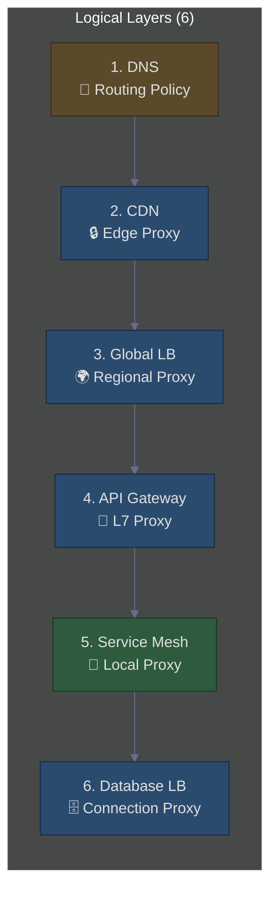
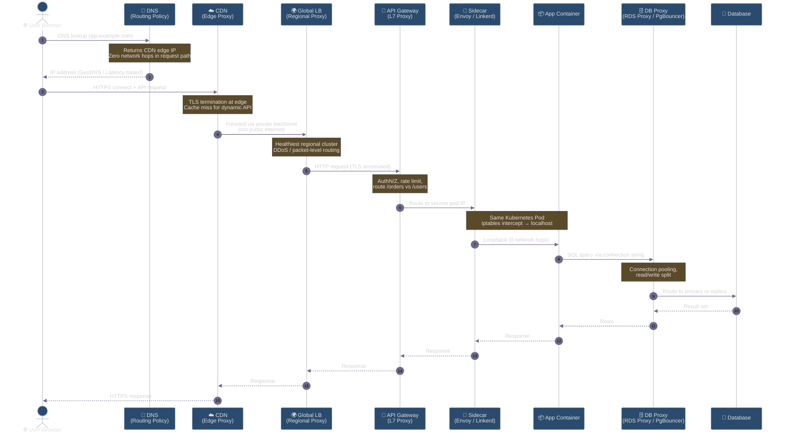
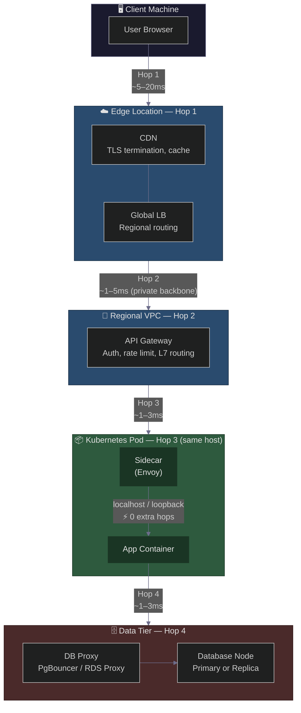
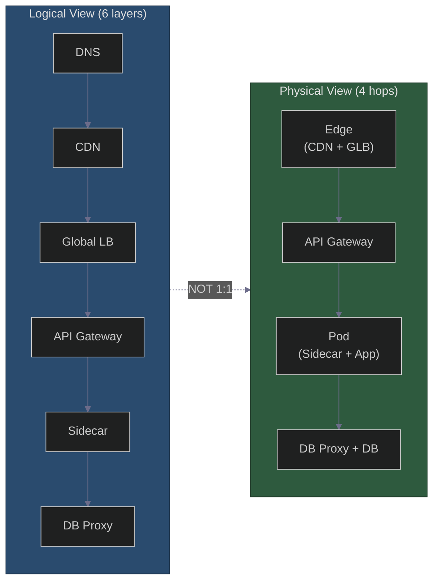

# The Sequence Breakdown: What Each Layer Does
### Day 70 of 50 - System Design Interview Preparation Series

**By Sunchit Dudeja**

*An Architect's Guide to Logical Layers vs Physical Network Hops*

---

## 📑 Table of Contents

1. [Introduction: Six Layers, One API Call](#-introduction-six-layers-one-api-call)
2. [The Sequence Breakdown: What Each Layer Does](#the-sequence-breakdown-what-each-layer-does)
3. [Does It Physically Hop Through All of Them?](#does-it-physically-hop-through-all-of-them)
4. [Step-by-Step Physical Path](#step-by-step-physical-path)
5. [Diagram 1: Full Logical Workflow (Sequence)](#diagram-1-full-logical-workflow-sequence)
6. [Diagram 2: Physical Network Hops (The Reality View)](#diagram-2-physical-network-hops-the-reality-view)
7. [The Architect's Cheat Sheet](#the-architects-cheat-sheet)
8. [What Junior Developers Get Wrong (And Architects Get Right)](#what-junior-developers-get-wrong-and-architects-get-right)
9. [The One-Sentence Architect's Rule](#the-one-sentence-architects-rule)
10. [How to Talk About It in an Interview](#-how-to-talk-about-it-in-an-interview)
11. [Quick Recap](#-quick-recap)
12. [Final Words](#-final-words)

---

## 🎯 Introduction: Six Layers, One API Call

You open a system design diagram and see a wall of boxes: **DNS → CDN → Global LB → API Gateway → Service Mesh → Database LB**. Six layers. Six load balancers. Your first instinct?

*"This is too many hops. The latency will be terrible."*

That instinct is half right — and half wrong. **Six logical layers does not mean six physical network hops.** Architects don't stack proxies for fun. Each layer solves a distinct problem: geo-routing, edge caching, DDoS protection, auth, service discovery, and connection pooling.

The skill that separates a senior engineer from an architect is knowing **which layers are real network machines** and which are **logical routing policies or co-located sidecars**.

> 🎨 **Companion diagram:** [`day70-load-balancing-layers-physical-hops.excalidraw`](./day70-load-balancing-layers-physical-hops.excalidraw) — the same architecture as a hand-drawn whiteboard (open in Excalidraw / the VS Code Excalidraw extension).

> **Companion reads:**
> - [Day 8 — Load Balancing](./Day8_Load_Balancing.md) — algorithms from Round Robin to intelligent traffic orchestration.
> - [Day 22 — 7 Layers HLD Architecture](./Day22_7_Layers_HLD_Architecture.md) — where load balancing sits in the full stack.
> - [Day 29 — Forward vs Reverse Proxy](./Day29_Forward_Reverse_Proxy.md) — CDN and API Gateway are reverse proxies; DNS is not.
> - [Day 47 — Database Connection Pool](./Day47_Database_Connection_Pool_Biggest_Blunder.md) — why the DB proxy layer exists.
> - [Day 57 — Rate Limiting Algorithms](./Day57_Rate_Limiting_Algorithms_Fixed_Window_Boundary_Bug.md) — rate limiting lives at the API Gateway layer.

---

## The Sequence Breakdown: What Each Layer Does

| Layer | What it does | Is it a "Load Balancer" in the traditional sense? |
|-------|--------------|-----------------------------------------------------|
| **1. DNS Load Balancing** | Returns different IPs based on the user's geographic location (GeoDNS / Route53 Latency-based). | **No** — it's a routing policy, not a proxy. The client connects directly to the IP returned. |
| **2. CDN** | Terminates the TLS connection at the Edge. Caches static assets. For dynamic APIs, it acts as a reverse proxy routing traffic to the nearest regional origin. | **Yes** — Edge proxy. |
| **3. Global Load Balancer** | The "Front Door" of the cloud (e.g., AWS Global Accelerator, GCP Cloud Load Balancing). Terminates edge TLS and routes to the healthiest regional cluster. | **Yes** — Layer 4/7 proxy. |
| **4. API Gateway** | Handles AuthN/Z, rate limiting, request transformation, and routes the request to the specific backend microservice (e.g., `/orders` vs `/users`). | **Yes** — Layer 7 proxy. |
| **5. Service Mesh LB (Sidecar)** | The client-side load balancer (Envoy, Linkerd). The sidecar discovers healthy service instances and routes the request via mTLS. | **Yes** — Local proxy. |
| **6. Database LB** | (e.g., ProxySQL, PgBouncer, RDS Proxy). Handles connection pooling, read/write splitting, and distributing queries across read replicas. | **Yes** — Connection proxy. |

### At a Glance: Proxy vs Policy

> **Key insight:** Only DNS is *not* a proxy. Everything else terminates or forwards traffic. But "proxy" does not always mean "separate network hop."

---

## Does It Physically Hop Through All of Them?

**No.**

Here is the architect's rule:

> Each hop adds ~1ms to 10ms of latency. If you sequentially proxy through 6 machines, the user waits 30ms+ just for routing. **We don't do that.**

The six layers describe **responsibilities**, not a chain of six network boxes. Some layers are policies (DNS), some are co-located at the edge (CDN + Global LB), and some run on the same host as your app (Service Mesh sidecar).

---

## Step-by-Step Physical Path

### 1. DNS (Zero Network Hops)

The browser does a DNS lookup. It receives an IP address for the CDN and connects **directly** to it. No "DNS machine" sits between the request and the response — DNS happened *before* the TCP connection.

### 2. CDN → Global LB

The CDN (e.g., CloudFront) is a massive globally distributed network. If the CDN doesn't have the dynamic response cached, it establishes a **single optimized connection** to the Regional Global Load Balancer (e.g., AWS NLB) using the cloud provider's **private backbone** — not the public internet.

### 3. Global LB → API Gateway

The Global LB handles TCP/TLS termination and forwards the HTTP request to the API Gateway (e.g., Kong). At this point, the request has physically hit **3 boxes**: CDN, GLB, Gateway.

### 4. API Gateway → Service

The Gateway figures out which microservice should handle the request. It forwards the call to the Kubernetes/EC2 service IP.

### 5. The "Zero-Hop" Service Mesh (The Sidecar Trick)

The Service Mesh sidecar (Envoy) does **not** sit on a separate machine. It is a container alongside your application code (Sidecar pattern). The call goes from the API Gateway to the application pod. The first thing that pod does is intercept the incoming connection via the sidecar. It then reroutes it locally (via localhost or loopback) to the actual application container.

**Network-wise: 0 physical hops.** Logically: a critical routing layer.

### 6. Database

The application makes a SQL query. The connection string points to the Database Load Balancer (RDS Proxy). It makes a direct network call to the DB Proxy, which routes the query to the specific database node.

---

## Diagram 1: Full Logical Workflow (Sequence)

This shows the **chronological journey** of a single API call through all layers — perfect for explaining the flow to a team or in an interview whiteboard.

---

## Diagram 2: Physical Network Hops (The Reality View)

This is the diagram that matters for latency. It shows **which components are separate network machines** vs **co-located processes**. Network hops cost milliseconds; logical layers on the same host cost microseconds.

### What This Diagram Teaches

| The Diagram's Point | The Architect's Takeaway |
|---------------------|--------------------------|
| DNS is first, but it's not a proxy. | DNS doesn't route the packet — it tells the client where to go. Zero latency added to the request path itself. |
| CDN and Global LB are physically linked. | In modern clouds, CDN and Global LB often sit at the same edge location. User → Edge = **Hop 1**. |
| API Gateway is a separate regional hop. | It scales independently and is the official entrance into your private VPC. User → Edge → Gateway = **2 hops so far**. |
| Service Mesh is a sidecar — zero physical hops. | The sidecar sits next to the app container in the same Kubernetes Pod. Routing through it is essentially free (CPU/memory overhead only). |
| Database is the final hop. | The DB Load Balancer manages read replicas and connection pooling so the database doesn't crash under load. |

### The Network Hop Summary (Golden Rule)

If you trace the actual TCP/IP packets, they physically travel like this:

| Step | Path | Hops |
|------|------|------|
| 1 | User → Edge (CDN/GLB) | 1 network hop |
| 2 | Edge → Regional (API Gateway) | 1 network hop |
| 3 | Regional → Kubernetes Pod (Sidecar + App) | 1 network hop |
| 4 | Pod → Database Proxy | 1 network hop |

**Total physical hops = 4.**

All the other work — authorization, rate limiting, TLS termination, business logic, connection pooling — happens **within** these 4 physical locations.

---

## The Architect's Cheat Sheet

| Scenario | Physical Network Boxes Hit |
|----------|----------------------------|
| **Simple Web App (single region)** | 1. Cloud LB → 2. Web Server → DB. **Total: 2 proxies** |
| **Microservices + Global (your sequence)** | 1. CDN → 2. Global LB → 3. API Gateway → 4. App Pod (Sidecar intercepts internally) → 5. DB Proxy. **Total: 5 distinct network proxies** |

> **Note:** The microservices path counts CDN, GLB, Gateway, Pod, and DB Proxy as distinct network endpoints. The sidecar is **not** a distinct endpoint — it shares the pod's network namespace.

### Logical vs Physical: Side-by-Side

---

## What Junior Developers Get Wrong (And Architects Get Right)

| Mistake | Architect's Fix |
|---------|-----------------|
| "This is too many hops; the latency will be terrible." | Architects offload TLS termination to the CDN/Global LB and keep the internal path on high-speed private networks (AWS Backbone). The added latency for security (WAF, Auth) is worth it. |
| "The Service Mesh sidecar adds a network hop." | Architects know the sidecar is on the same host. It uses iptables to intercept traffic at the kernel level — no extra network hop, just a tiny CPU overhead. |
| "We need a Global LB **and** an API Gateway?" | **Yes.** The Global LB handles DDoS protection and packet-level routing; the API Gateway handles business-level routing (HTTP verbs, headers). They do fundamentally different things. |
| "DNS is a load balancer in the request path." | DNS is a **routing policy**. It runs before the TCP connection. The client talks directly to whatever IP DNS returned — no DNS proxy in the middle. |
| "Every layer on the diagram is a separate VM." | Diagrams show **responsibilities**, not **machines**. Always ask: "Is this co-located? Is this a policy? Is this localhost?" |

---

## The One-Sentence Architect's Rule

> "An API call traverses **2 to 3 physical network proxies** (Edge, Gateway, Database) and up to **3 logical routing layers** (DNS, Sidecar, Code), but we accept this complexity because it provides security, observability, and global resilience — the price of scale is a few extra milliseconds."

This is how massive systems like Netflix or Amazon handle billions of requests a day: **minimize physical hops** and put the complexity (like the Service Mesh) on the same machine as the application to avoid network latency.

---

## 💬 How to Talk About It in an Interview

When asked *"Walk me through what happens when a user hits your API"* or *"Isn't six load balancers too many?"*:

> "I'd start with the logical layers — DNS, CDN, Global LB, API Gateway, Service Mesh, DB Proxy — because each solves a distinct problem. But I'd immediately clarify that six logical layers is not six network hops.
>
> DNS is a routing policy, not a proxy — it returns an IP and gets out of the way. The CDN and Global LB often sit at the same edge. The Service Mesh sidecar runs in the same Kubernetes pod as my app — iptables intercept, localhost reroute, zero extra hops.
>
> Physically, I'm looking at about four network endpoints: Edge, API Gateway, App Pod, and DB Proxy. TLS termination and DDoS protection happen at the edge on private backbone links. Auth and rate limiting happen at the gateway. Connection pooling happens at the DB proxy. The few extra milliseconds buy me security, observability, and global resilience — and that's the trade-off I'd defend at scale."

---

## 🧾 Quick Recap

- **Six logical layers ≠ six network hops.** Diagrams show responsibilities, not machines.
- **DNS is not a proxy** — it's a routing policy that runs before the TCP connection.
- **CDN + Global LB** = edge protection and regional routing (often co-located).
- **API Gateway** = business-level routing (auth, rate limits, `/orders` vs `/users`).
- **Service Mesh sidecar** = same pod, localhost loopback, **zero physical hops**.
- **DB Proxy** = connection pooling, read/write split — the final network hop.
- **Physical hop count:** ~4 for a global microservices stack, ~2 for a simple single-region app.
- **Architect's rule:** Minimize physical hops; accept logical complexity for security and scale.

---

## 🎬 Final Words

The next time you see a diagram with six boxes between the user and the database, don't panic about latency. **Ask which boxes are real network machines and which are policies or co-located processes.**

Junior developers count boxes. Architects count **hops** — and they know that the sidecar sitting next to your app container isn't a hop at all. It's iptables, localhost, and a few microseconds of CPU.

That distinction — logical sequence vs physical path — is exactly what interviewers are testing when they draw this architecture on the whiteboard. Now you can draw it back, with the workflow diagram to prove it. 🎯

---

*This blog post is part of the **System Design from an Architect's Perspective** series. For more deep dives, follow the series and learn how to think like an architect — not just a developer.*

*If this cleared up the "six load balancers" confusion, pass it to the next engineer who's about to reject a production architecture because "too many hops."* 🎯
