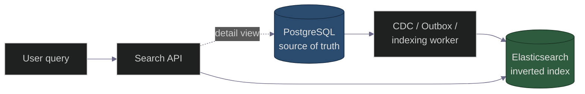

# Search Engines Deep Dive — Elasticsearch, Inverted Indexes, and the Architect's Guide
### Databases Chapter — System Design Interview Preparation Series

**By Sunchit Dudeja**

> **Also read:** [Day 23 — Database Selection](../Day23_Database_Selection_System_Design.md) · [Day 9 — Bloom Filters](../Day9_Bloom_Filters_Cache_Penetration.md) · [Day 37 — Cache Hit Rate](../Day37_Optimizing_Cache_High_Hit_Rate_Distributed_Systems.md)

---

## 🎯 The Core Idea

Your primary database (Postgres, MongoDB) is terrible at **full-text search** across millions of documents. That's what **search engines** — Elasticsearch, OpenSearch, Solr — are for.

> **Mental model:** A search engine is a **specialized read-optimized index** built on an **inverted index** — it maps *words → documents*, not *documents → words*. You never use it as your source of truth; you **index** data into it from your OLTP database or event stream.

[Day 23](./../Day23_Database_Selection_System_Design.md) mentions "Search → Elasticsearch" in one line. This is the deep dive.

---

## 🏛️ Why Not Just Use SQL `LIKE`?

| Approach | Problem at scale |
|----------|------------------|
| `WHERE title LIKE '%phone%'` | Full table scan — O(n) per query |
| SQL full-text indexes | Limited ranking, fuzzy match, faceting |
| Search engine | Inverted index — O(1) term lookup + relevance scoring |

**Polyglot persistence:** Postgres holds the **source of truth**; Elasticsearch holds a **searchable projection** updated asynchronously (CDC, outbox, or dual-write-with-care).

---

## 📖 The Inverted Index

```
Documents:
  doc1: "quick brown fox"
  doc2: "quick blue sky"
  doc3: "brown dog"

Inverted index:
  "quick" → [doc1, doc2]
  "brown" → [doc1, doc3]
  "fox"   → [doc1]
  "blue"  → [doc2]
  "sky"   → [doc2]
  "dog"   → [doc3]
```

Query `"quick brown"` → intersect posting lists → **doc1** matches both terms. Ranking (TF-IDF, BM25) scores relevance.



---

## 🧱 Elasticsearch Core Concepts

| Concept | Meaning |
|---------|---------|
| **Index** | Like a database table (e.g., `products`) |
| **Document** | JSON record (one product, one tweet) |
| **Shard** | Horizontal partition of an index ([Day 64 sharding](../Day64_Database_Sharding_Strategies.md) same idea) |
| **Replica** | Copy of a shard for read scale + HA ([Day 30](../Day30_Database_Replication_AWS_Architecture.md)) |
| **Mapping** | Schema — field types, analyzers |
| **Analyzer** | Tokenizer + filters (lowercase, stemming, stop words) |

**Typical cluster:** 3+ data nodes, primary shards spread across nodes, replica shards for failover and read fan-out.

---

## 🔍 Query Types You'll Design Around

| Query | Use |
|-------|-----|
| **Match** | Full-text search (`match: { title: "wireless headphones" }`) |
| **Term / filter** | Exact match (category, price range) — cached, fast |
| **Bool** | Combine must/should/must_not (AND/OR/NOT) |
| **Fuzzy** | Typo tolerance (`fuzziness: AUTO`) |
| **Suggest / completion** | Typeahead autocomplete (edge n-grams) |
| **Aggregations** | Faceted search (count by brand, price histogram) |

> **Interview tip:** typeahead is a **separate indexing strategy** (edge n-grams or a dedicated suggest field) — not just `match` on the same index.

---

## 🔄 Keeping Search in Sync

| Pattern | Pros | Cons |
|---------|------|------|
| **Dual write** (app writes DB + ES) | Simple | Dual-write failure — one succeeds, one fails |
| **CDC** (Debezium → Kafka → indexer) | Decoupled, reliable | More moving parts |
| **[Outbox pattern](../Day39_Outbox_Pattern_Reliable_Messaging.md)** | Atomic DB + event | Extra table + relay |
| **Periodic batch reindex** | Simple recovery | Stale between runs |

**Architect's pick:** CDC or outbox → async indexer. Never trust dual-write for search sync.

**Eventual consistency is OK:** search results can lag OLTP by seconds — users accept "just posted" delay. Strong consistency is not required ([Day 41 BASE](../Day41_ACID_vs_BASE_Instagram_CAP.md)).

---

## 📈 Scaling & Performance

| Lever | How |
|-------|-----|
| **More shards** | Parallelize indexing and query (don't over-shard — each shard has overhead) |
| **Replicas** | Scale read QPS; HA during node loss |
| **Routing key** | Co-locate related docs (e.g., all of one tenant's data on one shard) |
| **Cache** | Filter clauses cached; hot queries in Redis ([Day 37](../Day37_Optimizing_Cache_High_Hit_Rate_Distributed_Systems.md)) |
| **Index lifecycle** | Hot/warm/cold tiers — recent data on fast nodes |

**Rule of thumb:** aim for **20–50 GB per shard**; too many tiny shards hurts; too few huge shards can't parallelize.

---

## ❌ Junior vs Architect

| Junior | Architect |
|--------|-----------|
| "We'll search Postgres with LIKE" | Dedicated search index; OLTP stays OLTP |
| Dual-write to ES from the API | **CDC / outbox** for sync |
| One giant index, no routing | Shards + routing for tenant isolation |
| Same mapping for search and autocomplete | Separate analyzers / suggest fields |
| ES as source of truth | ES is a **projection**; Postgres/Mongo is truth |

---

## 💬 Interview Sound Bite

> "Search is a **read-optimized projection**. I'd keep the source of truth in Postgres, stream changes via CDC or the outbox into Elasticsearch with an inverted index. Queries hit ES for full-text + facets; detail pages fetch from OLTP by ID. I'd shard the ES index by volume, use replicas for read scale, accept **eventual consistency** for search freshness, and never dual-write."

---

## 🧾 Quick Recap

- Search engines use an **inverted index** (term → documents), not table scans.
- **Elasticsearch** = index, document, shard, replica, mapping, analyzer.
- **Never** use SQL `LIKE` at scale; **never** use ES as source of truth.
- Sync via **CDC / outbox**, not dual-write.
- **Typeahead** needs its own indexing strategy.
- Scale with **shards + replicas**; tune shard size (~20–50 GB).

---

*Database selection context:* [Day 23](../Day23_Database_Selection_System_Design.md) · *Sharding the index:* [Day 64](../Day64_Database_Sharding_Strategies.md)
