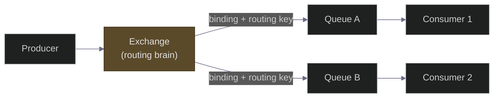

# RabbitMQ Deep Dive — Exchanges, Queues, ACKs, DLQ, and Production Patterns
### Message Queues Chapter — System Design Interview Preparation Series

**By Sunchit Dudeja**

> **Also read:** [Day 36 — RabbitMQ vs Kafka](../Day36_RabbitMQ_vs_Kafka_Architects_Decision_Guide.md) · [Day 62 — Distributed Job Scheduler](../Day62_Distributed_Job_Scheduler_RabbitMQ.md) · [Day 39 — Outbox Pattern](../Day39_Outbox_Pattern_Reliable_Messaging.md)

---

## 🎯 The Core Idea

RabbitMQ is a **message broker**: it receives messages from producers, routes them through **exchanges** into **queues**, and delivers them to consumers who **acknowledge** when done. If something fails, messages can be retried or dead-lettered.

> **Mental model:** RabbitMQ is a **postal service with smart routing** — not a warehouse of records (that's Kafka). Each package is delivered, acknowledged, and removed. You choose *who gets which mail* via exchange types and bindings.

Use RabbitMQ when you need **per-message ACK**, **complex routing**, **priority queues**, **native dead-letter queues**, and **moderate throughput** with strong delivery semantics — job scheduling ([Day 62](../Day62_Distributed_Job_Scheduler_RabbitMQ.md)), task queues, RPC-style request/reply.

---

## 🏛️ Architecture: Producer → Exchange → Queue → Consumer

**Key components:**

| Component | Role |
|-----------|------|
| **Producer** | Publishes to an **exchange** (never directly to a queue) |
| **Exchange** | Routes messages to queues by rules |
| **Binding** | Links exchange → queue with a routing key / pattern |
| **Queue** | Buffers messages until consumed + acked |
| **Consumer** | Pulls (push-delivered) messages; **acks** on success |

---

## 🔀 Exchange Types — The Routing Brain

| Type | Routing rule | Use case |
|------|--------------|----------|
| **Direct** | Exact routing key match | Point-to-point (`order.created` → `billing_queue`) |
| **Fanout** | Broadcast to **all** bound queues | Notifications to every subscriber |
| **Topic** | Pattern match (`order.*`, `order.#`) | Multi-tenant / category routing |
| **Headers** | Match on message headers | Rare; complex routing without key strings |

**Architect's tip:** start with **topic** exchanges — they're flexible enough for most systems and you won't repaint yourself into a corner.

---

## ✅ Acknowledgements & Delivery Semantics

| Setting | Behavior |
|---------|----------|
| **Manual ack** (`basic.ack`) | Consumer acks **after** work completes — crash before ack → message redelivered (**at-least-once**) |
| **Auto ack** | Broker removes message on delivery — **at-most-once**; you lose messages on crash |
| **Nack + requeue=false** | Send to DLQ or alternate exchange instead of infinite retry |
| **Prefetch** | Limit unacked messages per consumer — prevents one slow worker hoarding |

> **The rule from [Day 62](../Day62_Distributed_Job_Scheduler_RabbitMQ.md):** ack **after** processing, never before. Make handlers **idempotent** ([Day 48](../Day48_Idempotency_The_Key_That_Lied.md)) because redelivery will happen.

---

## 💀 Dead Letter Queue (DLQ)

When a message is rejected, expires, or exceeds max length, RabbitMQ can route it to a **Dead Letter Exchange (DLX)** → **DLQ**.

| Trigger | Example |
|---------|---------|
| `nack(requeue=false)` | Business logic failure after max retries |
| Message TTL exceeded | Stale job in retry queue |
| Queue max-length hit | Backpressure overflow |

**Production pattern:** main queue → on failure → retry queue (TTL backoff) → after N tries → DLQ for human triage. Same spine as [Day 62's retry_jobs](../Day62_Distributed_Job_Scheduler_RabbitMQ.md).

---

## 🏭 Production Checklist

| Concern | Recommendation |
|---------|----------------|
| **Durability** | Durable queues + `delivery_mode=2` (persistent messages) |
| **Clustering** | **Quorum queues** (Raft) for HA — not classic mirrored queues |
| **Publisher confirms** | Wait for broker confirm before marking job "sent" |
| **Poison messages** | Max retries → DLQ; never retry forever ([Day 53](../Day53_Uber_Retry_Storm_Exponential_Backoff_Circuit_Breaker.md)) |
| **Ordering** | One consumer per queue if you need strict order |
| **Throughput** | Scale **consumers**, not queue count; tune prefetch |

---

## ⚔️ RabbitMQ vs Kafka — When to Pick Which

| Pick **RabbitMQ** | Pick **Kafka** |
|-------------------|----------------|
| Job queues, task workers | Event streaming, analytics pipeline |
| Per-message ACK + native DLQ | Replay from offset, log retention |
| Complex routing (topic exchange) | Massive throughput (100k+ msg/s) |
| Request/reply RPC patterns | Stream processing (Flink, ksqlDB) |

Full comparison: [Day 36](../Day36_RabbitMQ_vs_Kafka_Architects_Decision_Guide.md).

---

## ❌ Junior vs Architect

| Junior | Architect |
|--------|-----------|
| Auto-ack for convenience | Manual ack after work; idempotent handlers |
| Publish directly to queue name | Publish to **exchange** with routing key |
| Infinite requeue on failure | TTL backoff + DLQ + alert on DLQ depth |
| One big queue for everything | Separate queues per workload / priority |
| "RabbitMQ is slow" | Tune prefetch, quorum queues, consumer count |

---

## 🧾 Quick Recap

- **Exchange** routes; **queue** buffers; **consumer** acks.
- Exchange types: **direct, fanout, topic, headers**.
- **Manual ack + idempotency** = safe at-least-once.
- **DLQ** for poison messages; retry with **TTL backoff**.
- **Quorum queues + persistent messages + publisher confirms** for production HA.
- Choose RabbitMQ for **task queues and routing**; Kafka for **event logs and replay**.

---

*Full job-scheduler walkthrough with RabbitMQ as the spine:* [Day 62](../Day62_Distributed_Job_Scheduler_RabbitMQ.md)
